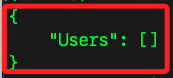

# 建立 S3 Bucket

_透過 AWS CLI 操作 S3 之前，必須先建立一個具備 S3 權限的使用者_

<br>

## 刪除指定帳號與設定

_要先刪除帳號的附加政策及內嵌政策_

<br>

1. 列出並刪除指定帳號如 `s3user` 的 `附加政策`。

    ```bash
    aws iam list-attached-user-policies --user-name s3user --profile default --query 'AttachedPolicies[*].PolicyArn' --output text | xargs -n 1 -I {} aws iam detach-user-policy --user-name s3user --policy-arn {} --profile default
    ```

<br>

2. 刪除指定使用者如 `s3user` 的 `內嵌政策`。

    ```bash
    aws iam list-user-policies --user-name s3user --profile default --query 'PolicyNames' --output text | xargs -n 1 -I {} aws iam delete-user-policy --user-name s3user --policy-name {} --profile default
    ```

<br>

3. 刪除指定使用者如 `s3user` 的 `訪問密鑰`。

    ```bash
    aws iam list-access-keys --user-name s3user --profile default --query 'AccessKeyMetadata[*].AccessKeyId' --output text | xargs -n 1 -I {} aws iam delete-access-key --user-name s3user --access-key-id {} --profile default
    ```

<br>

4. 刪除指定使用者如 `s3user` 的登入設定；假如回傳 `NoSuchEntity`，表示使用者 `s3user` 沒有登入設定，故可跳過這步驟。

    ```bash
    aws iam delete-login-profile --user-name s3user --profile default
    ```

<br>

5. 刪除 SSH 公鑰。

    ```bash
    aws iam list-ssh-public-keys --user-name s3user --profile default --query 'SSHPublicKeys[*].SSHPublicKeyId' --output text | xargs -n 1 -I {} aws iam delete-ssh-public-key --user-name s3user --ssh-public-key-id {} --profile default
    ```

<br>

6. 刪除多因素驗證設備。

    ```bash
    aws iam list-mfa-devices --user-name s3user --profile default --query 'MFADevices[*].SerialNumber' --output text | xargs -n 1 -I {} aws iam deactivate-mfa-device --user-name s3user --serial-number {} --profile default
    aws iam list-mfa-devices --user-name s3user --profile default --query 'MFADevices[*].SerialNumber' --output text | xargs -n 1 -I {} aws iam delete-virtual-mfa-device --serial-number {} --profile default
    ```

<br>

7. 刪除使用者。

    ```bash
    aws iam delete-user --user-name s3user --profile default
    ```

<br>

## 建立使用者及政策

1. 查詢當前有哪些 User；特別注意，會回傳一個列表，但不包含 root 帳號。

    ```bash
    aws iam list-users
    ```

    _輸出：無其他使用者_

    

<br>

2. 刪除指定名稱的使用者，如 `s3user。`；使用 `root` 權限的配置文件 `default`。

    ```bash
    aws iam delete-user --user-name s3user --profile default
    ```

<br>

3. 建立一個新的 IAM 用戶，命名為 s3user。

    ```bash
    aws iam create-user --user-name s3user
    ```

    

<br>

## 步驟

1. 使用具備 S3 權限的使用者配置文件，如 `s3user`。

    ```bash
    aws configure --profile s3user
    ```

<br>

2. 使用指令建立 S3 Bucket；參數 `--bucket` 指定命名為 `my-bucket-623801`；參數 `--region` 指定區域；參數 `--profile` 使用指定配置文件，也就是指定使用者。

    ```bash
    aws s3api create-bucket --bucket my-bucket-623801 --region us-east-1 --profile s3user
    ```

    _輸出_

    ```json
    {
        "Location": "/my-bucket-623801"
    }
    ```

<br>

3. 假如命名不合法如已經存在，會得到錯誤訊息 `BucketAlreadyExists`。

    ```bash
    An error occurred (BucketAlreadyExists) when calling the CreateBucket operation: The requested bucket name is not available. The bucket namespace is shared by all users of the system. Please select a different name and try again.
    ```

<br>

4. 列出所有的 S3 Buckets。

    ```bash
    aws s3api list-buckets --profile s3user
    ```

    _輸出_

    ```json
    {
        "Buckets": [
            {
                "Name": "my-bucket-623801",
                "CreationDate": "2024-07-22T01:00:18+00:00"
            }
        ],
        "Owner": {
            "DisplayName": "gsam6239",
            "ID": "8c7ce1b0c7300ae640c613669ce0ef6f359b9ad4486d07f6812781d752bcf850"
        }
    }
    ```

<br>

5. 上傳檔案到 S3 Bucket，如 `localfile.txt`。

    ```bash
    aws s3 cp localfile.txt s3://my-bucket-623801/localfile.txt --profile s3user
    ```

    _完成時會顯示_

    ```bash
    upload: ./localfile.txt to s3://my-bucket-623801/localfile.txt  
    ```

<br>

6. 列出 S3 Bucket 中的檔案。

    ```bash
    aws s3 ls s3://my-bucket-623801 --profile s3user
    ```

    _輸出_

    ```bash
    2024-07-22 09:10:05         12 localfile.txt
    ```

<br>

7. 從 S3 Bucket下載檔案。

    ```bash
    aws s3 cp s3://my-bucket-623801/localfile.txt downloadfile.txt --profile s3user
    ```

    _輸出_

    ```bash
    download: s3://my-bucket-623801/localfile.txt to ./downloadfile.txt
    ```

<br>

8. 刪除 S3 Bucket 中的檔案。

    ```bash
    aws s3 rm s3://my-bucket-623801/localfile.txt --profile s3user
    ```

    _輸出_

    ```bash
    delete: s3://my-bucket-623801/localfile.txt
    ```

<br>

9. 刪除指定 S3 Bucket。

    ```bash
    aws s3api delete-bucket --bucket my-bucket-623801 --region us-east-1 --profile s3user
    ```

<br>

## 設置 Bucket 政策

_設置權限  Bucket Policy_

<br>

1. 建立一個 JSON 檔案，如 `bucket-policy.json`。

    ```json
    {
        "Version": "2012-10-17",
        "Statement": [
            {
                "Effect": "Allow",
                "Principal": "*",
                "Action": "s3:GetObject",
                "Resource": "arn:aws:s3:::my-bucket-623801/*"
            }
        ]
    }
    ```

<br>

2. 設定或更新 S3 的政策；在以下範例中，參數 `--bucket my-bucket-623801` 指定要設定的 S3 Bucket 是 `my-bucket-623801`；參數 `--policy` 指定政策名稱；參數 `--profile s3user` 指定使用的配置檔案。

    ```bash
    aws s3api put-bucket-policy --bucket my-bucket-623801 --policy file://bucket-policy.json --profile s3user
    ```

<br>

3. 建立伺服器端加密（SSE）文件，如 `encryption.json`。

    ```json
    {
        "ServerSideEncryptionConfiguration": {
            "Rules": [
                {
                    "ApplyServerSideEncryptionByDefault": {
                        "SSEAlgorithm": "AES256"
                    }
                }
            ]
        }
    }
    ```

<br>

4. 對 S3 Bucket 設置伺服器端加密；可確保數據在存儲過程中安全的一個重要措施，幫助滿足合規要求，簡化加密管理，並降低數據洩露的風險；對於授權用戶來說，加密和解密過程通常是透明的，在讀取和寫入文件時不需要額外的操作，S3 會自動處理加密和解密；而未經授權者即使獲得了加密文件，由於沒有解密密鑰，也無法解密文件，確保了數據的安全性。

    ```bash
    aws s3api put-bucket-encryption --bucket my-bucket-623801 --server-side-encryption-configuration file://encryption.json --profile s3user
    ```

<br>

5. 在上傳單一對象時指定加密選項，這樣只對指定的對象進行加密。

    ```bash
    aws s3 cp localfile.txt s3://my-bucket-623801/localfile.txt --sse AES256 --profile s3user
    ```

<br>

6. 查看指定對象的元數據，包括加密信息；其中 `"ServerSideEncryption": "AES256"` 就是加密的資訊。

    ```bash
    aws s3api head-object --bucket my-bucket-623801 --key localfile.txt --profile s3user
    ```

    _輸出_

    ```json
    {
        "AcceptRanges": "bytes",
        "LastModified": "2024-07-22T01:35:01+00:00",
        "ContentLength": 12,
        "ETag": "\"3591d2c5f96c1cda19b7c82c326ce67b\"",
        "ContentType": "text/plain",
        "ServerSideEncryption": "AES256",
        "Metadata": {}
    }
    ```

<br>

___

_END_