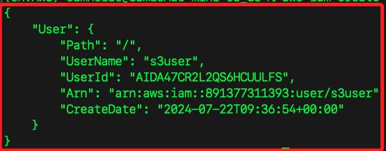
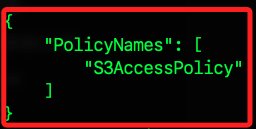
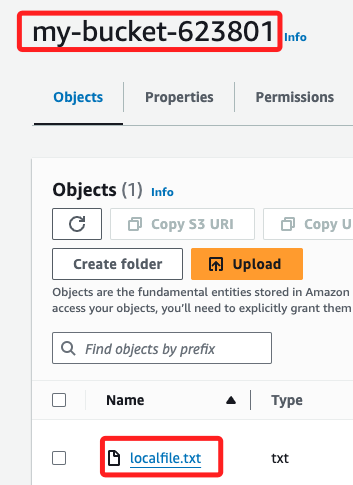
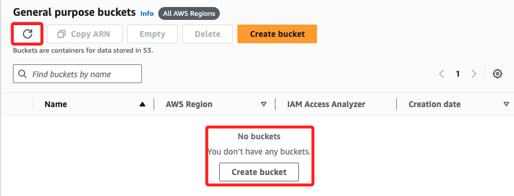

# 建立 S3 Bucket

_透過 AWS CLI 操作 S3，以下是一個完整的操作步驟，從零開始，最後刪除並還原乾淨環境_

<br>

## 檢查指定帳號

_以下示範的指定帳號是 `s3user`，不再贅述_

1. 檢查指定帳號是否存在；若不存在會顯示 `NoSuchEntity`。

    ```bash
    aws iam get-user --user-name s3user --profile default
    ```

    _輸出：若存在會顯示帳號資訊_

    

<br>

2. 若存在，查詢指定帳號具有的附加政策。

    ```bash
    aws iam list-attached-user-policies --user-name s3user --profile default
    ```

<br>

3. 若存在，查詢指定帳號具有的內嵌政策。

    ```bash
    aws iam list-user-policies --user-name s3user --profile default
    ```

<br>

4. 若存在，查詢指定帳號的訪問密鑰。

    ```bash
    aws iam list-access-keys --user-name s3user --profile default
    ```

<br>

## 刪除指定帳號與設定

_這裡是基於練習實作，刪除先前建立的帳號 `s3user`，而刪除帳號前，要先刪除帳號的 `附加政策` 及 `內嵌政策`_

<br>

1. 列出並刪除指定帳號如 `s3user` 的 `附加政策`。

    ```bash
    aws iam list-attached-user-policies --user-name s3user --profile default --query 'AttachedPolicies[*].PolicyArn' --output text | xargs -n 1 -I {} aws iam detach-user-policy --user-name s3user --policy-arn {} --profile default
    ```

<br>

2. 刪除指定使用者如 `s3user` 的 `內嵌政策`。

    ```bash
    aws iam list-user-policies --user-name s3user --profile default --query 'PolicyNames' --output text | xargs -n 1 -I {} aws iam delete-user-policy --user-name s3user --policy-name {} --profile default
    ```

<br>

3. 刪除指定使用者如 `s3user` 的 `訪問密鑰`。

    ```bash
    aws iam list-access-keys --user-name s3user --profile default --query 'AccessKeyMetadata[*].AccessKeyId' --output text | xargs -n 1 -I {} aws iam delete-access-key --user-name s3user --access-key-id {} --profile default
    ```

<br>

4. 刪除指定使用者如 `s3user` 的登入設定；假如回傳 `NoSuchEntity`，表示使用者 `s3user` 沒有登入設定，故可跳過這步驟。

    ```bash
    aws iam delete-login-profile --user-name s3user --profile default
    ```

<br>

5. 刪除 SSH 公鑰。

    ```bash
    aws iam list-ssh-public-keys --user-name s3user --profile default --query 'SSHPublicKeys[*].SSHPublicKeyId' --output text | xargs -n 1 -I {} aws iam delete-ssh-public-key --user-name s3user --ssh-public-key-id {} --profile default
    ```

<br>

6. 刪除多因素驗證設備。

    ```bash
    aws iam list-mfa-devices --user-name s3user --profile default --query 'MFADevices[*].SerialNumber' --output text | xargs -n 1 -I {} aws iam deactivate-mfa-device --user-name s3user --serial-number {} --profile default
    ```

<br>

7. 刪除指定帳號；使用 `root` 權限的配置文件 `default`。

    ```bash
    aws iam delete-user --user-name s3user --profile default
    ```

<br>

## 建立使用者

1. 查詢當前有哪些 User；特別注意，會回傳一個列表，但不包含 root 帳號。

    ```bash
    aws iam list-users
    ```

    _輸出：無其他使用者_

    

<br>

2. 建立一個新的 IAM 用戶，命名為 `s3user`；以下資訊可不用紀錄，之後皆可查詢。

    ```bash
    aws iam create-user --user-name s3user
    ```

    

<br>

3. 創建 User 的訪問密鑰；要記錄好輸出的資訊，因為後續步驟將用於編輯配置文件，建議存放在專案中的 `.env` 文件；再次強調，該文件內容將無法再度透過查詢取得。

    ```bash
    aws iam create-access-key --user-name s3user
    ```

    _結果_

    

<br>

## 設定 AWS CLI 配置文件

_設定指定配置文件的內容_

<br>

1. 依據前面步驟建立的資訊，在本地配置名為 `s3user` 的 AWS CLI 配置檔案，可為配置檔案設置 `訪問金鑰`、`秘密金鑰`、`預設區域` 和 `輸出格式`；其中 `Default region name` 設置為 `us-east-1`，`Default output format` 設置為 `json`。

    ```bash
    aws configure --profile s3user
    ```

<br>

## 建立政策

1. 建立訪問 S3 的政策文件 `s3_policy.json`。

    ```bash
    touch s3_policy.json
    ```

<br>

2. 編輯政策文件 `s3_policy.json`。

    ```json
    {
        "Version": "2012-10-17",
        "Statement": [
            {
                "Effect": "Allow",
                "Action": "s3:*",
                "Resource": "*"
            }
        ]
    }
    ```

<br>

3. 這個政策也可以限縮範圍如下，這是比較建議的做法；特別注意，這裡似乎有兩個 `Action` 是無效的，之後會再修正。

    ```json
    {
        "Version": "2012-10-17",
        "Statement": [
            {
                "Effect": "Allow",
                "Action": [
                    "s3:PutBucketPolicy",
                    "s3:GetBucketPolicy",
                    "s3:ListBucket",
                    "s3:PutObject",
                    "s3:GetObject",
                    "s3:DeleteObject",
                    "s3:DeletePublicAccessBlock",
                    "s3:GetPublicAccessBlock",
                    "s3:PutEncryptionConfiguration",
                    "s3:GetEncryptionConfiguration",
                    "s3:DeleteBucket",
                    "s3:CreateBucket"
                ],
                "Resource": [
                    "arn:aws:s3:::my-bucket-623801",
                    "arn:aws:s3:::my-bucket-623801/*"
                ]
            }
        ]
    }
    ```

<br>

4. 將政策 `S3AccessPolicy` 添加到指定使用者，並授予指定的權限。

    ```bash
    aws iam put-user-policy --user-name s3user --policy-name S3AccessPolicy --policy-document file://s3_policy.json --profile default
    ```

<br>

5. 列出使用者的內嵌政策，已確認前面步驟確實完成。

    ```bash
    aws iam list-user-policies --user-name s3user --profile default
    ```

    

<br>

6. 查詢具體的內嵌政策內容。

    ```bash
    aws iam get-user-policy --user-name s3user --policy-name S3AccessPolicy --profile default
    ```

<br>

## 內嵌政策 VS. 附加政策

1. `內嵌政策` 是直接附加到用戶、組或角色上的 `JSON 格式政策文件`，這與 `附加政策（managed policy）` 不同；後者是 `獨立管理的政策`，可以附加到多個用戶、組或角色上。

<br>

2. `內嵌政策（inline policy）` 使用 `aws iam put-user-policy` 添加；`附加政策（managed policy）` 使用 `aws iam attach-user-policy` 附加；在前面步驟所添加的是 `內嵌政策`。

<br>

## 建立 S3 Bucket 對象

1. 建立 S3 Bucket；參數 `--bucket` 指定命名為 `my-bucket-623801`；參數 `--region` 指定區域；參數 `--profile` 使用指定配置文件，也就是指定使用者。

    ```bash
    aws s3api create-bucket --bucket my-bucket-623801 --region us-east-1 --profile s3user
    ```

    _輸出_

    ```json
    {
        "Location": "/my-bucket-623801"
    }
    ```

<br>

2. 假如命名不合法如已經存在，會得到錯誤訊息 `BucketAlreadyExists`。

    ```bash
    An error occurred (BucketAlreadyExists) when calling the CreateBucket operation: The requested bucket name is not available. The bucket namespace is shared by all users of the system. Please select a different name and try again.
    ```

<br>

3. 列出所有的 S3 Buckets；其中 Owner `gsam6239` 指的是 root 使用者。

    ```bash
    aws s3api list-buckets --profile s3user
    ```

    _輸出_

    ```json
    {
        "Buckets": [
            {
                "Name": "my-bucket-623801",
                "CreationDate": "2024-07-22T01:00:18+00:00"
            }
        ],
        "Owner": {
            "DisplayName": "gsam6239",
            "ID": "8c7ce1b0c7300ae640c613669ce0ef6f359b9ad4486d07f6812781d752bcf850"
        }
    }
    ```

<br>

## 操作 S3 Bucket

_以下所稱 Bucket 皆指 `S3 Bucket`，而指定 Bucket 皆為 `my-bucket-623801`，不再贅述_

<br>

1. 建立測試文件 `localfile.txt` 並寫入測試內容。

    ```bash
    echo "這是測試文件 localfile.txt" > localfile.txt
    ```

<br>

2. 上傳測試文件 `localfile.txt` 到指定 Bucket。

    ```bash
    aws s3 cp localfile.txt s3://my-bucket-623801/localfile.txt --profile s3user
    ```

    _完成時會顯示_

    ```bash
    upload: ./localfile.txt to s3://my-bucket-623801/localfile.txt  
    ```

    

<br>

3. 列出 Bucket 中的檔案。

    ```bash
    aws s3 ls s3://my-bucket-623801 --profile s3user
    ```

    _輸出_

    ```bash
    2024-07-22 09:10:05         12 localfile.txt
    ```

<br>

4. 從 Bucket下載檔案並命名為 `downloadfile.txt`。

    ```bash
    aws s3 cp s3://my-bucket-623801/localfile.txt downloadfile.txt --profile s3user
    ```

    _輸出_

    ```bash
    download: s3://my-bucket-623801/localfile.txt to ./downloadfile.txt
    ```

<br>

5. 刪除 S3 Bucket 中的檔案。

    ```bash
    aws s3 rm s3://my-bucket-623801/localfile.txt --profile s3user
    ```

    _輸出_

    ```bash
    delete: s3://my-bucket-623801/localfile.txt
    ```

    

<br>

_關於 Bucket 的刪除指令在最後面補充，避免在此刪除後，無法繼續後續演繹_

<br>

## 管理 Block Public Access 設置

_為了後續編輯 Bucket 政策的需要，可參考官方說明 [Configuring block public access settings for your account](https://docs.aws.amazon.com/AmazonS3/latest/userguide/configuring-block-public-access-account.html)_

<br>

1. 預設如下，封鎖了所有形式的公有存取權，也就是沒有任何公有存取權能夠應用到該 Bucket 及其物件上。

    

<br>

2. 先取得帳戶 ID 用於後續指令。

    ```bash
    aws sts get-caller-identity --profile default
    ```

    

<br>

3. 檢查當前 `帳戶級別` 的公共訪問設置，與控制台查詢結果是一致的。

    ```bash
    aws s3control get-public-access-block --account-id 891377311393 --profile default
    ```

    _輸出：全部都是封鎖狀態_

    

<br>

4. 配置或更新帳戶級別的公共訪問封鎖設置。

    ```bash
    aws s3control put-public-access-block --account-id 891377311393 --public-access-block-configuration BlockPublicAcls=false,IgnorePublicAcls=false,BlockPublicPolicy=false,RestrictPublicBuckets=false --profile default
    ```

<br>

5. 確認 Bucket 級別的公共訪問封鎖設置。

    ```bash
    aws s3api get-public-access-block --bucket my-bucket-623801 --profile default
    ```

    _輸出：封鎖已解除_

    

<br>

6. 若設定無法生效，可嘗試刪除 Bucket 級別的公共訪問封鎖設置；刪除後，該 Bucket 及其對象可以被設置為公共訪問，允許任何人訪。

    ```bash
    aws s3api delete-public-access-block --bucket my-bucket-623801 --profile default
    ```

    

<br>

7. 再次查詢會顯示 `NoSuchPublicAccessBlockConfiguration`，結果顯示 Bucket 級別的公共訪問封鎖設置已刪除。

    

<br>

## 設置 Bucket 政策

_與前面設置 `IAM User Policy` 不同，Bucket 政策是直接附加到 S3 Bucket；而 User 政策是附加到特定的 IAM 使用者或角色，用以控制該對象訪問 AWS 資源的權限。_

<br>

1. 建立 Bucket 政策文件，命名為 `bucket-policy.json`。

    ```bash
    touch bucket-policy.json
    ```

<br>

2. 編輯政策，允許 `所有人 (Principal: "*")` 對 `指定 Bucket（my-bucket-623801）` 中的對象執行 `s3:GetObject` 操作。

    ```json
    {
        "Version": "2012-10-17",
        "Statement": [
            {
                "Effect": "Allow",
                "Principal": "*",
                "Action": "s3:GetObject",
                "Resource": "arn:aws:s3:::my-bucket-623801/*"
            }
        ]
    }
    ```

<br>

3. 以下指令可設定或更新 S3 的政策，此處是將上述政策文件應用到指定的 Bucket `（my-bucket-623801）`；其中參數 `--bucket my-bucket-623801` 指定要設定的 S3 Bucket 是 `my-bucket-623801`；參數 `--policy` 指定政策名稱；參數 `--profile s3user` 指定使用的配置檔案。

    ```bash
    aws s3api put-bucket-policy --bucket my-bucket-623801 --policy file://bucket-policy.json --profile s3user
    ```

<br>

4. 建立伺服器端加密（SSE）文件 `encryption.json`。

    ```bash
    touch encryption.json
    ```

<br>

5. 編輯加密文件的政策，指定使用 `AES256 算法`，確保存儲在 S3 中的對象自動進行伺服器端加密。

    ```json
    {
        "Rules": [
            {
                "ApplyServerSideEncryptionByDefault": {
                    "SSEAlgorithm": "AES256"
                }
            }
        ]
    }
    ```

<br>

6. 對 S3 Bucket 設置伺服器端加密；可確保數據在存儲過程中安全的一個重要措施，幫助滿足合規要求，簡化加密管理，並降低數據洩露的風險；對於授權用戶來說，加密和解密過程通常是透明的，在讀取和寫入文件時不需要額外的操作，S3 會自動處理加密和解密；而未經授權者即使獲得了加密文件，由於沒有解密密鑰，也無法解密文件，確保了數據的安全性。

    ```bash
    aws s3api put-bucket-encryption --bucket my-bucket-623801 --server-side-encryption-configuration file://encryption.json --profile s3user
    ```

<br>

7. 在上傳單一對象時指定加密選項，這樣只對指定的對象進行加密。

    ```bash
    aws s3 cp localfile.txt s3://my-bucket-623801/localfile.txt --sse AES256 --profile s3user
    ```

    _輸出_

    ```bash
    upload: ./localfile.txt to s3://my-bucket-623801/localfile.txt   
    ```

<br>

8. 查看指定對象的元數據，包括加密信息，用以確認對象已經使用伺服器端加密；其中 `"ServerSideEncryption": "AES256"` 就是加密的資訊。

    ```bash
    aws s3api head-object --bucket my-bucket-623801 --key localfile.txt --profile s3user
    ```

    _輸出_

    ```json
    {
        "AcceptRanges": "bytes",
        "LastModified": "2024-07-22T01:35:01+00:00",
        "ContentLength": 12,
        "ETag": "\"3591d2c5f96c1cda19b7c82c326ce67b\"",
        "ContentType": "text/plain",
        "ServerSideEncryption": "AES256",
        "Metadata": {}
    }
    ```

<br>

## 重新授權

_特別注意，若遇到權限問題而重新設定政策，需再次運行這個部分來重新授權_

<br>

1. 使用 `根帳戶` 設置 Bucket 政策。

    ```bash
    aws s3api put-bucket-policy --bucket my-bucket-623801 --policy file://bucket-policy.json --profile default
    ```

<br>

2. 再次執行附加政策到 `s3user`。

    ```bash
    aws iam put-user-policy --user-name s3user --policy-name S3AccessPolicy --policy-document file://s3_policy.json --profile default
    ```

<br>

_以上從零開始，實作了建立 IAM User、配置 AWS CLI、建立 Policy、建立並操作 Bucket、管理 Public Access、設置 Bucket Policy，接下來要刪除一切設定並還原環境。_

<br>

## 還原環境

1. 刪除 Bucket 之前，請確認 Bucket 中沒有對象。

    ```bash
    aws s3api list-objects --bucket my-bucket-623801 --profile s3user
    ```

<br>

2. 如果有對象要先刪除。

    ```bash
    aws s3 rm s3://my-bucket-623801 --recursive --profile s3user
    ```

    _輸出_

    ```bash
    delete: s3://my-bucket-623801/localfile.txt
    ```

<br>

3. 刪除指定 S3 Bucket。

    ```bash
    aws s3api delete-bucket --bucket my-bucket-623801 --region us-east-1 --profile s3user
    ```

    

<br>

4. 刪除附加政策。

    ```bash
    aws iam list-attached-user-policies --user-name s3user --profile default --query 'AttachedPolicies[*].PolicyArn' --output text | xargs -n 1 -I {} aws iam detach-user-policy --user-name s3user --policy-arn {} --profile default
    ```

<br>

5. 查詢附加政策是否都已刪除。

    ```bash
    aws iam list-attached-user-policies --user-name s3user --profile default
    ```

<br>

6. 刪除內嵌政策。

    ```bash
    aws iam list-user-policies --user-name s3user --profile default --query 'PolicyNames' --output text | xargs -n 1 -I {} aws iam delete-user-policy --user-name s3user --policy-name {} --profile default
    ```

<br>

7. 確認內嵌策略都已刪除。

    ```bash
    aws iam list-user-policies --user-name s3user --profile default
    ```

<br>

8. 刪除 User 的訪問密鑰。

    ```bash
    aws iam list-access-keys --user-name s3user --profile default --query 'AccessKeyMetadata[*].AccessKeyId' --output text | xargs -n 1 -I {} aws iam delete-access-key --user-name s3user --access-key-id {} --profile default
    ```

<br>

9. 刪除 s3user 的登入設定。

    ```bash
    aws iam delete-login-profile --user-name s3user --profile default
    ```

<br>

10. 列出多因素驗證設備。

    ```bash
    aws iam list-mfa-devices --user-name s3user --profile default
    ```

<br>

11. 若有需要則刪除多因素驗證設備。

    ```bash
    aws iam list-mfa-devices --user-name s3user --profile default --query 'MFADevices[*].SerialNumber' --output text | xargs -n 1 -I {} aws iam deactivate-mfa-device --user-name s3user --serial-number {} --profile default
    aws iam list-virtual-mfa-devices --profile default --query 'VirtualMFADevices[?User.UserName==`s3user`].SerialNumber' --output text | xargs -n 1 -I {} aws iam delete-virtual-mfa-device --serial-number {} --profile default
    ```

<br>

12. 列出 SSH 公鑰。

    ```bash
    aws iam list-ssh-public-keys --user-name s3user --profile default
    ```

<br>

13. 若有需要則刪除 SSH 公鑰。

    ```bash
    aws iam list-ssh-public-keys --user-name s3user --profile default --query 'SSHPublicKeys[*].SSHPublicKeyId' --output text | xargs -n 1 -I {} aws iam delete-ssh-public-key --user-name s3user --ssh-public-key-id {} --profile default
    ```

<br>

14. 列出服務特定憑證。

    ```bash
    aws iam list-service-specific-credentials --user-name s3user --profile default
    ```

<br>

15. 若有需要則進行刪除服務特定憑證。

    ```bash
    aws iam list-service-specific-credentials --user-name s3user --profile default --query 'ServiceSpecificCredentials[*].ServiceSpecificCredentialId' --output text | xargs -n 1 -I {} aws iam delete-service-specific-credential --user-name s3user --service-specific-credential-id {} --profile default
    ```

<br>

16. 確認所有策略和資源已刪除後，刪除用戶。

    ```bash
    aws iam delete-user --user-name s3user --profile default
    ```

<br>

17. 刪除過程中建立的所有文件；徹底還原練習環境。

    ```bash
    rm bucket-policy.json downloadfile.txt encryption.json localfile.txt s3_policy.json
    ```

<br>

___

_END_