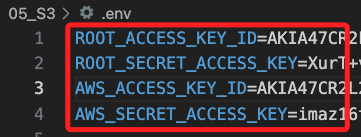

# 自動化操作

_以上的 AWS CLI 指令可以打包為 Shell 腳本，並且將不同功能分開打包。_

<br>

## 建立根用戶密鑰

1. 新建腳本 `rotate_root_keys.sh`。

    ```bash
    touch rotate_root_keys.sh
    ```

<br>

2. 編輯腳本 `rotate_root_keys.sh`；這個腳本會將根用戶的憑證寫入 `.env`。

    ```bash
    #!/bin/bash

    # 檢查 .env 文件是否存在，如果不存在則創建它
    if [ ! -f .env ]; then
        touch .env
    fi

    # 確保 AWS CLI 配置已設置根用戶憑證
    aws sts get-caller-identity --profile default

    # 檢查上一步是否成功
    if [ $? -ne 0 ]; then
        echo "AWS CLI 配置的根用戶憑證無效。請檢查您的 AWS CLI 配置。"
        exit 1
    fi

    # 從現有 AWS 配置文件中獲取根用戶憑證並寫入 .env 文件
    ROOT_ACCESS_KEY_ID=$(aws configure get aws_access_key_id --profile default)
    ROOT_SECRET_ACCESS_KEY=$(aws configure get aws_secret_access_key --profile default)

    echo "ROOT_ACCESS_KEY_ID=$ROOT_ACCESS_KEY_ID" > .env
    echo "ROOT_SECRET_ACCESS_KEY=$ROOT_SECRET_ACCESS_KEY" >> .env

    echo "Root user keys have been stored in .env file."
    ```

<br>

3. 授權腳本可執行 `+x`。

    ```bash
    chmod +x rotate_root_keys.sh
    ```

<br>

4. 運行腳本 `rotate_root_keys.sh`。

    ```bash
    ./rotate_root_keys.sh
    ```

    _輸出_

    

<br>

5. `.env` 文件會寫入密鑰。

    

<br>

## 建立 IAM User

1. 新建一個腳本，命名為 `create_user.sh`；這個腳本會建立新的 IAM User `s3user`。

    ```bash
    touch create_user.sh
    ```

<br>

2. 編輯腳本 `create_user.sh`。

    ```bash
    #!/bin/bash

    # 檢查 .env 文件是否存在，如果不存在則創建它
    if [ ! -f .env ]; then
        echo ".env 文件不存在，請先運行根用戶密鑰腳本。"
        exit 1
    fi

    # 讀取 .env 文件
    export $(grep -v '^#' .env | xargs)

    # 創建一個新的 IAM 用戶，命名為 s3user
    aws iam create-user --user-name s3user --profile default

    # 創建訪問密鑰，並將結果輸出到 .env 文件
    aws iam create-access-key --user-name s3user --query 'AccessKey.[AccessKeyId,SecretAccessKey]' --output text --profile default | while read access_key secret_key; do
        echo "AWS_ACCESS_KEY_ID=$access_key" >> .env
        echo "AWS_SECRET_ACCESS_KEY=$secret_key" >> .env
    done
    ```

<br>

3. 授予腳本執行權限。

    ```bash
    chmod +x create_user.sh
    ```

<br>

4. 運行腳本。

    ```bash
    ./create_user.sh
    ```

    _輸出_

    

<br>

5. 可查看自動添加的敏感資訊文件 `.env`。

    

<br>

## 處理敏感資訊

_若要手動建立敏感資訊可依據這個步驟，不過在上一個單元中，是會自動化建立敏感的_

<br>

1. 建立文件。

    ```bash
    touch .env
    ```

<br>

2. 編輯內容。

    ```json
    ROOT_ACCESS_KEY_ID=A
    ROOT_SECRET_ACCESS_KEY=
    AWS_ACCESS_KEY_ID=
    AWS_SECRET_ACCESS_KEY=
    ```

<br>

## 添加 User 政策

1. 新增腳本 `create_user_policy.sh`。

    ```bash
    touch create_user_policy.sh
    ```

<br>

2. 編輯腳本 `create_user_policy.sh`。

    ```bash
    #!/bin/bash

    # 讀取 .env 文件
    export $(grep -v '^#' .env | xargs)

    # 建立政策文件
    cat <<EOL > s3_policy.json
    {
        "Version": "2012-10-17",
        "Statement": [
            {
                "Effect": "Allow",
                "Action": [
                    "s3:PutBucketPolicy",
                    "s3:GetBucketPolicy",
                    "s3:ListBucket",
                    "s3:PutObject",
                    "s3:GetObject",
                    "s3:DeleteObject",
                    "s3:PutBucketPublicAccessBlock",
                    "s3:PutEncryptionConfiguration",
                    "s3:GetEncryptionConfiguration",
                    "s3:DeleteBucket",
                    "s3:CreateBucket"
                ],
                "Resource": [
                    "arn:aws:s3:::my-bucket-623801",
                    "arn:aws:s3:::my-bucket-623801/*"
                ]
            }
        ]
    }
    EOL

    # 使用根用戶附加政策到 s3user
    aws iam put-user-policy --user-name s3user --policy-name S3AccessPolicy --policy-document file://s3_policy.json --profile default
    ```

<br>

3. 授予腳本執行權限。

    ```bash
    chmod +x create_user_policy.sh
    ```

<br>

4. 執行建立用戶政策的腳本。

    ```bash
    ./create_user_policy.sh
    ```

<br>

5. 在主控台 `Users` 中的 `Permissions` 頁籤中可查看政策 `S3AccessPolicy`。

    

<br>

## 建立 Bucket 腳本

1. 新增腳本 `create_s3_bucket.sh`。

    ```bash
    touch create_s3_bucket.sh
    ```

<br>

2. 編輯腳本 `create_s3_bucket.sh`。

    ```bash
    #!/bin/bash

    # 讀取 .env 文件
    export $(grep -v '^#' .env | xargs)

    # 設定用戶配置
    aws configure set aws_access_key_id $AWS_ACCESS_KEY_ID --profile s3user
    aws configure set aws_secret_access_key $AWS_SECRET_ACCESS_KEY --profile s3user
    aws configure set region us-east-1 --profile s3user
    aws configure set output json --profile s3user

    # 建立 S3 Bucket
    aws s3api create-bucket --bucket my-bucket-623801 --region us-east-1 --profile s3user

    # 建立測試文件
    echo "這是測試文件 localfile.txt" > localfile.txt

    # 上傳文件到 S3
    aws s3 cp localfile.txt s3://my-bucket-623801/localfile.txt --profile s3user
    ```

<br>

3. 授予腳本執行權限。

    ```bash
    chmod +x create_s3_bucket.sh
    ```

<br>

4. 執行 S3 的操作腳本。

    ```bash
    ./create_s3_bucket.sh
    ```

    _輸出_

    

<br>

5. 在腳本中，`export $(grep -v '^#' .env | xargs)` 命令會去讀取 `.env` 文件中的變量並將其導出為 `環境變量`，然後在設置 AWS 配置時，使用 `$AWS_ACCESS_KEY_ID` 和 `$AWS_SECRET_ACCESS_KEY` 來載入環境變量。

<br>

6. 在主控台的 S3 中可以看到這個 Bucket。

    

<br>

7. 點擊進入可以看到上傳的 `localfile.txt`。

    

<br>

## 查詢相關設置

1. 新增腳本，命名為 `query_s3_settings.sh`。

    ```bash
    touch query_s3_settings.sh
    ```

<br>

2. 編輯腳本；需要首先確保 S3 Bucket 存在且有適當的權限。

    ```bash
    #!/bin/bash

    # 查詢指定帳號資訊
    aws iam get-user --user-name s3user --profile default

    # 查詢附加政策
    aws iam list-attached-user-policies --user-name s3user --profile default

    # 查詢內嵌政策
    aws iam list-user-policies --user-name s3user --profile default

    # 查詢訪問密鑰
    aws iam list-access-keys --user-name s3user --profile default

    # 檢查 S3 Bucket 是否存在並查詢設置
    aws s3api head-bucket --bucket my-bucket-623801 --profile s3user
    if [ $? -eq 0 ]; then
        aws s3api list-buckets --profile s3user
        aws s3 ls s3://my-bucket-623801 --profile s3user
        aws s3api get-public-access-block --bucket my-bucket-623801 --profile default
        aws s3api head-object --bucket my-bucket-623801 --key localfile.txt --profile s3user
    else
        echo "S3 Bucket 'my-bucket-623801' 不存在或無權訪問。"
    fi
    ```

<br>

3. 授予腳本執行權限。

    ```bash
    chmod +x query_s3_settings.sh
    ```

<br>

4. 執行建立 S3 Bucket 的腳本。

    ```bash
    ./query_s3_settings.sh
    ```

<br>

## 刪除 S3 及相關設置

1. 新增腳本，命名為 `delete_s3_bucket.sh`。

    ```bash
    touch delete_s3_bucket.sh
    ```

<br>

2. 編輯腳本。

    ```bash
    #!/bin/bash

    BUCKET_NAME="my-bucket-623801"
    PROFILE="s3user"
    ROOT_PROFILE="default"
    USER_NAME="s3user"

    # 刪除 Bucket 中的文件
    echo "正在刪除 S3 Bucket 中的文件..."
    aws s3 rm s3://$BUCKET_NAME --recursive --profile $PROFILE

    # 刪除 S3 Bucket
    echo "正在刪除 S3 Bucket..."
    aws s3api delete-bucket --bucket $BUCKET_NAME --region us-east-1 --profile $PROFILE

    # 刪除使用者的附加政策
    echo "正在刪除使用者的附加政策..."
    aws iam list-attached-user-policies --user-name $USER_NAME --profile $ROOT_PROFILE --query 'AttachedPolicies[*].PolicyArn' --output text | xargs -n 1 -I {} sh -c 'echo "刪除政策: {}"; aws iam detach-user-policy --user-name $USER_NAME --policy-arn {} --profile $ROOT_PROFILE'

    # 刪除使用者的內嵌政策
    echo "正在刪除使用者的內嵌政策..."
    aws iam list-user-policies --user-name $USER_NAME --profile $ROOT_PROFILE --query 'PolicyNames' --output text | xargs -n 1 -I {} sh -c 'echo "刪除內嵌政策: {}"; aws iam delete-user-policy --user-name $USER_NAME --policy-name {} --profile $ROOT_PROFILE'

    # 刪除使用者的訪問密鑰
    echo "正在刪除使用者的訪問密鑰..."
    aws iam list-access-keys --user-name $USER_NAME --profile $ROOT_PROFILE --query 'AccessKeyMetadata[*].AccessKeyId' --output text | xargs -n 1 -I {} sh -c 'echo "刪除訪問密鑰: {}"; aws iam delete-access-key --user-name $USER_NAME --access-key-id {} --profile $ROOT_PROFILE'

    # 刪除使用者
    echo "正在刪除使用者..."
    aws iam delete-user --user-name $USER_NAME --profile $ROOT_PROFILE

    # 刪除本地文件
    echo "正在刪除本地文件..."
    rm -v s3_policy.json localfile.txt

    echo "所有操作已完成。"
    ```

<br>

3. 授予腳本執行權限。

    ```bash
    chmod +x delete_s3_bucket.sh
    ```

<br>

4. 執行建立 S3 Bucket 的腳本。

    ```bash
    ./delete_s3_bucket.sh
    ```

<br>

## 清除練習環境

1. 手動將相關文件都刪除。

    ```bash
    rm create_s3_bucket.sh create_user_policy.sh query_s3_settings.sh create_user.sh delete_s3_bucket.sh	rotate_root_keys.sh
    ```

<br>

___

_END_