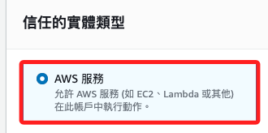
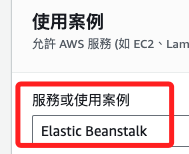
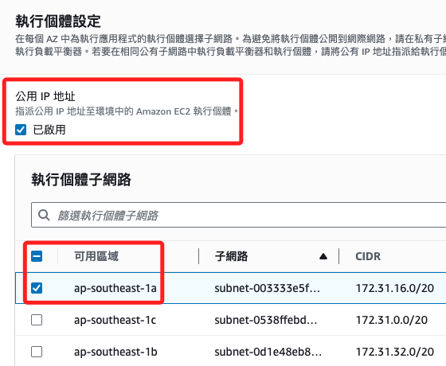

# Elastic Beanstalk

_完整的 EB 建立過程紀錄_

<br>

## 概述

1. AWS Elastic Beanstalk 是一個簡化部署和管理應用程序的服務，開發者只需上傳代碼，Elastic Beanstalk 會自動處理容量佈建、負載均衡、縮放以及應用程序的健康狀態監控。

<br>

2. 支援多種編程語言和應用程序平台，如 Java、.NET、Node.js、Python、Ruby、PHP、Go 和 Docker。

<br>

## 應用

1. 部署和測試 Web 應用程序。

<br>

2. 部署基於微服務架構的應用程序。

<br>

## 收費

_Elastic Beanstalk 本身不收取額外費用，但您需要支付所使用的 AWS 資源費用_


<br>

1. EC2：計算資源的使用費。

<br>

2. S3：存儲資源的使用費。

<br>

3. Elastic Load Balancing：負載均衡器的使用費。

<br>

4. RDS：資料庫資源的使用費。

<br>

## 配置 IAM 角色

_需要兩個角色：服務角色、EC2 執行個體設定檔；建立角色_

<br>

1. 登入 AWS 管理控制台，進入 `IAM`，建立一個新的角色。

    

<br>

2. 選擇 `AWS 服務`。

    

<br>

3. 然後選擇 `Elastic Beanstalk`。

    

<br>

4. 選擇 `Elastic Beanstalk - Customizable`，點擊 `下一步`。

    

<br>

5. 預設有兩個政策 `AWSElasticBeanstalkEnhancedHealth`、`AWSElasticBeanstalkService`，先點擊 `下一步`。

    

<br>

6. 自定義角色名稱 `MyAWSServiceRoleForElasticBeanstalk`，因為角色名稱的前綴 `AWSServiceRoleFor` 只使用給 AWS Service Linked Roles。

    

<br>

7. 要編輯 `信任政策`，在預設的 `Service` 中加入 `"ec2.amazonaws.com"`，但這裡點擊 `編輯` 可能會跳出，可最後再作修改，編輯後如下。

    ```json
    {
        "Version": "2012-10-17",
        "Statement": [
            {
                "Sid": "",
                "Effect": "Allow",
                "Principal": {
                    "Service": [
                        "elasticbeanstalk.amazonaws.com",
                        "ec2.amazonaws.com"
                    ]
                },
                "Action": [
                    "sts:AssumeRole"
                ],
                "Condition": {
                    "StringEquals": {
                        "sts:ExternalId": "elasticbeanstalk"
                    }
                }
            }
        ]
    }
    ```

<br>


8. 編輯 `新增許可` 加入以下項目，同樣地，若閃退，可最後再行編輯。

    ```bash
    # 提供對 Elastic Beanstalk 環境健康狀況的增強監控
    AWSElasticBeanstalkEnhancedHealth

    # 授予 Elastic Beanstalk 服務所需的基本權限
    # 允許 Elastic Beanstalk 在 AWS 資源上執行基本操作，如啟動和停止 EC2 實例、管理安全組等
    AWSElasticBeanstalkService

    # 允許 Elastic Beanstalk 管理平台更新
    # 包括自動應用安全修補程序和其他重要更新，以確保應用程序運行在最新且安全的環境中
    AWSElasticBeanstalkManagedUpdatesCustomerRolePolicy

    # 為使用多容器 Docker 部署的 Elastic Beanstalk 環境提供必要的權限
    # 允許這些環境管理和運行多個 Docker 容器
    AWSElasticBeanstalkMulticontainerDocker

    # 為 Web 伺服器環境提供必要的權限
    # 允許實例上傳日誌文件到 Amazon S3，並執行其他與 Web 伺服器相關的操作
    AWSElasticBeanstalkWebTier

    # 為工作環境提供必要的權限
    # 允許實例上傳日誌文件到 Amazon S3，使用 Amazon SQS 來監控應用程序的任務隊列，使用 Amazon DynamoDB 進行領導選舉，並使用 Amazon CloudWatch 發佈健康狀態指標
    AWSElasticBeanstalkWorkerTier
    ```

<br>

9. 建立角色。

    

<br>

## 新增許可

_針對以上兩個要補做的部分_

<br>

1. 進入前一個步驟建立的角色中，點擊 `新增許可`，並選擇 `連接政策`。

    

<br>

2. 添加前面步驟說明的政策，兩個預設的政策不再贅述。

    ```bash
    AWSElasticBeanstalkManagedUpdatesCustomerRolePolicy
    AWSElasticBeanstalkMulticontainerDocker
    AWSElasticBeanstalkWebTier
    AWSElasticBeanstalkWorkerTier
    ```

<br>

3. 完成時點擊 `新增許可`。

    

<br>

## 信任關係

1. 切換到 `信任關係`，並點擊 `編輯信任政策`。

    

<br>

2. 編輯鍵 `Service` 的值，原本是單一值，改寫為 `列表 []` 並添加一個項目；特別注意，AWS 設定文件對於格式要求非常嚴格，若有錯誤會顯示紅色警告。

    ```json
    {
        "Version": "2012-10-17",
        "Statement": [
            {
                "Sid": "",
                "Effect": "Allow",
                "Principal": {
                    "Service": [
                        "elasticbeanstalk.amazonaws.com",
                        "ec2.amazonaws.com"
                    ]
                },
                "Action": [
                    "sts:AssumeRole"
                ],
                "Condition": {
                    "StringEquals": {
                        "sts:ExternalId": "elasticbeanstalk"
                    }
                }
            }
        ]
    }
    ```

<br>

3. 完成後點擊 `更新政策`。

    

<br>

## 服務角色 & EC2 執行個體設定檔

_兩者都是 IAM 角色，但用途不同_

<br>

1. 服務角色 (Service Role) 是在 EB 中用來管理和配置環境時使用的角色，如啟動、停止和擴展 EC2 執行個體，訪問其他 AWS 服務所需的資源；表示為 `arn:aws:iam::891377311393:role/MyRole-EC2-EB`，`ARN` 提供唯一標識 AWS 資源的方法，確保在任何上下文中都能唯一確定這個角色；`aws` 表示資源屬於 AWS，`iam` 表示資源類型是 IAM，`891377311393` 是 AWS 帳戶 ID；最終則是具體的角色名稱。

<br>

2. EC2 執行個體設定檔 (EC2 Instance Profile)是分配給 EB 環境中的 EC2 執行個體的角色，用於授予 EC2 訪問 AWS 資源的權限，如 S3 Bucket、CloudWatch、RDS 等；表示為 `aws-elasticbeanstalk-ec2-role`。

<br>

## 建立 PHP 腳本

1. 先編輯一個腳本待用。

    ```bash
    cd ~/Downloads && touch index.php && code index.php
    ```

<br>

2. 編輯內容如下。

    ```html
    <html>
        <head>
            <title>PHP Test</title>
        </head>
        <body>
            <?php echo '<p>PHP 測試腳本</p>'; ?>
        </body>
    </html>
    ```

<br>

3. 壓縮檔案並顯示檢查。

    ```bash
    zip index.zip index.php && ls -l index.zip
    ```

    

<br>

## 建立 Beanstalk 應用

1. 進入 `Beanstalk` 主控台，點擊右上角的 `建立應用程式`。

    

<br>

2. 自訂名稱 `_PHP_Demo_`；描述可有可無，任意編輯即可。

    

<br>

## 建立環境

1. 在應用中，點擊右上角 `建立新的環境`。

    

<br>

2. 環境層使用預設的 `Web 伺服器環境`。

    

<br>

3. 可使用預設的環境名稱。

    

<br>

4. `平台` 選擇 `PHP`，其餘使用自動選取的即可。

    

<br>

5. 上傳程式碼。

    

<br>

6. 自訂版本標籤。

    

<br>

7. 選擇從 `本機檔案` 上傳。

    

<br>

8. 選取前面步驟壓縮的 `index.zip` 檔案。

    

<br>

9. `組態預設 Presets` 部分勾選 `單一執行個體`。

    

<br>

10. 下一步。

    

<br>

## 設定服務存取

1. 在 `服務存取`設定，選擇 `使用現有的服務角色`，就是在前面建立的角色。

    

<br>

2. EC2 金鑰組，這是要通過 SSH 連接到 EC2 實例所使用，選擇任一組現有的 KeyPair 即可，這與其他設置無直接關係，然後 `下一步`。

    

<br>

3. 選擇 EC2 執行個體的設定檔。

    

<br>

## 設定網路功能、資料庫和標籤

1. 虛擬私有雲端 VPC 有一個選項可選。

    

<br>

2. 在 `執行個體設定`中，勾選 `已啟用` 公用 IP 地址，並選擇子網路 `ap-southeast-1a`。

    

<br>

3. 資料庫選除了 `1a` 以外的選項可都勾選如 `1b`、`1c` 等；這些子網路定義了資料庫的網絡範圍和可用區域，確保應用程序可順利連接和使用資料庫資源；特別注意，要確認 VPC 中是否包含至少兩個可用區域中的子網。

    

<br>

4. 勾選 `啟用資料庫`。

    

<br>

5. 設定使用者名稱、密碼。

    

<br>

6. 接下來其他設置都使用預設值即可，連續點擊三次 `下一步`。

    

<br>

7. 點擊 `提交`。

    

<br>

8. 接著顯示啟動環境，要等幾分鐘；真的得等幾分鐘。

    

<br>

9. 可觀察下方的 `事件` 或 `運作狀態`，任何錯誤訊息或警告都會顯示在這裡。

    

<br>

## 事件

1. 在 `Elastic Beanstalk` 啟動過程中，設定畫面最下方會有事件日誌可以查看。

    

<br>

## 完成

1. 當環境啟動完畢時會顯示如下。

    

<br>

2. 點擊應用程式中的 `網域`，即可訪問這個 PHP 應用。

    

<br>

___

_END_