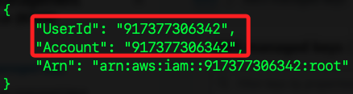
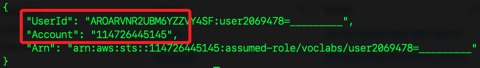
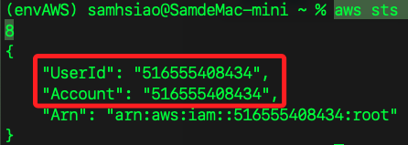
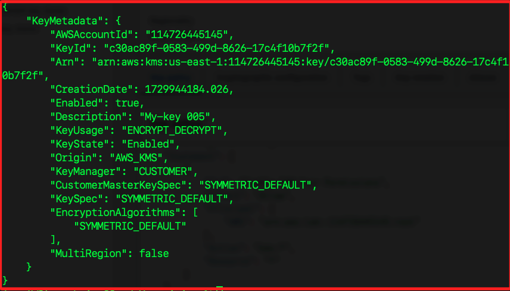
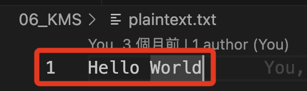
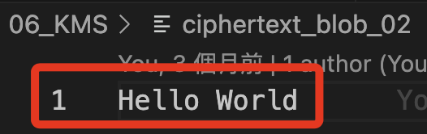
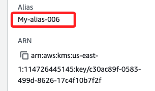
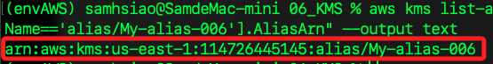
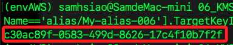
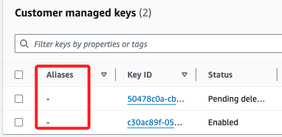

# 關於 KMS 加密

_Key Management Service_

<br>

## 簡介

_簡單文字敘述_

<br>

1. KMS 是一個獨立的服務，提供集中化的密鑰管理服務，用於建立、管理和控制加密密鑰的使用。

    

<br>

2. KMS 密鑰分為 `對稱密鑰` 和 `非對稱密鑰`；加密或解密時，用戶或服務調用 `KMS API` 使用指定的 KMS 密鑰進行加密或解密操作，完成時返回加密結果或返回原始資料。

<br>

3. 可為 KMS 密鑰建立別名作為易記標識符，簡化密鑰的使用和管理；KMS 密鑰可應用於 AWS 的多種服務上，如 S3、EBS、RDS、Lambda 等。

<br>

4. KMS 服務分為兩種；其一，`AWS managed keys` 是由 AWS 自動管理的密鑰，用於 AWS 服務的預設加密需求，無需用戶手動管理；其二， `Customer managed keys` 是由用戶建立和管理的密鑰，用戶可自定義密鑰的政策、旋轉、啟用、禁用等設置。

    

5. `KMS_KEY_ID` 是密鑰的唯一標識符，格式可以是文字 `alias/<alias_name>`、ARN `arn:aws:kms:<region>:<account-id>:key/<key-id>`、UUID `abcd1234-5678-90ab-cdef-EXAMPLEKEY`）；在主控台 KMS 可查看其密鑰 ID、別名、ARN。

<br>

## 準備工作

1. 準備一個文檔用來記錄；操作細節不贅述，前面寫過很多次了。

```bash
# 第一部分：複製 AWS CLI 貼上，格式不重要，稍後會直接覆蓋
[default]
aws_access_key_id=
aws_secret_access_key=
aws_session_token=

# 第二部分：建立環境變數
export AWS_ACCESS_KEY_ID=$aws_access_key_id
export AWS_SECRET_ACCESS_KEY=$aws_secret_access_key
export AWS_SESSION_TOKEN=$aws_session_token

# 第三部分：設定變數
KEY_ID=
```

<br>

2. 確認用戶資訊。

    ```bash
    aws sts get-caller-identity
    ```

<br>

## 查詢現有 KMS 資訊

_指令查詢並比對主控台資訊_

<br>

1. 查詢所有 KMS 密鑰的 ID；這個輸出包含了 `AWS managed keys` 與 `Customer managed keys`，輸出的結果是無序的。

    ```bash
    aws kms list-keys
    ```

    _輸出_

    

<br>

2. 在主控台中會看到三個 `AWS managed keys`。

    

<br>

3. 特別說明，透過 CLI 查詢的密鑰包還 `刪除排程中的密鑰`、`其他區域的密鑰`，可使用以下指令逐一查詢。

    ```bash
    aws kms describe-key --key-id <密鑰-Id>
    ```

<br>

4. 如下就是一個已經刪除的密鑰。

    

<br>

## 關於參數 `--profile`

1. AWS CLi 指令可加入參數 `--profile` 來指定要使用哪一個帳號的設定檔，也就是設定在 `~/.aws` 中的各用戶；若要使用預設用戶 `default`，可將指令修改如下。

    ```bash
    aws sts get-caller-identity --profile default
    ```

    

<br>

2. 不使用參數，會以設定在環境變數中的設定檔為優先。

    ```bash
    aws sts get-caller-identity
    ```

    

<br>

3. 若要查詢設定檔 `samhsiao6238`。

    ```bash
    aws sts get-caller-identity --profile samhsiao6238
    ```

    

<br>

## 建立 KMS 密鑰

_開始實作_

<br>

1. 建立一個 KMS `對稱密鑰` 用於加密和解密資料，命名為 `My-key 005`，如果重複操作，建議更新名稱，因為 KMS 已刪除密鑰仍會保存在紀錄中；建立後會顯示在主控台的 `ustomer managed keys` 項目中；參數 `--description` 對密鑰添加描述，以便將來識別。

    ```bash
    KEY_ID=$(aws kms create-key --description "My-key 005" --query 'KeyMetadata.KeyId' --output text)
    ```

<br>

2. 假如沒有存入變數時，會顯示輸出。

    

<br>

3. 這個指令不支持直接指定別名，需要在建立後再使用 `aws kms create-alias` 為該密鑰建立別名。

    

<br>

## 建立別名

1. 取得指定密鑰 ID 的詳細信息，這裡示範指定的是前面步驟取得的變數 `KEY_ID`。

    ```bash
    aws kms describe-key --key-id $KEY_ID
    ```

    _輸出_

    

<br>

2. 為 KMS 密鑰建立別名，並將其指向目標密鑰的 ID 或 ARN，這是一個方便的標籤，允許使用更易記住的名稱來引用加密密鑰，而不是使用密鑰的 ARN（Amazon Resource Name）；參數 `--alias-name` 指定別名為 `alias/My-alias-005`，別名必須以 alias/ 開頭；參數 `--target-key-id` 指定目標密鑰的 ID 或 ARN，這裡指定變數 `KEY_ID` 中儲存的 ID。

    ```bash
    aws kms create-alias --alias-name alias/My-alias-005 --target-key-id $KEY_ID
    ```

    

<br>

## 補充說明參數

1. 可使用以下指令建立 KMS 密鑰；這個指令與原先的指令並無差異，只是顯式進行參數設置。

    ```bash
    aws kms create-key --description "My KMS Key" --key-usage ENCRYPT_DECRYPT --origin AWS_KMS
    ```

<br>

2. 指定 `--key-usage` 為 `ENCRYPT_DECRYPT`，也就是明確指出密鑰用於加密和解密操作，而省略該參數時將預設密鑰設置為 `ENCRYPT_DECRYPT`，不過顯式指定 `--key-usage` 可提升指令的可讀性。

<br>

3. `--origin` 參數設置 `AWS_KMS`，表示密鑰的來源是由 `AWS KMS` 自動管理的密鑰材料，省略參數預設也是 `AWS_KMS`；若未來需要生成自定義密鑰，可明確指定 `--origin EXTERNAL`。

<br>

4. 原指令有參數 `--profile` 並指定 `default`，也就是指定預設的憑證配置；如果未指定 `--profile`，系統也是使用預設的 AWS CLI 配置或當前環境中的預設憑證。

<br>

## 加密

1. 將明文 `Hello World` 保存到文件 `plaintext.txt`。

    ```bash
    echo -n "Hello World" > plaintext.txt
    ```

    

<br>

2. 加密文件中的明文並保存加密結果 `ciphertext_blob_01`。

    ```bash
    aws kms encrypt --key-id alias/My-alias-005 --plaintext fileb://plaintext.txt --output text --query CiphertextBlob | base64 --decode > ciphertext_blob_01
    ```

<br>

3. 這個文件是加密的，所以無法查看。

    

<br>

## 解密資料

1. 解密 `fileb://ciphertext_blob_01` 並保存為 `ciphertext_blob_02`。

    ```bash
    aws kms decrypt --ciphertext-blob fileb://ciphertext_blob_01 --output text --query Plaintext | base64 --decode > ciphertext_blob_02
    ```

    

<br>

2. 特別注意，使用 `cat` 指令查看文件時，有時尾綴會多一個符號 `%`，這並不是真正的文件內容，而是終端機顯示文件時提醒使用者文件結尾缺少換行符號所做的標記。

    ```bash
    cat ciphertext_blob_02
    ```

    

<br>

3. 可使用 `hexdump` 工具檢查文件末尾是否有多餘的字元。

    ```bash
    hexdump -C ciphertext_blob_02
    ```

    

<br>

## 密鑰別名

1. 列出所有的密鑰別名。

    ```bash
    aws kms list-aliases
    ```

<br>

2. 列出指定別名如 `My-alias-005` 的 ID。

    ```bash
    aws kms list-aliases --query "Aliases[?AliasName=='alias/My-alias-005'].TargetKeyId" --output text
    ```

    

<br>

3. 更新別名時，必須先刪除原本別名然後重新對別名命名；這裡示範將原本的別名 `My-alias-005` 改為 `My-alias-006`。

    ```bash
    aws kms delete-alias --alias-name alias/My-alias-005 && aws kms create-alias --alias-name alias/My-alias-006 --target-key-id $KEY_ID
    ```

    

<br>

4. 將現有別名指向另一個密鑰。

    ```bash
    aws kms update-alias --alias-name alias/My-alias-006 --target-key-id <另一個-KMS-ID>
    ```

<br>

5. 查詢指定別名密鑰的 ARN。

    ```bash
    aws kms list-aliases --query "Aliases[?AliasName=='alias/My-alias-006'].AliasArn" --output text
    ```

    _輸出_

    

<br>

11. 查詢指定別名密鑰的 ID。

    ```bash
    aws kms list-aliases --query "Aliases[?AliasName=='alias/My-alias-006'].TargetKeyId" --output text
    ```

    _輸出_

    

<br>

12. 刪除密鑰別名。

    ```bash
    aws kms delete-alias --alias-name alias/My-alias-006
    ```

    

<br>

## 各種服務的加密示範

_可不用實作，僅供指令參考_

<br>

1. 建立 S3 Bucket 時使用 KMS 進行伺服器端加密。

    ```bash
    aws s3api put-bucket-encryption --bucket my-bucket --server-side-encryption-configuration '{
        "Rules": [{
            "ApplyServerSideEncryptionByDefault": {
                "SSEAlgorithm": "aws:kms",
                "KMSMasterKeyID": "arn:aws:kms:us-east-1:123456789012:key/<密鑰-ID>"
            }
        }]
    }'
    ```

<br>

2. 對於 S3 的政策參數，可將其寫入政策文件如 `encryption-policy.json。

    ```json
    {
        "Rules": [
            {
                "ApplyServerSideEncryptionByDefault": {
                    "SSEAlgorithm": "aws:kms",
                    "KMSMasterKeyID": "arn:aws:kms:us-east-1:123456789012:key/<密鑰-ID>"
                }
            }
        ]
    }
    ```

<br>

3. 指令改用文件路徑來引用，如 `file://encryption-policy.json`。

    ```bash
    aws s3api put-bucket-encryption --bucket my-bucket --server-side-encryption-configuration file://encryption-policy.json
    ```

<br>

4. 建立 EBS 卷（volume）時可使用 KMS 加密；EBS（Elastic Block Store）是 AWS 的持久性塊儲存服務，用於為 EC2 提供儲存卷（volume）；而 EC2 是 AWS 的虛擬伺服器服務，用於運行應用和工作負載。

    ```bash
    aws ec2 create-volume --size 100 --region us-east-1 --availability-zone us-east-1a --encrypted --kms-key-id arn:aws:kms:us-east-1:123456789012:key/your-key-id
    ```

<br>

5. 建立 RDS 資料庫時可使用 KMS 加密。

    ```bash
    aws rds create-db-instance --db-instance-identifier mydbinstance --db-instance-class db.t2.micro --engine mysql --allocated-storage 20 --master-username admin --master-user-password password --storage-encrypted --kms-key-id arn:aws:kms:us-east-1:123456789012:key/your-key-id
    ```

<br>

6. 配置 Lambda 函數時可使用 KMS 加密環境變數；特別注意，加密的是環境變數而不是 Labda 本身。

    ```bash
    aws lambda create-function --function-name my-function --runtime nodejs14.x --role arn:aws:iam::123456789012:role/execution_role --handler index.handler --zip-file fileb://function.zip --environment Variables={KEY1=VALUE1,KEY2=VALUE2} --kms-key-arn arn:aws:kms:us-east-1:123456789012:key/your-key-id
    ```

<br>

## 範例解說

1. 使用前面步驟所建立別名為的 KMS 密鑰 `alias/My-alias-005`，透過以下指令將文件上傳到 S3，並使用該密鑰加密。

    ```bash
    aws s3 cp localfile.txt s3://my-bucket-623801/localfile.txt --sse aws:kms --sse-kms-key-id alias/my-key-alias
    ```

<br>

2. 或者使用密鑰 ARN 加密上傳的文件。

    ```bash
    aws s3 cp localfile.txt s3://my-bucket-623801/localfile.txt --sse aws:kms --sse-kms-key-id arn:aws:kms:us-east-1:123456789012:key/abcd1234-5678-90ab-cdef-EXAMPLEKEY
    ```

<br>

___

_END_