# 建立 Elastic Beanstalk 環境

 

## 建立應用

1. 搜尋並進入 `Elastic Beanstalk` 控制台。

    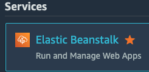

 

2. 在左側欄中，選擇 `Applications`，點擊右上角 `Create Application`。

    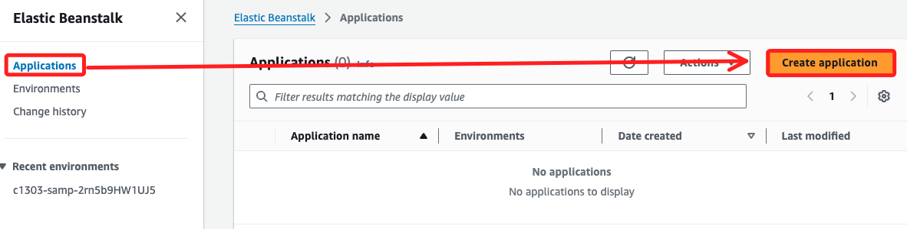

 

3. 自訂應用名稱，如 `PHPDemo`，點擊右下角 `Cretae`。

    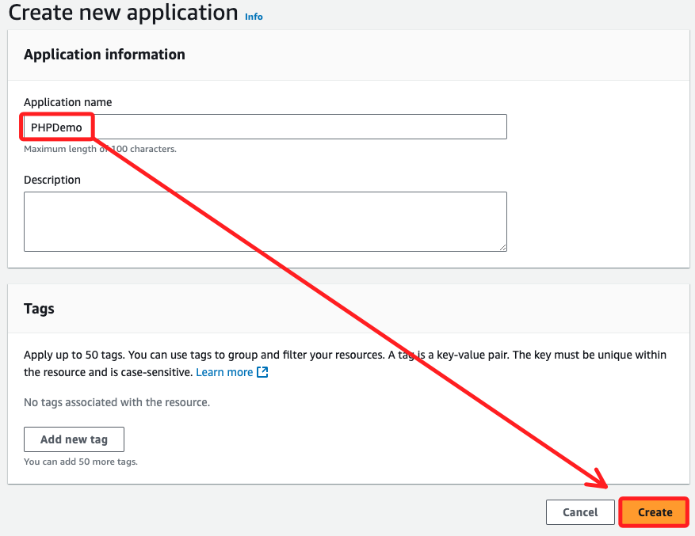

 

4. 回到清單就會看到，點擊進入應用中。

    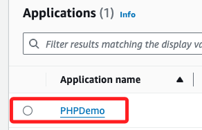

 

## 建立環境

1. 點擊右上方 `Create new environment` 建立新的環境。

    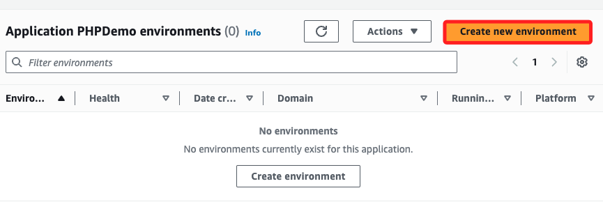

 

2. 選擇 `Web server environment`。

    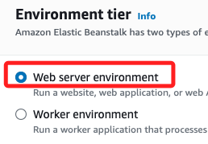

 

3. 在 `Platform` 區塊選擇 `PHP`，其餘使用預設帶出的設定。

    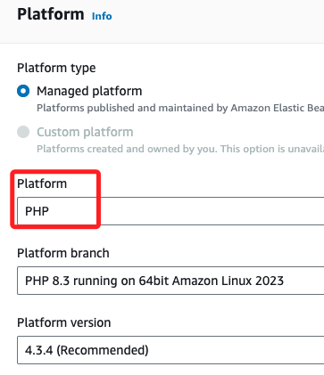

 

4. `Application code` 切換到 `Upload your code`，`Version label` 版本標籤寫入 `v01`。

    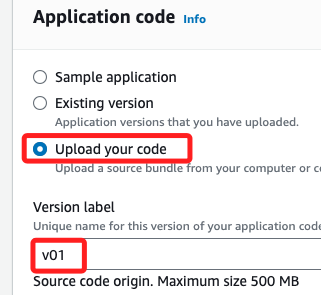

 

5. 點擊 `Local file`，選擇準備好的 `index.zip`。

    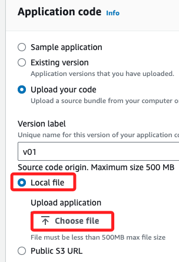

 

6. 點擊 `下一步`。

    

 

## 設定服務存取權限

1. 在 `服務角色` 區塊，選擇 `Use an existing service role for Service Role`；假如使用 Lab，可選擇 `LabRole`，假如是使用個人帳號，可使用其他步驟建立的角色如 `My-AWS-elasticbeastalk-ec2-role`；在 `EC2金鑰組` 部分也是一樣，在 Lab 中選擇預設的 `vockey`，或選擇自行建立的 `.pem` 文件；點擊 `下一步`。

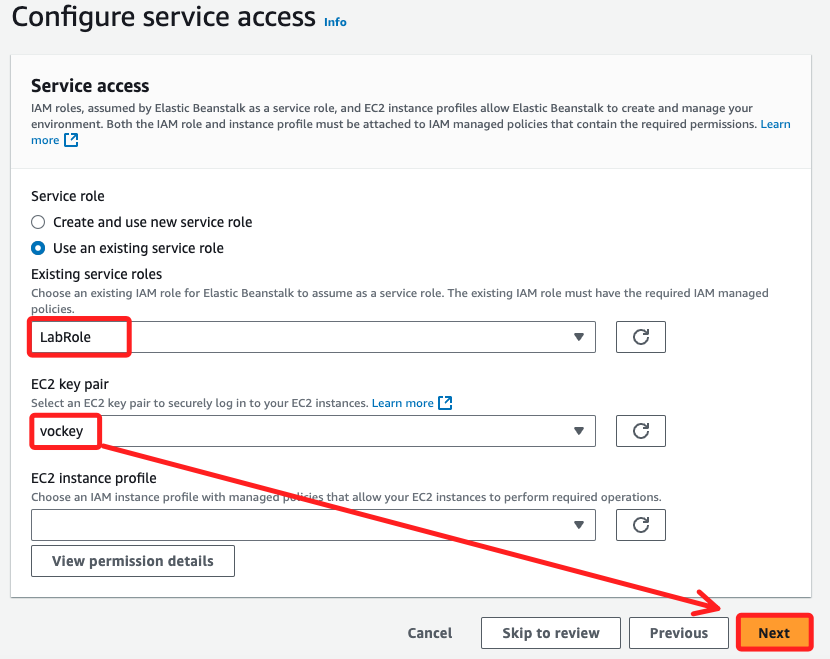

 

## 網路、資料庫

1. 選擇 VPC，展開下拉選單，選擇唯一一個可用的選項。

    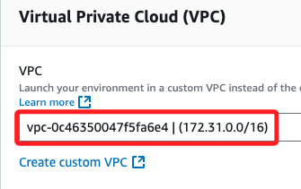

 

2. 在 `Public IP address` 部分，勾選 `Activated`，子網路勾選 `ap-southeast-1a`。

    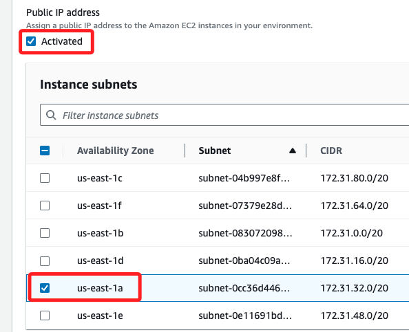

 

3. 資料庫子網路勾選 `ap-southeast-1c` 及 `ap-southeast-1b`。

    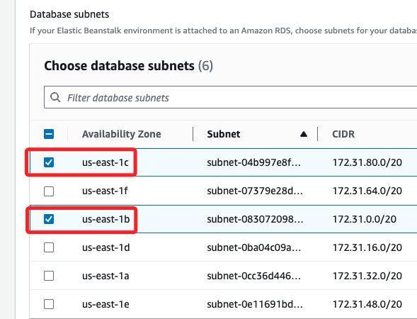

 

4. 接著打開 `Enable database` 啟用資料庫。

    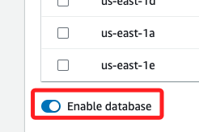

 

5. 自訂資料庫的使用者名稱為 `sam6238`，並且設定密碼。

    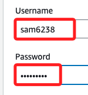

 

6. 然後點擊 `Next`。

    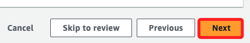

 

## 設定執行個體流量和擴展

_`Configure instance traffic and scaling - optional`；跳過，`Next`_

 

## 設定更新、監控和記錄

_`Configure updates, monitoring, and logging - optional`；跳過，`Next`_

 

## 檢閱

_沒問題就點擊 `提交`_

 

___

_END：先做到這_