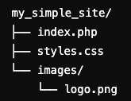

# 建立簡易 PHP 網站

_使用 VSCode_

<br>

## 步驟

1. 在專案路徑中建立資料結構。

    

<br>

2. index.php。

    ```html
    <!DOCTYPE html>
    <html lang="zh-TW">
    <head>
        <meta charset="UTF-8">
        <meta name="viewport" content="width=device-width, initial-scale=1.0">
        <title>簡易 PHP 站台</title>
        <link rel="stylesheet" href="styles.css">
    </head>
    <body>

        <!-- 頁首 -->
        <header>
            <div class="logo">
                
                <h1>歡迎來到我的網站</h1>
            </div>
            <nav>
                <ul>
                    <li><a href="#">首頁</a></li>
                    <li><a href="#">關於我們</a></li>
                    <li><a href="#">服務</a></li>
                    <li><a href="#">聯絡我們</a></li>
                </ul>
            </nav>
        </header>

        <!-- 主內容區域 -->
        <main>
            <section class="welcome">
                <h2>您好！歡迎光臨！</h2>
                <p>這是一個簡單的 PHP 站台範例。我們專注於提供高質量的內容和服務。</p>
                <button onclick="alert('感謝您的到訪！')">了解更多</button>
            </section>
        </main>

        <!-- 頁腳 -->
        <footer>
            <p>&copy; <?php echo date("Y"); ?> 我的網站 | 版權所有</p>
        </footer>

    </body>
    </html>
    ```

<br>

3. styles.css。

    ```css
    * {
        margin: 0;
        padding: 0;
        box-sizing: border-box;
        font-family: Arial, sans-serif;
    }

    body {
        line-height: 1.6;
        background-color: #f4f4f9;
        color: #333;
    }

    header {
        background-color: #333;
        color: #fff;
        padding: 10px 0;
        text-align: center;
    }

    header .logo img {
        width: 50px;
        vertical-align: middle;
    }

    header .logo h1 {
        display: inline;
        margin-left: 10px;
        font-size: 24px;
    }

    nav ul {
        list-style-type: none;
        margin-top: 10px;
    }

    nav ul li {
        display: inline;
        margin: 0 15px;
    }

    nav ul li a {
        color: #fff;
        text-decoration: none;
        font-weight: bold;
    }

    nav ul li a:hover {
        color: #ff6b6b;
    }

    main {
        padding: 20px;
        text-align: center;
    }

    .welcome h2 {
        color: #333;
        margin-bottom: 10px;
    }

    .welcome p {
        font-size: 18px;
        margin-bottom: 20px;
        color: #666;
    }

    button {
        padding: 10px 20px;
        background-color: #ff6b6b;
        color: #fff;
        border: none;
        cursor: pointer;
        font-size: 16px;
        border-radius: 5px;
    }

    button:hover {
        background-color: #ff4c4c;
    }

    footer {
        background-color: #333;
        color: #fff;
        text-align: center;
        padding: 10px 0;
        position: fixed;
        width: 100%;
        bottom: 0;
    }
    ```

<br>

4. 找一張任意圖片作為 logo。

    

<br>

5. 確認已經安裝 `php`。

    ```bash
    php -v
    ```

<br>

6. 在專案所在路徑啟動站台。

    ```bash
    php -S localhost:8000
    ```

<br>

7. 開啟瀏覽器訪問。

    ```bash
    http://localhost:8000
    ```

<br>

## 壓縮文件備用

1. 運行以下指令將資料夾 `my_simple_site` 壓縮為 `index.zip`。

    ```bash
    zip -r index.zip my_simple_site
    ```

<br>

___

_END_