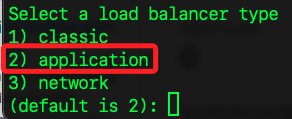

# 建立 EB 應用

_使用 EB CLI 建立 PHP Web 應用_

<br>

## 準備工作

1. 確認 EB CLI 已安裝。

   ```bash
   eb --version
   ```

   

<br>

2. 建立並進入專案資料夾；任意命名即可。

   ```bash
   cd ~/Desktop && mkdir _ex0715_ && cd _ex0715_
   ```

<br>

## 建立專案

_特別說明，最後系統會將公鑰上傳至 EC2，並與指定區域`us-east-1` 中的實例關聯。_

<br>

1. 初始化 EB 應用。

   ```bash
   eb init
   ```

<br>

2. 開始設定；區域 -> `1`：us-east-1。

   

<br>

3. 應用名稱，預設為資料夾名稱：_ex0715_(ENTER)

<br>

4. 選擇平台 PHP：(7)

<br>

5. 選擇 PHP 版本：PHP 8.3 running on 64bit Amazon Linux 2023(1)

<br>

6. 在這裡會看到一行提示，提到系統嘗試設定 `AWS CodeCommit` 作為版本控制系統來管理和同步代碼，但因為當前的專案沒有啟用版本控制，所以 CodeCommit 無法完成設定；這在下一個步驟會進行處理。

   

<br>

7. 是否希望為實例設置 SSH 訪問：(Y)

   

<br>

8. 命名 KeyPair，預設 vockey：(ENTER)

   

<br>

## 在專案建立 Git

_因為前面會看到訊息 `Cannot setup CodeCommit because there is no Source Control setup, continuing with initialization`_

1. 建立必要文件。

   ```bash
   touch .gitignore
   ```

<br>

2. 初始化 Git。

   ```bash
   git init
   ```

<br>

3. 添加文件到 Git。

   ```bash
   git add .
   ```

<br>

4. 提交文件到 Git。

   ```bash
   git commit -m "Initial commit"
   ```

   

<br>

## 建立 PHP 文件

_建立站台文件，假如在前面已經完成並壓縮為 `index.zip`，這裡可跳過。_

<br>

1. 建立 PHP 文件 `index.php`。

   ```bash 
   touch index.php && code index.php
   ```

<br>

2. 編輯 PHP 文件 `index.php`。

   ```php
   <?php
   echo "這是 Elastic Beanstalk 測試網頁應用。";
   ?>
   ```

<br>

## 建立 Elastic Beanstalk 環境

1. 建立環境。

   ```bash
   eb create
   ```

<br>

2. Environment Name，按下 `ENTER` 使用預設值。

   

<br>

3. DNS CNAME prefix，按下 `ENTER` 使用預設值。

   

<br>

4. Load balancer type，選擇 `2 (application)`，直接按下 `ENTER` 也是預設為 `2`。

   

<br>

5. 是否啟用 Spot Fleet requests政策，選擇 `N`，僅使用按需實例。

   

<br>

6. 顯示訊息，表示平台需要一個服務角色，Elastic Beanstalk 會嘗試建立一個服務角色；也可以使用 --service-role 選項指定自己的角色；按 `ENTER` 繼續，或按 `view` 查看；假如使用 Lab 可能出現以下訊息，表明當前使用的 IAM 使用者帳戶缺少足夠的權限來確認 aws-elasticbeanstalk-ec2-role 這個角色是否已存在，Elastic Beanstalk 預設需要這個角色來讓 EC2 實例訪問 AWS 資源、因為無法確認角色存在，因此會假設角色已經存在，並繼續初始化。

   

<br>

## 關於 --service-role

_建立 Elastic Beanstalk 環境時，可使用 `--service-role` 選項指定服務角色。_

<br>

1. 假設應用名稱為 `my-app`，環境名稱為 `my-environment`，服務角色名為 `MyElasticBeanstalkServiceRole`，指令如下。

   ```bash
   eb init -p php -r us-west-2 my-app
   eb create my-environment --service-role arn:aws:iam::YOUR_ACCOUNT_ID:role/MyElasticBeanstalkServiceRole
   ```

<br>

2. 在這個指令中，`arn:aws:iam::<自己得帳號 ID>:role/MyElasticBeanstalkServiceRole` 是服務角色的 `ARN（Amazon Resource Name）`，並要替換 `自己得帳號 ID` 為自己的 AWS 帳戶 ID。

<br>

## 開始建立應用

1. 完成以上步驟會開始進行建立，需要等上一段時間。 

   ```bash
   Creating application version archive "app-240714_184422381456".
   Uploading _ex0714_/app-240714_184422381456.zip to S3. This may take a while.
   Upload Complete.
   Environment details for: eb--ex0714--dev
   Application name: _ex0714_
   Region: us-east-1
   Deployed Version: app-240714_184422381456
   Environment ID: e-yyd8qug2mm
   Platform: arn:aws:elasticbeanstalk:us-east-1::platform/PHP 8.3 running on 64bit Amazon Linux 2023/4.3.0
   Tier: WebServer-Standard-1.0
   CNAME: eb--ex0714--dev.us-east-1.elasticbeanstalk.com
   Updated: 2024-07-14 10:44:28.534000+00:00
   Printing Status:
   2024-07-14 10:44:27    INFO    createEnvironment is starting.
   2024-07-14 10:44:28    INFO    Using elasticbeanstalk-us-east-1-730335644197 as Amazon S3 storage bucket for environment data.
   2024-07-14 10:44:54    INFO    Created security group named: sg-06902153e6c305969
   2024-07-14 10:44:54    INFO    Created security group named: awseb-e-yyd8qug2mm-stack-AWSEBSecurityGroup-v3lH1sI3PQC6
   2024-07-14 10:44:54    INFO    Created Auto Scaling launch configuration named: awseb-e-yyd8qug2mm-stack-AWSEBAutoScalingLaunchConfiguration-9qUI8snszvj5
   2024-07-14 10:45:10    INFO    Created target group named: arn:aws:elasticloadbalancing:us-east-1:730335644197:targetgroup/awseb-AWSEB-FPBPD40J1ATT/e633a004bf373d9b
   2024-07-14 10:45:25    INFO    Created Auto Scaling group named: awseb-e-yyd8qug2mm-stack-AWSEBAutoScalingGroup-8RVXdVVS5ul6
   2024-07-14 10:45:25    INFO    Waiting for EC2 instances to launch. This may take a few minutes.
   2024-07-14 10:45:25    INFO    Created CloudWatch alarm named: awseb-e-yyd8qug2mm-stack-AWSEBCloudwatchAlarmLow-4YKY9hCpnDFS
   2024-07-14 10:45:25    INFO    Created CloudWatch alarm named: awseb-e-yyd8qug2mm-stack-AWSEBCloudwatchAlarmHigh-Uj3v3v0eyldR
   2024-07-14 10:45:25    INFO    Created Auto Scaling group policy named: arn:aws:autoscaling:us-east-1:730335644197:scalingPolicy:2b20ff82-124a-43b4-9156-fb19edaf0532:autoScalingGroupName/awseb-e-yyd8qug2mm-stack-AWSEBAutoScalingGroup-8RVXdVVS5ul6:policyName/awseb-e-yyd8qug2mm-stack-AWSEBAutoScalingScaleDownPolicy-m6HisIS9KT8Q
   2024-07-14 10:45:25    INFO    Created Auto Scaling group policy named: arn:aws:autoscaling:us-east-1:730335644197:scalingPolicy:782b82e4-d073-4982-a2d2-12a4a7b4716a:autoScalingGroupName/awseb-e-yyd8qug2mm-stack-AWSEBAutoScalingGroup-8RVXdVVS5ul6:policyName/awseb-e-yyd8qug2mm-stack-AWSEBAutoScalingScaleUpPolicy-WHc4MN1JRlQz
   2024-07-14 10:48:01    INFO    Created load balancer named: arn:aws:elasticloadbalancing:us-east-1:730335644197:loadbalancer/app/awseb--AWSEB-Azb8xEwzinUC/b6f103f50cb9da6d
   2024-07-14 10:48:01    INFO    Created Load Balancer listener named: arn:aws:elasticloadbalancing:us-east-1:730335644197:listener/app/awseb--AWSEB-Azb8xEwzinUC/b6f103f50cb9da6d/e2fd7b3c6286bb45
   2024-07-14 10:48:05    INFO    Instance deployment: You didn't include a 'composer.json' file in your source bundle. The deployment didn't install Composer dependencies.
   2024-07-14 10:48:10    INFO    Instance deployment completed successfully.
   2024-07-14 10:49:15    INFO    Successfully launched environment: eb--ex0714--dev
   ```

<br>

## 說明 Create 過程

_Elastic Beanstalk 環境已經成功建立並啟動_

<br>

1. 應用版本存檔並上傳到 S3。

<br>

2. 建立安全群組、Auto Scaling 配置、目標組和 Auto Scaling 組。

<br>

3. 建立 CloudWatch 警報和擴展政策。

<br>

4. 建立負載均衡器和聽眾。

<br>

5. 部署應用實例，處理依賴項。

<br>

6. 環境成功建立並啟動。

<br>

## 確認角色的政策

1. AWSElasticBeanstalkManagedUpdatesCustomerRolePolicy

<br>

2. AWSElasticBeanstalkMulticontainerDocker

<br>

3. AWSElasticBeanstalkWebTier

<br>

4. AWSElasticBeanstalkWorkerTier

<br>

## 角色的信任關係

1. 進入所選定的角色，點擊 `信任關係` 頁籤，並更新內容如下。

   ```json
   {
      "Version": "2012-10-17",
         "Statement": [
         {
               "Effect": "Allow",
               "Principal": {
                  "Service": "ec2.amazonaws.com"
               },
               "Action": "sts:AssumeRole"
         },
         {
               "Effect": "Allow",
               "Principal": {
                  "Service": "elasticbeanstalk.amazonaws.com"
               },
               "Action": "sts:AssumeRole"
         }
      ]
   }
   ```

<br>

2. 設定後要重啟 Elastic Beanstalk 環境。

   ```bash
   aws elasticbeanstalk restart-app-server --environment-name Ex0716-env
   ```

<br>

3. 運行後會看到。

   

<br>

4. 重建當前目錄中的 Elastic Beanstalk 環境。

   ```bash
   eb rebuild
   ```

<br>

## 部署應用

1. 部署。

   ```bash
   eb deploy
   ```

<br>

___

_END：後補_