# RDS 入門

<br>

## 準備工作

1. 記錄文檔。

    ```bash
    Endpoint=
    ```

<br>

## 步驟

1. 登入系統，選擇 `RDS`。

    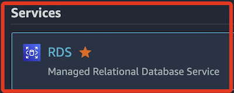

<br>

2. `Create database` 建立資料庫。

    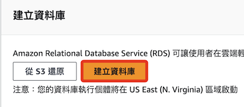

<br>

3. 這裡示範使用 `MySQL`。

    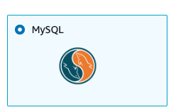

<br>

4. 在範本選擇 `Free tier` 免費方案。

    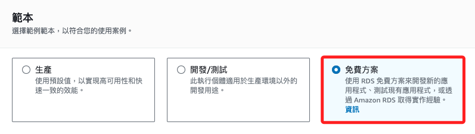

<br>

5. 為資料庫命名 `mydatabase-01`，該名稱必須為所有資料庫的唯一名稱，會以小寫的形式儲存。

    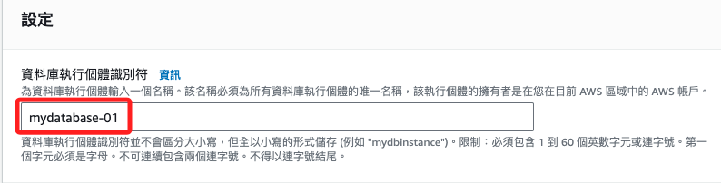

<br>

6. 修改 `Master username` 自訂帳號，預設是 `admin`，改為 `sam6238`。

    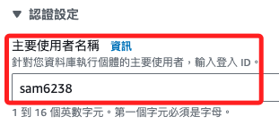

<br>

7. 建立 `Master password`。

    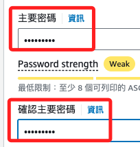

<br>

8. 在 `Public access` 選取 `Yes` 設定為公開存取。

    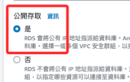

<br>

9. 其他都使用預設，點擊右下角的 `Create database` 建立資料庫。

    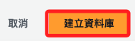

<br>

10. 跳出的視窗是建議的附加元件，點擊 `Close` 關閉，不做設定。

    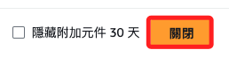

<br>

11. 會顯示正在鍵例，這需要一點時間。

    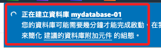

<br>

12. 完成時會顯示綠色背景通知。

    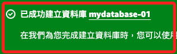

<br>

## 設定 Inbound Rules 傳入規則

_控制哪些 IP 地址和網路可以連接到 RDS 資料庫_

<br>

1. 點擊資料庫 `mydatabase-01` 進入詳細頁面。

    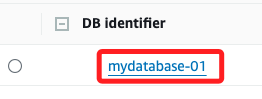

<br>

2. 在 `Security` 點擊下方安全群組 ID。

    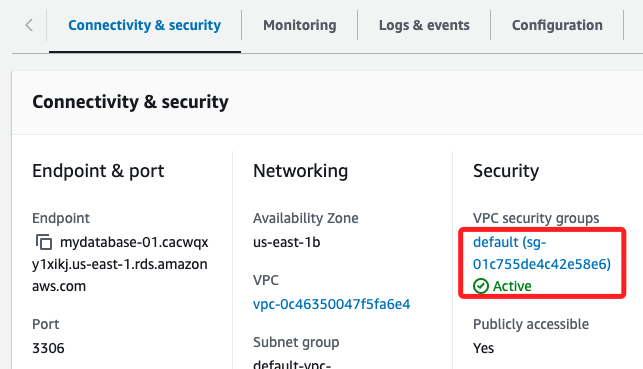

<br>

3. 點擊進入的是 `EC2 儀表板`。

    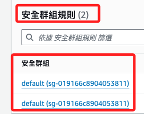

<br>

4. 再點擊一次進入安全群組 ID。

    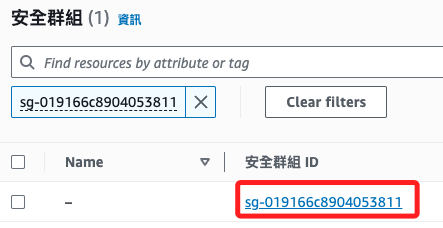

<br>

5. 預設進入 `Inbound rules` 進站規則頁籤，點擊右側的 `Edit inbound rules`。

    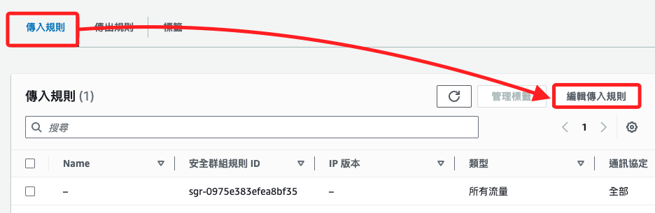

<br>

6. 點擊 `Add rule` 新增規則。

    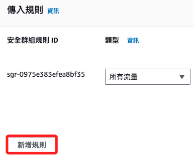

<br>

7. 添加一個 `MYSQL/Aurora`，並從選單中選取 `0.0.0.0/0`，下方有說明，這裡不做贅述；點擊右下角 `Save rules`。

    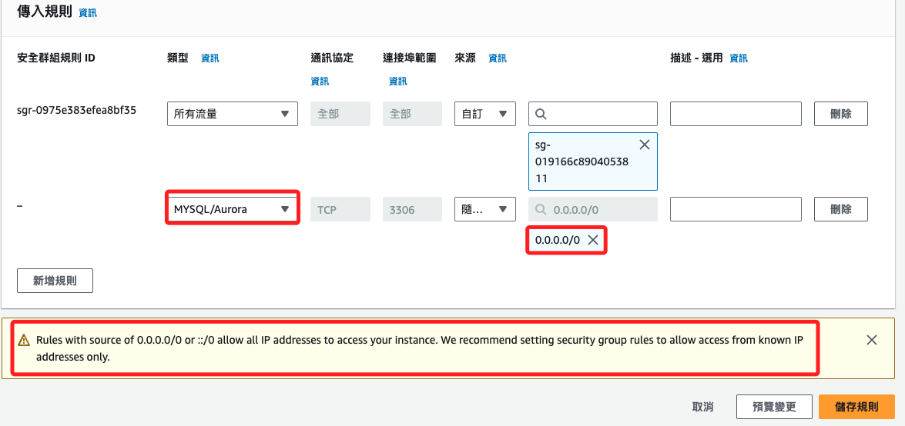

<br>

8. 完成後會看到有兩個 `Inbound rules` 進站規則。

    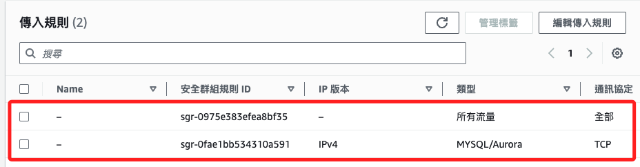

<br>

## 修改資料庫設定

_回到 RDS 主控台_

<br>

1. 切換到頁籤 `Databases`，點擊資料庫名稱鏈接可進入詳細頁面。

    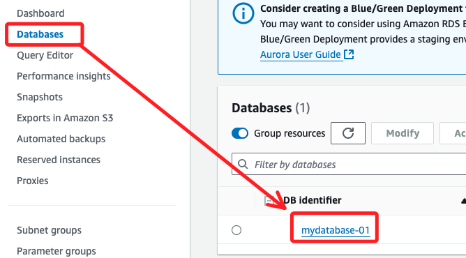

<br>

2. 若要修改個別資料庫的設定，可點擊右上角的 `Modify` 進行修改。

    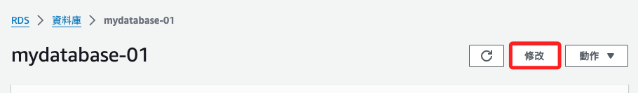

<br>

## 進入資料庫

1. 點擊進入資料庫。

    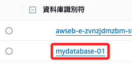

<br>

2. 在 `Connectivity & security` 區塊下的 `Endpoint` 就是資料庫 URL，預設 `Port` 是 `3306`。

    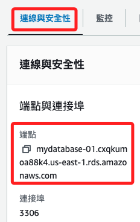

<br>

## 連線資料庫 

_使用 MySQLWorkbench_

<br>

1. 點擊 `+` 添加資料庫連線。

    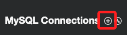

<br>

4. 自訂 `Connection Name` 如 `MyAWS-RDS`，在 `Hostname` 則將複製的 `Endpoint` 貼上，`Username` 輸入在 RDS 設定的使用者帳號 `sam6238`；然後點擊 `Store in Keychain`。

    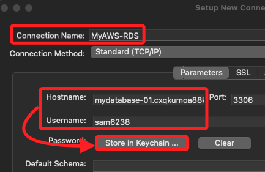

<br>

5. 在彈窗中輸入密碼，然後點擊 `OK`。

    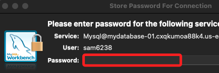

<br>

6. 點擊右下角的 `Test Connection`。

    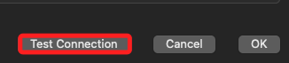

<br>

7. 設置完成會跳出視窗顯示 `Successfully ...`，這樣便表示設定都正確，可進行連線資料庫。

    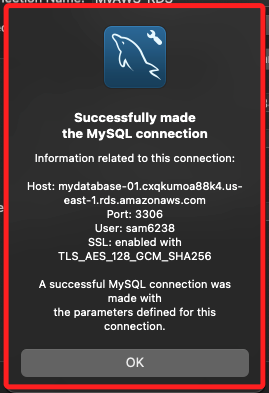

<br>

8. 點擊 `OK` 完成設置。

    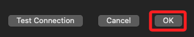

<br>

## 導入數據

_示範簡單的資料庫操作_

<br>

1. 在本地電腦上準備一個文件 `test_movies.csv`，內有簡單的電影資訊。

    

<br>

2. 在應用的主控台點擊前面步驟建立的連線進行連線。

    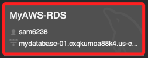

<br>

3. 使用語法建立資料庫，選取語法並點擊閃電執行。

    ```sql
    create database db20240718
    ```

    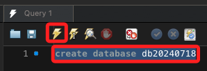

<br>

4. 下方 OUTPUT 會顯示資訊。

    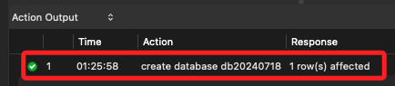

<br>

5. 點擊左側 `Schemas` 會顯示有一個 `sys`。

    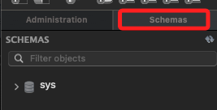

<br>

6. 點擊右鍵後在選單點擊 `Refresh all`。

    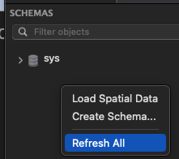

<br>

7. 在 `Schemas` 會添加所建立的資料庫。

    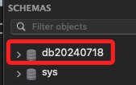

<br>

8. 在資料庫上點右鍵，然後點擊選單中的 `Table Data Import Wizard` 導入資料。

    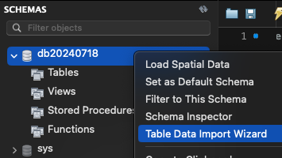

<br>

9. 輸入準備好的 `.csv` 文件，接著點擊 `Next`。

    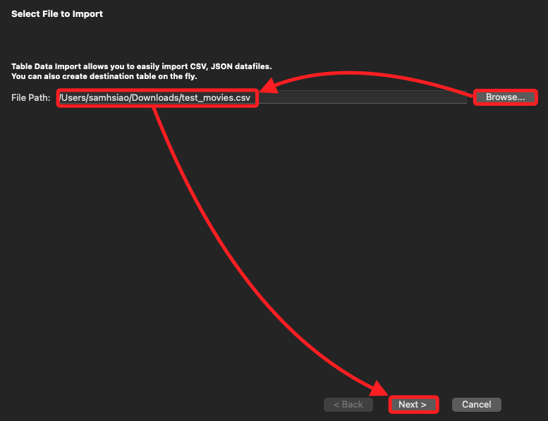

<br>

10. 使用預設值，建立的 Table 名稱為 `db20240718`，接著點擊 `Next`。

    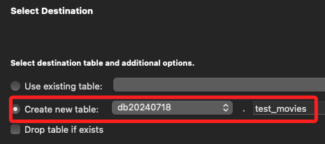

<br>

11. 在下一個格式的設定頁面中，同樣使用預設值，接著點擊 `Next`。

    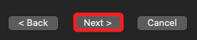

<br>

12. 最後一個設定頁面，同樣點擊 `Next`，開始導入資料庫，完成時再點擊一次 `Next` 及 `Finish`。

    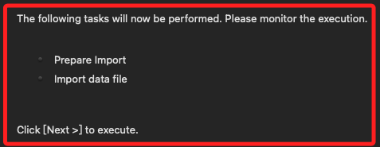

<br>

## 查詢數據

1. 點擊 `Refresh All` 會出現建立的 Table。

    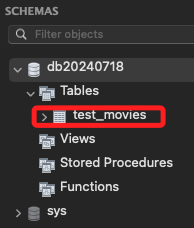

<br>

2. 執行查詢語法；特別注意，若要運行多行指令，必須在每個指令行尾綴加上分號 `;`。

    ```sql
    select * from db20240718.test_movies;
    ```

    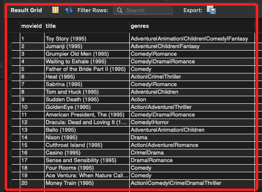

<br>

3. 附加條件的查詢。

    ```sql
    select * from db20240718.test_movies where genres = 'Comedy|Romance';
    ```

    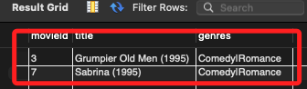

<br>

___

_END_