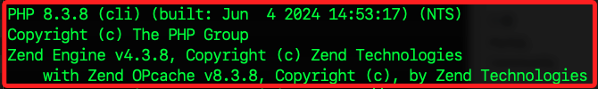
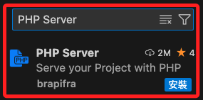
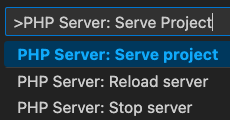
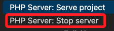
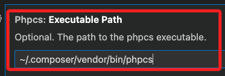
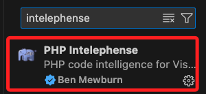

# 瀏覽 `index.php`

<br>

## 編輯腳本

1. 代碼如下，請填入資料庫確實資訊，更換自己的帳號密碼。

    ```php
    <?php
    /**
     * 這是標準的註解範例
     * 
     * PHP version 7.4
     *
     * @category Example
     * @package  None
     * @author   Your Name <your.email@example.com>
     * @license  http://opensource.org/licenses/gpl-license.php GNU Public License
     * @link     http://example.com
     */

    // 開始連結資料庫 
    echo "開始連線 ... </br>";

    // 定義常數
    define('DB_HOSTNAME', 'mydatabase-01.cxqkumoa88k4.us-east-1.rds.amazonaws.com');
    define('DB_USERNAME', '<資料庫帳號>');
    define('DB_PASSWORD', '<資料庫密碼>');
    define('DB_SCHEMA', 'db20240718');
    define('DB_PORT', 3306);

    // 資料表
    define('DB_TABLE', 'test_movies');

    // 使用 MySQLi 連接資料庫
    $conn = mysqli_connect(
        DB_HOSTNAME,
        DB_USERNAME,
        DB_PASSWORD,
        DB_SCHEMA,
        DB_PORT
    );

    // 判斷是否成功
    if (mysqli_connect_errno()) {
        echo "連線 MySQL 失敗：" . mysqli_connect_error() . "</br>";
    } else {
        echo "資料庫連線成功。</br>";
    }

    // SQL 語法
    $sql = "SELECT * FROM " . DB_TABLE;

    // 調用 mysqli_query()函數進行查詢
    $result = mysqli_query($conn, $sql);

    // 檢查查詢是否成功
    if (!$result) {
        echo "資料庫查詢失敗: " . mysqli_error($conn) . "</br>";
        exit;
    }

    // 取出資料，迭代到最後會傳出 NULL 跳出 loop
    while ($row = mysqli_fetch_array($result, MYSQLI_ASSOC)) {
        echo "movieId=" . $row['movieId'] . " ;  title=" . $row['title'] . "; genres=" . $row['genres'] . "</br>";
    }

    echo "=== THE END ===";

    // 關閉連線
    mysqli_close($conn);
    ?>
    ```

<br>

2. 查詢結果顯示如下。

    

<br>

## 說明

1. 若要在 VSCode 中使用 Live Server 瀏覽 `index.php`，需要進行一些設定，因為 Live Server 本身主要是為靜態文件如 HTML、CSS、JavaScript）設計的。

<br>

2. 要正確地運行 PHP 文件，需要使用 PHP 伺服器，如 Apache 或 PHP 的內建伺服器。

<br>

## 設置步驟

1. 確認電腦中已經安裝了 PHP。

    ```bash
    php -v
    ```

    

<br>

2. 在 VSCode 安裝插件 `PHP Server`，這是用來直接在 VSCode 中運行 PHP 服務器。

    

<br>

3. 在 VSCode 中打開的 `index.php` 文件，然後按下 `Ctrl + Shift + P` 打開指令面板，輸入 `PHP Server: Serve Project` 並選擇此選項，這會啟動 PHP 的內建伺服器，並在瀏覽器中打開 `index.php`。

    

<br>

4. 若要停止伺服器運行，需執行。

    

<br>

## 關於錯誤訊息

1. 在 VSCode 中出現以下訊息。

    ```bash
    phpcs: Request workspace/configuration failed with message: Unable to locate phpcs. Please add phpcs to your global path or use composer dependency manager to install it in your project locally.
    ```

<br>

2. 這表示 VSCode 無法找到 PHP CodeSniffer (phpcs) 程式來執行代碼分析，所以要將 phpcs 添加到全局路徑中，或者使用 Composer 依賴管理工具進行安裝它。

<br>

## 全局安裝 phpcs

1. 安裝 Composer 全局安裝工具。

    ```bash
    php -r "copy('https://getcomposer.org/installer', 'composer-setup.php');"
    php composer-setup.php --install-dir=/usr/local/bin --filename=composer
    php -r "unlink('composer-setup.php');"
    ```

<br>

2. 使用 Composer 進行全局安裝。

    ```bash
    composer global require --dev "squizlabs/php_codesniffer=*"
    ```

<br>

3. 編輯 `~/.zshrc` 並確保全局安裝的 Composer 的 `bin` 目錄在系統 PATH 中；若無責進行添加，完成後重載設定。

    ```bash
    export PATH="$PATH:$HOME/.composer/vendor/bin"
    ```

<br>

## 配置 VSCode

_配置後可使用全局安裝的 phpcs_

<br>

1. 確認安裝路徑 `~/.composer/vendor/bin/phpcs`。

    ```bash
    ls ~/.composer/vendor/bin/phpcs
    ```

<br>

2. 打開 VSCode 設定，搜尋 `phpcs`，找到 `phpcs: Executable Path` 設定，填入全局安裝的 phpcs 路徑。

    ```bash
    ~/.composer/vendor/bin/phpcs
    ```

    

<br>

3. 可以直接編輯 `settings.json`。

    ```json
    "phpcs.executablePath": "/Users/samhsiao/.composer/vendor/bin/phpcs",
    // 這是PHP 解釋器的路徑
    "php.validate.executablePath": "/usr/local/bin/php"
    ```

<br>

4. 若要設置格式化工具，先安裝插件。

    

<br>

5. 設定VSCode。

    ```json
    "[php]": {
        "editor.defaultFormatter": "bmewburn.vscode-intelephense-client"
    }
    ```

<br>

___

_END_