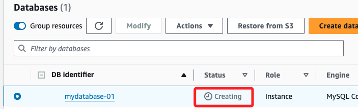

# 自動化操作 RSD

_建立 MySQL 資料庫_

<br>

## 準備工作

1. 在終端機輸入 AWS CLI，並輸出為環境變數。

    ```bash
    export AWS_ACCESS_KEY_ID=$aws_access_key_id
    export AWS_SECRET_ACCESS_KEY=$aws_secret_access_key
    export AWS_SESSION_TOKEN=$aws_session_token
    ```

<br>

2. 設置環境變數到記錄文件。

    ```bash
    LOG_FILE="$HOME/Desktop/rds_setup_log.txt"
    DB_NAME="mydatabase-01"
    DB_ENDPOINT="mydatabase-01.cacwqxy1xikj.us-east-1.rds.amazonaws.com"
    DB_USERNAME="sam6238"
    DB_PASSWORD="<自行輸入>"
    DB_SCHEMA="db20240718"
    DB_PORT="3306"
    REGION="us-east-1"
    SG_NAME="MyRDSGroupRule"
    ENGINE="mysql"
    DB_INSTANCE_CLASS="db.t4g.micro"
    STORAGE_TYPE="gp3"
    ENGINE_VERSION="8.0.39"
    ```

<br>

3. 請務必記得自行輸入密碼。

    ```bash
    DB_PASSWORD=""
    ```

<br>


4. 在桌面建立一個記錄文件，並寫入環境變數。

    ```bash
    touch "$LOG_FILE" && code -n "$LOG_FILE"
    ```

<br>

5. 將環境變數寫入 LOG_FILE。

    ```bash
    echo "DB_NAME=\"$DB_NAME\"" | tee -a "$LOG_FILE"
    echo "DB_ENDPOINT=\"$DB_ENDPOINT\"" | tee -a "$LOG_FILE"
    echo "DB_USERNAME=\"$DB_USERNAME\"" | tee -a "$LOG_FILE"
    echo "DB_PASSWORD=\"$DB_PASSWORD\"" | tee -a "$LOG_FILE"
    echo "DB_SCHEMA=\"$DB_SCHEMA\"" | tee -a "$LOG_FILE"
    echo "DB_PORT=\"$DB_PORT\"" | tee -a "$LOG_FILE"
    echo "REGION=\"$REGION\"" | tee -a "$LOG_FILE"
    echo "SG_NAME=\"$SG_NAME\"" | tee -a "$LOG_FILE"
    ```

<br>

## 建立安全群組並配置規則

1. 建立安全群組並添加 `MySQL/Aurora` 的允許訪問規則，並記錄 `GroupId` 為 `SG_ID`。

    ```bash
    SG_ID=$(aws ec2 create-security-group \
        --group-name "$SG_NAME" \
        --description "Security group for RDS with MySQL access" \
        --region "$REGION" \
        --query 'GroupId' \
        --output text)

    echo "SG_ID=\"$SG_ID\"" | tee -a "$LOG_FILE"
    ```

<br>

2. 添加規則，允許所有 IP 訪問。

    ```bash
    aws ec2 authorize-security-group-ingress \
        --group-id "$SG_ID" \
        --protocol tcp \
        --port "$DB_PORT" \
        --cidr 0.0.0.0/0 \
        --region "$REGION"
    ```

    

<br>

## 建立 RDS MySQL

1. 建立 RDS 資料庫，並將其設置為可公開訪問；特別注意，指令最後顯式表示 `tee -a "$LOG_FILE"`，也就是會將建立過程的 JSON 回應寫入 `$LOG_FILE`，這部分很常，若要取消請刪掉語句即可。

    ```bash
    aws rds create-db-instance \
        --db-instance-identifier "$DB_NAME" \
        --db-instance-class "$DB_INSTANCE_CLASS" \
        --engine "$ENGINE" \
        --allocated-storage 20 \
        --master-username "$DB_USERNAME" \
        --master-user-password "$DB_PASSWORD" \
        --backup-retention-period 7 \
        --vpc-security-group-ids "$SG_ID" \
        --availability-zone "$REGION"a \
        --no-multi-az \
        --publicly-accessible \
        --no-auto-minor-version-upgrade \
        --storage-type "$STORAGE_TYPE" \
        --engine-version "$ENGINE_VERSION" \
        --db-name "$DB_SCHEMA" \
        --region "$REGION" | tee -a "$LOG_FILE"
    ```

    

<br>

2. 建立後，狀態需要一段時間才能變為 `available`，可通過指令檢查狀態，在 `Creating` 階段尚未生成端點，需稍作等待。

    ```bash
    aws rds describe-db-instances \
        --db-instance-identifier "$DB_NAME" \
        --region "$REGION" \
        --query 'DBInstances[0].DBInstanceStatus' \
        --output text
    ```

    

<br>

3. 還會經過一個 `backing-up` 階段，表示 RDS 資料庫正在執行備份操作，這是過渡性狀態；RDS 自動備份完成後，狀態將更改為 `available`，屆時代表資料庫才可以接受連接；特別注意， `backing-up` 階段已經有端點資訊，可以繼續下一步。

    

<br>

4. 取得並記錄其終端點 `DB_ENDPOINT`。

    ```bash
    DB_ENDPOINT=$(aws rds describe-db-instances \
        --db-instance-identifier "$DB_NAME" \
        --region "$REGION" \
        --query 'DBInstances[0].Endpoint.Address' \
        --output text)

    echo "DB_ENDPOINT=\"$DB_ENDPOINT\"" | tee -a "$LOG_FILE"
    ```

<br>

## 準備連線

_假如還未安裝客戶端，請先進行安裝；已經安裝則進行更新。_

<br>

1. MacOS。

    ```bash
    brew install mysql
    ```

<br>

2. Ubuntu 或 Debian 系統。

    ```bash
    sudo apt-get install mysql-client
    ```

<br>

3. 假如已經安裝，進行更新。

    ```bash
    brew upgrade mysql-client
    ```

<br>

## 連線資料庫

1. 因為 AWS 會使用 `mysql_native_password` 插件進行身份驗證，透過 Workbench 連線資料庫運行以下指令，更改 MySQL 用戶的身份驗證插件為 caching_sha2_password， MySQL 8 的新身份驗證方法。

    ```bash
    ALTER USER 'sam6238'@'%' IDENTIFIED WITH 'caching_sha2_password' BY 'sam112233';
    ```

<br>

2. 連線指令；特別注意，參數 `-p` 與密碼 `$DB_PASSWORD` 是緊鄰的，不可分開。

    ```bash
    mysql -h "$DB_ENDPOINT" -P "$DB_PORT" -u "$DB_USERNAME" -p"$DB_PASSWORD"
    ```

<br>

3. 將用戶的身份驗證方式切回 mysql_native_password。

    ```bash
    ALTER USER 'sam6238'@'%' IDENTIFIED WITH 'mysql_native_password' BY 'sam112233';
    ```

<br>

## 

1. 連線 `MySQL` 時，可在連線指令中加入參數 `--local-infile` 啟用本地文件加載功能。

    ```bash
    mysql -h "$DB_ENDPOINT" -P "$DB_PORT" -u "$DB_USERNAME" -p"$DB_PASSWORD" --local-infile=1
    ```

<br>

2. 選擇資料庫 `db20240718`。

    ```bash
    USE db20240718;
    ```

<br>

3. 建立 `test_movies` 資料表。

    ```bash
    CREATE TABLE test_movies (
        movieId INT,
        title VARCHAR(255),
        genres VARCHAR(255)
    );
    ```

<br>

4. 從指定的本地文件中讀取資料 `test_movies.csv`，並將資料插入的目標資料表 `test_movies`，指定 CSV 文件中的分隔符號是逗號 `,`，每個欄位值被引號 `"` 包圍，指定文件中每一行的結束符號為 `\n`，並且忽略文件中的第一行，也就是說文件是有標題行的。

    ```bash
    LOAD DATA LOCAL INFILE '~/Downloads/test_movies.csv'
    INTO TABLE test_movies
    FIELDS TERMINATED BY ',' 
    ENCLOSED BY '"' 
    LINES TERMINATED BY '\n'
    IGNORE 1 LINES 
    (movieId, title, genres);
    ```

<br>

5. 從資料表中讀取全部數據。

    ```bash
    SELECT * FROM test_movies;
    ```

<br>

6. 返回 `title` 和 `genres` 兩個欄位的值，並篩選 `genres` 欄位中包含 `Action` 的記錄。

    ```bash
    SELECT title, genres FROM test_movies WHERE genres LIKE '%Action%';
    ```

    

<br>

7. 如果只需要查詢少量記錄，可以在查詢結尾加上 \G，將結果轉換成垂直格式，避免橫向滾動和列錯位。

    ```bash
    SELECT title, genres FROM test_movies WHERE genres LIKE '%Action%' \G
    ```

    

<br>

## 在 Workbench 中操作

1. 同樣先切換到資料庫 `db20240718`。 

    ```bash
    USE db20240718;
    ```

    _顯示生效_

    

<br>

2. 查詢全部資料。

    ```bash
    SELECT * FROM test_movies;
    ```

    

<br>

___

_END_