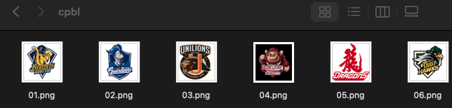
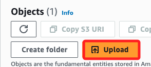
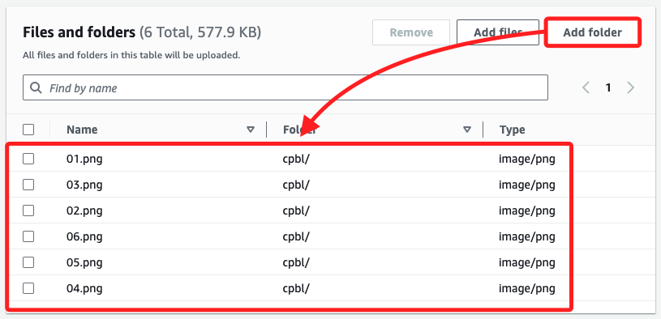
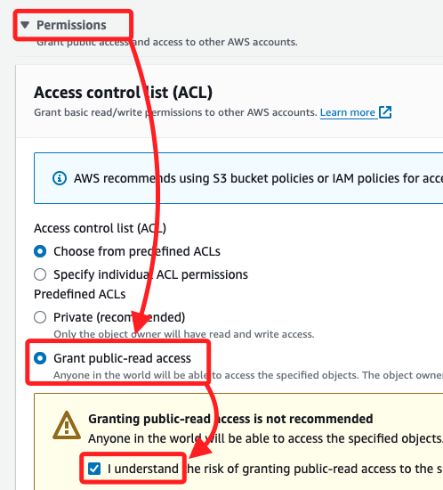
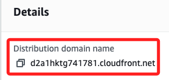
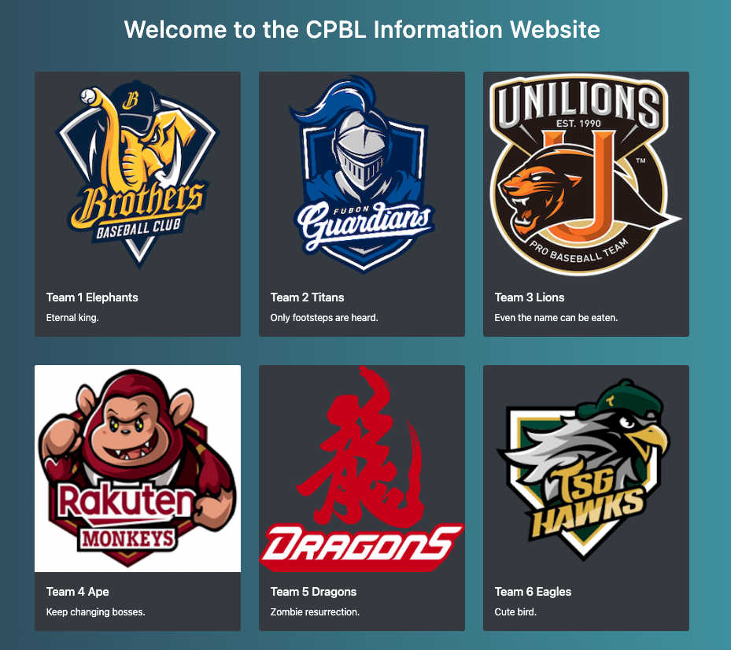

# 上傳資料夾

_同時優化網站_

<br>

## 說明

1. 這裡準備了六張相片，分別命名為 `01.png` 等，並將其存放在本地電腦的資料夾 `cpbl` 中。

    

<br>

2. 進入前面步驟建立的 Bicket `mybucket-0721` 中，點擊 `Upload`。

    

<br>

3. 點擊 `Add folder`，然後選取本地的 `cpbl` 資料夾，完成後顯示如下，並會標明所屬 `Folder` 為 `cpbl/`。

    

<br>

4. 展開 `Permissions`，勾選 `Grant public-read access`，並勾選 `I understand`。

    

<br>

5. 然後點擊 `Upload`。

    

<br>

## 編輯網頁腳本

1. 腳本中包含六張圖片，與之前相同，使用 CloudFront 的 `Distribution domain name` 作為主路徑 `https://d2a1hktg741781.cloudfront.net`。

    

<br>

2. 接著在路徑上加上 Bucket 的相對路徑如 `cpbl/01.png`，路徑間以 `/` 串接，結合如下。

    ```html
    
    ```

<br>

3. 完整代碼代碼如下。

    ```html
    <!DOCTYPE html>
    <html lang="en">
    <head>
        <meta charset="UTF-8">
        <meta name="viewport" content="width=device-width, initial-scale=1.0">
        <title>Simple Bootstrap Website</title>
        <link rel="stylesheet" href="https://stackpath.bootstrapcdn.com/bootstrap/4.5.2/css/bootstrap.min.css">
        <style>
            body {
                background: linear-gradient(to right, #2c3e50, #4ca1af);
                color: white;
            }
            .card {
                background-color: #343a40;
                border: none;
            }
            .card-title, .card-text {
                color: white;
            }
        </style>
    </head>
    <body>
        <div class="container">
            <h1 class="text-center mt-5">Welcome to the CPBL Information Website</h1>
            <div class="row mt-5">
                <div class="col-md-4">
                    <div class="card">
                        
                        <div class="card-body">
                            <h5 class="card-title">Team 1 Elephants</h5>
                            <p class="card-text">Eternal king.</p>
                        </div>
                    </div>
                </div>
                <div class="col-md-4">
                    <div class="card">
                        
                        <div class="card-body">
                            <h5 class="card-title">Team 2 Titans</h5>
                            <p class="card-text">Only footsteps are heard.</p>
                        </div>
                    </div>
                </div>
                <div class="col-md-4">
                    <div class="card">
                        
                        <div class="card-body">
                            <h5 class="card-title">Team 3 Lions</h5>
                            <p class="card-text">Even the name can be eaten.</p>
                        </div>
                    </div>
                </div>
            </div>
            <div class="row mt-5">
                <div class="col-md-4">
                    <div class="card">
                        
                        <div class="card-body">
                            <h5 class="card-title">Team 4 Ape</h5>
                            <p class="card-text">Keep changing bosses.</p>
                        </div>
                    </div>
                </div>
                <div class="col-md-4">
                    <div class="card">
                        
                        <div class="card-body">
                            <h5 class="card-title">Team 5 Dragons</h5>
                            <p class="card-text">Zombie resurrection.</p>
                        </div>
                    </div>
                </div>
                <div class="col-md-4">
                    <div class="card">
                        
                        <div class="card-body">
                            <h5 class="card-title">Team 6 Eagles</h5>
                            <p class="card-text">Cute bird.</p>
                        </div>
                    </div>
                </div>
            </div>
        </div>
        <script src="https://code.jquery.com/jquery-3.5.1.slim.min.js"></script>
        <script src="https://cdn.jsdelivr.net/npm/@popperjs/core@2.5.4/dist/umd/popper.min.js"></script>
        <script src="https://stackpath.bootstrapcdn.com/bootstrap/4.5.2/js/bootstrap.min.js"></script>
    </body>
    </html>
    ```

<br>

4. 結果顯示如下。

    

<br>

___

_END_