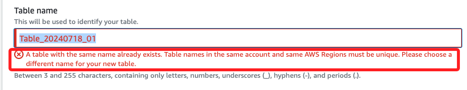
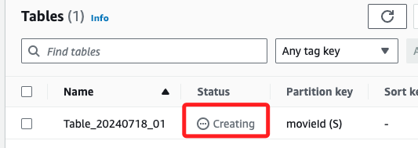
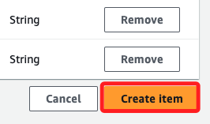
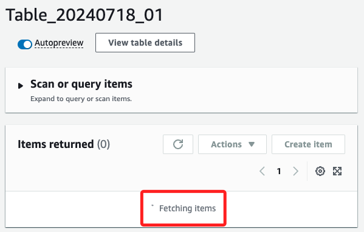
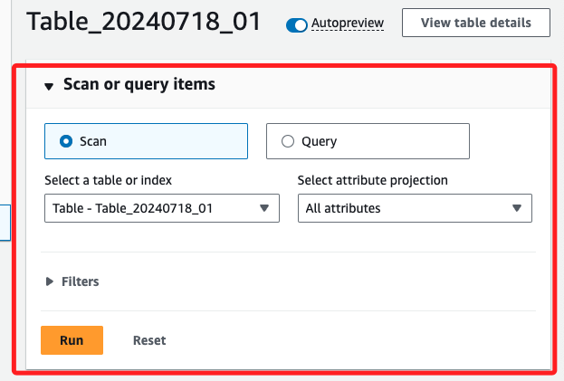
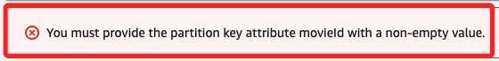
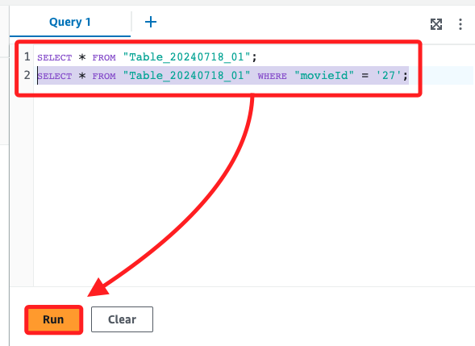
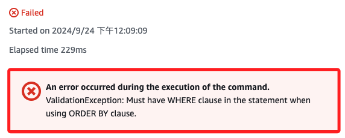

# DynamoDB

_以下將使用這個 `.csv` 文件說明_


<br>

## 說明

_進入主控台，選擇 `DynamoDB` 服務_

<br>

1. `建立資料表 Create table`。

    

<br>

2. 自訂名稱 `Table_20240718_01`。

    

<br>

3. 特別注意，這個命名在相同的帳號及區域內必須是唯一的。

    

<br>

4. 使用 `movieId` 作為主鍵 `Partition key`。

    

<br>

5. 點擊右下角建立資料表 `Create table`。

    

<br>

6. 建立中會顯示 `Creating`。

    

<br>

7. 過一會建立完成，狀態會轉變作用中 `Active`；接著點擊 `資料表名稱` 處進入。

    

<br>

## 資料表

1. 展開動作 `Actions` 選單，點擊建立項目 `Create item`。

    

<br>

2. 內有一個已建立好的屬性名稱 `Attribute name`，就是前面建立的 `movieId`。

    

<br>

3. 點擊右上方新增屬性 `Add new attribute`，選擇字串 `String`。

    

<br>

4. 按照資料來源，將屬性名稱輸入為 `title`。

    

<br>

5. 再添加一個屬性 `genres`；若有更多也是這樣加入。

    

<br>

6. 接著編輯值 `Value`，分別是 `21`、`英雄本色`、`警匪片`。

    

<br>

7. 完成後點擊右下角的建立項目 `Create item`。

    

<br>

8. 會顯示 `Fetching items`；可直接刷新網頁。

    

<br>

## 查詢資料

_特別注意，完成這個步驟後，先手動刷新網頁 `command + R`_

<br>

1. 刷新頁面後會看到如下畫面。

    

<br>

2. 點擊檢視資料表詳細資訊 `View table details` 可展開資訊。

    

<br>

3. 點擊右上角的探索資料表項目 `Explore table items` 或左側的 `探索項目` 可進行簡易操作。

    

<br>

4. 點擊執行 `Run` 可查看當前內容。

    

<br>

5. 再次進入到建立項目 `Create item` 的功能中；在右上方選單切換到 `JSON 檢視`，使用 JSON 文本寫入；特別注意，一次只可以加入一筆數據。

    

<br>

6. 填入以下文本後點擊右下角 `建立項目`；特別注意，預設是開啟 `檢視 Dynamo JSON`，這時資料會以 DynamoDB 特有的 JSON 格式呈現，這種格式包含了 `類型標識符`，用於表示每個屬性值的資料類型，`S` 表示 `字串 (String)` 類型、`數字類型` 則會顯示 `N`。

    ```json
    {
        "movieId": {"S": "24"},
        "genres": {"S": "科幻片"},
        "title": {"S": "星際大戰"}
    }
    ```

    

<br>

7. 若將 `檢視 Dynamo JSON` 關閉，資料會以簡單的純 JSON 格式呈現，而不會顯示資料類型的標識符。

    

    ```json
    {
        "movieId": "25",
        "genres": "動畫片",
        "title": "冰雪奇緣"
    }
    ```

<br>

8. 再次注意，關閉或開啟 `檢視 Dynamo JSON` 必須相對應的格式規範，當格式錯誤時會顯示紅色警告。

    

    ```json
    {
        "movieId": {"S": "26"},
        "genres": {"S": "愛情片"},
        "title": {"S": "鐵達尼號"}
    }
    ```

<br>

9. 下方會顯示錯誤資訊。

    

<br>

10. 在下方傳回的項目中，可查看也可繼續 `建立項目`。

    

<br>

## 簡介 PartiQL 編輯器

1. `PartiQL` 是一種查詢語言、資料庫語言，支援 SQL 風格的語法，可對 DynamoDB 進行操作。

<br>

2. `PartiQL 編輯器` 是 DynamoDB 中的一個功能，用於操作 DynamoDB 資料，可使用 SQL 語法撰寫查詢語句。

<br>

## 使用 PartiQL 編輯器

1. 添加資料。

    

<br>

2. 逐筆加入以下資料，特別注意，同樣一次只可以加入一筆。

    ```json
    INSERT INTO "Table_20240718_01" VALUE {'movieId': '27', 'genres': '冒險片', 'title': '奪寶奇兵'};
    INSERT INTO "Table_20240718_01" VALUE {'movieId': '28', 'genres': '驚悚片', 'title': '寄生上流'};
    INSERT INTO "Table_20240718_01" VALUE {'movieId': '29', 'genres': '劇情片', 'title': '肖申克的救贖'};
    ```

<br>

3. 若同時執行多筆會出現錯誤，具體來說，錯誤的原因是 _一次執行多條查詢或操作_，而 PartiQL 不支援一次執行多個語句。

    

<br>

4. 雖然不支援一次執行多個語句，但與一般資料庫工具相同，可對語句進行選取後執行，所以編輯時可多行編輯。

    

<br>

## 查詢

_使用 PartiQL 編輯器進行查詢_

<br>

1. 查詢表中所有項目。

    ```sql
    SELECT * FROM "Table_20240718_01";
    ```

<br>

2. 查詢特定條件的項目。

    ```sql
    SELECT * FROM "Table_20240718_01" WHERE "movieId" = '27';
    ```

<br>

3. 查詢特定屬性的項目。

    ```sql
    SELECT "title", "genres" FROM "Table_20240718_01" WHERE "movieId" = '27';
    ```

<br>

4. 查詢多個條件的項目：

    ```sql
    SELECT * FROM "Table_20240718_01" WHERE "genres" = '冒險片' AND "title" = '奪寶奇兵';
    ```

<br>

## 語句錯誤

1. 以排序方式查詢資料時出現錯誤；特別注意，DynamoDB 的查詢機制不支援對整個資料表進行無限制的排序操作；當使用 `ORDER BY` 子句時，DynamoDB 需要知道如何篩選查詢的範圍，也就是 `WHERE` 子句，然後再基於篩選結果進行排序。

    ```sql
    SELECT * FROM "Table_20240718_01" ORDER BY "movieId";
    ```

    

<br>

2. 因為 DynamoDB 是針對大規模分散式資料設計的，因此它的查詢過程與傳統 SQL 資料庫不同，為了保持高效的查詢性能，DynamoDB 只允許在有限範圍內進行排序，而不能對整個資料表進行排序；所以在使用 `ORDER BY` 時，需要有 `WHERE` 條件來限制查詢範圍。

<br>

3. 要使用 `ORDER BY` 必須加入 `WHERE` 條件，指定篩選的範圍，也就是以主鍵 `movieId` 對特定範圍的資料進行排序。

<br>

4. 具有 `WHERE` 子句的排序查詢，`WHERE` 子句限制了查詢的範圍，然後再按照 `movieId` 進行排序。

    ```sql
    SELECT * FROM "Table_20240718_01" WHERE movieId = '25' ORDER BY movieId;
    ```

<br>

___

_END_
