# DynamoDB

_以下將使用這個 `.csv` 文件說明_

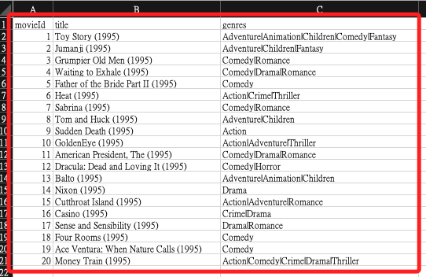

<br>

## 說明

_進入主控台，選擇 `DynamoDB` 服務_

<br>

1. `建立資料表 Create table`。

    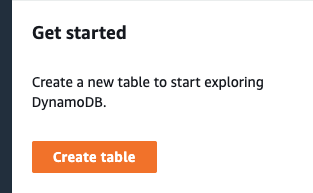

<br>

2. 自訂名稱 `Table_20240718_01`。

    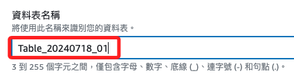

<br>

3. 使用 `movieId` 作為主鍵 `Partition key`。

    

<br>

4. 點擊右下角建立資料表 `Create table`。

    

<br>

5. 過一會建立完成並顯示作用中 `Active`，點擊資料表名稱處進入。

    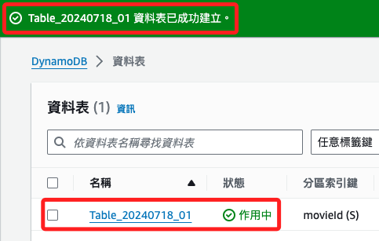

<br>

## 資料表

1. 展開動作 `Actions` 選單，點擊建立項目 `Create item`。

    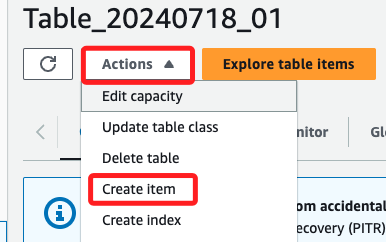

<br>

1. 內有一個已建立好的屬性名稱 `Attribute name` 就是前面建立的 `movieId`。

    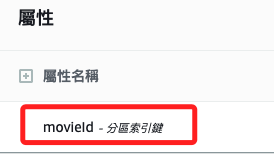

<br>

3. 點擊右上方新增屬性 `Add new attribute`，選擇字串 `String`。

    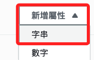

<br>

4. 按照資料來源，將屬性名稱輸入為 `title`。

    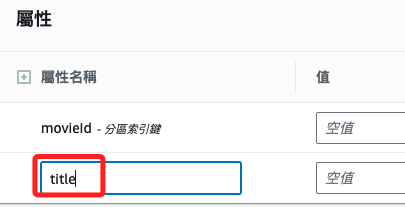

<br>

5. 再添加一個屬性 `genres`；若有更多也是這樣加入。

    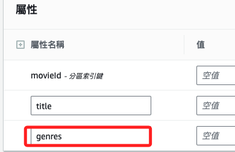

<br>

6. 接著編輯值 `Value`，分別是 `21`、`英雄本色`、`警匪片`，完成後點擊右下角的建立項目 `Create item`。

    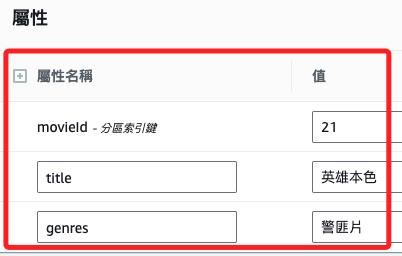

<br>

7. 點擊檢視資料表詳細資訊 `View table details` 可展開資訊。

    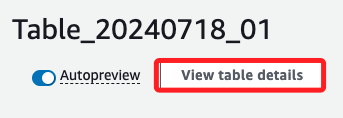

<br>

8. 點擊右上角的探索資料表項目 `Explore table items` 或左側的 `探索項目` 可進行簡易操作。

    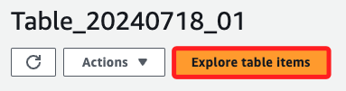

<br>

9. 點擊 `執行` 可查看當前內容。

    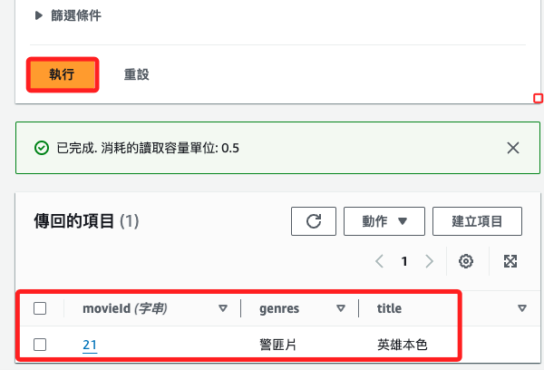

<br>

10. 在 `建立項目` 的功能中，可以切換到 `JSON 檢視`，使用 JSON 文本寫入；特別注意，一次只可以加入一筆數據。

    

<br>

11. 填入以下文本後點擊右下角 `建立項目`。

    ```json
    {
        "movieId": {"S": "24"},
        "genres": {"S": "科幻片"},
        "title": {"S": "星際大戰"}
    }
    ```

    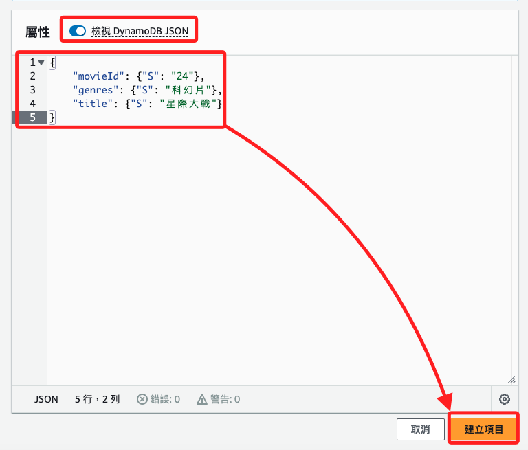

<br>

12. 若為關閉 `檢視 Dynamo JSON`，使用以下格式。

    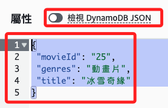

<br>

13. 再次注意，關閉或開啟 `檢視 Dynamo JSON` 必須使用不同格式，格式錯誤會顯示紅色錯誤警告。

    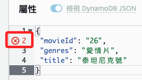

<br>

14. 在下方傳回的項目中，可查看也可繼續 `建立項目`。

    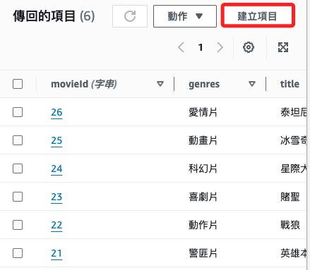

<br>

## 使用 PartQL 編輯器

1. 添加資料。

    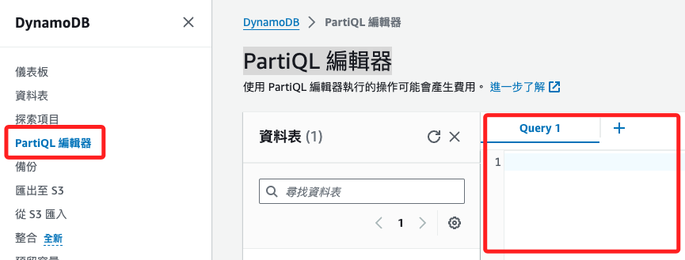

<br>

2. 逐筆加入以下資料，特別注意，同樣一次只可以加入一筆。

    ```json
    INSERT INTO "Table_20240718_01" VALUE {'movieId': '27', 'genres': '冒險片', 'title': '奪寶奇兵'};
    INSERT INTO "Table_20240718_01" VALUE {'movieId': '28', 'genres': '驚悚片', 'title': '寄生上流'};
    INSERT INTO "Table_20240718_01" VALUE {'movieId': '29', 'genres': '劇情片', 'title': '肖申克的救贖'};
    ```

<br>

3. 若同時執行多筆會出現錯誤。

    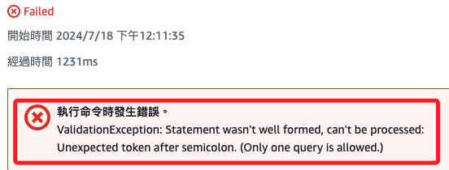

<br>

## 查詢

_使用 PartiQL 編輯器進行查詢_

<br>

1. 查詢表中所有項目。

    ```sql
    SELECT * FROM "Table_20240718_01";
    ```

<br>

2. 查詢特定條件的項目。

    ```sql
    SELECT * FROM "Table_20240718_01" WHERE "movieId" = '27';
    ```

<br>

3. 查詢特定屬性的項目。

    ```sql
    SELECT "title", "genres" FROM "Table_20240718_01" WHERE "movieId" = '27';
    ```

<br>

4. 查詢多個條件的項目：

    ```sql
    SELECT * FROM "Table_20240718_01" WHERE "genres" = '冒險片' AND "title" = '奪寶奇兵';
    ```

<br>

5. 查詢以排序方式查詢資料；特別注意，這個資料由於 ID 是字串，所以無法排序，這個語法僅作為示範。

    ```sql
    SELECT * FROM "Table_20240718_01" ORDER BY "movieId";
    ```

<br>

___

_END_
