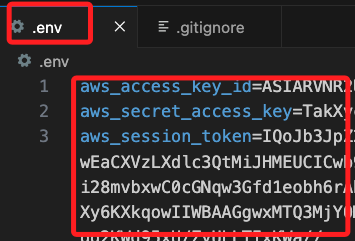
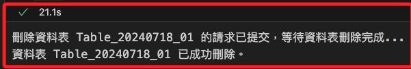

# Jupyter 環境使用 LearnerLab 憑證

_使用 `python-dotenv` 設定環境變數_

<br>

## 環境配置

_在本機上操作，先建立專案資料夾與虛擬環境，此部分不做贅述。_

<br>

1. 安裝 `python-dotenv`

    ```bash
    pip install python-dotenv
    ```

<br>

2. 建立 `.env` 及 `.gitignore` 文件

    ```bash
    touch .env .gitignore
    ```

<br>

3. 在當前專案路徑中開啟 VSCode。

    ```bash
    code .
    ```

<br>

4. 將 `.env` 寫入 `.gitignore`。

    ```bash
    .env
    ```

<br>

## 查詢 Learner Lab 憑證

_以下將進行查詢並貼在 `.env` 文件_

<br>

1. Lab 完成啟動後，點擊 `AWS Details`。


2. 點擊 `Show`。


3. 複製後直接貼到 `.env` 文件中。



4. 添加以下內容到 `.env` 中，這是因為 AWS SDK會自動讀取環境變數中的認證資訊，而環境變數的名稱是內定的，所以必須將貼上的鍵名稱進行另外編輯；除此，添加 `AWS_DEFAULT_REGION` 設定。

    ```dotenv
    AWS_ACCESS_KEY_ID=${aws_access_key_id}
    AWS_SECRET_ACCESS_KEY=${aws_secret_access_key}
    AWS_SESSION_TOKEN=${aws_session_token}
    AWS_DEFAULT_REGION=us-east-1
    ```

<br>

## 使用腳本進行查詢

_以 S3 及 EC2 為例_

<br>

1. 查詢所有 S3。

    ```python
    from dotenv import load_dotenv
    import os
    import boto3

    # 加載 .env 文件
    load_dotenv()

    # 使用加載的環境變數來創建 boto3 客戶端
    s3_client = boto3.client("s3")

    # 列出所有 S3 buckets 作為測試
    buckets = s3_client.list_buckets()
    for bucket in buckets["Buckets"]:
        print(bucket["Name"])
    ```

<br>

2. 查詢所有的 EC2。

    ```python
    import boto3
    from botocore.exceptions import ClientError

    from dotenv import load_dotenv
    import os
    # 加載 .env 文件
    load_dotenv()

    # 使用加載的環境變數來創建 boto3 客戶端
    ec2_client = boto3.client("ec2")

    # 查詢並列出所有 EC2 實例
    try:
        response = ec2_client.describe_instances()
        for reservation in response["Reservations"]:
            for instance in reservation["Instances"]:
                print(f"Instance ID: {instance['InstanceId']}")
                print(f"Instance Type: {instance['InstanceType']}")
                print(f"Instance State: {instance['State']['Name']}")
                print(f"Public IP: {instance.get('PublicIpAddress', 'N/A')}")
                print("-" * 20)
    except ClientError as e:
        print(f"An error occurred: {e}")
    ```

<br>

## 操作 DynamoDB

1. 建立一個包含 `movieId` 和 `title` 欄位的資料表，並使用 `movieId` 作為分區鍵。

    ```python
    import boto3
    from botocore.exceptions import ClientError
    import time

    from dotenv import load_dotenv
    import os
    # 加載 .env 文件
    load_dotenv()

    # 使用本地環境的認證
    dynamodb = boto3.resource('dynamodb')

    # 設定資料表名稱
    table_name = 'Table_20240718_01'

    # 創建資料表
    try:
        table = dynamodb.create_table(
            TableName=table_name,
            KeySchema=[
                {
                    'AttributeName': 'movieId',
                    # 分區鍵
                    'KeyType': 'HASH'
                }
            ],
            AttributeDefinitions=[
                {
                    'AttributeName': 'movieId',
                    # 數字型
                    'AttributeType': 'N'
                }
            ],
            ProvisionedThroughput={
                'ReadCapacityUnits': 5,
                'WriteCapacityUnits': 5
            }
        )
        print(f"創建資料表 {table_name} 成功。等待資料表變為 active 狀態...")
        table.meta.client.get_waiter('table_exists').wait(TableName=table_name)
        print("資料表已創建並可使用。")
    except ClientError as e:
        print(e.response['Error']['Message'])

    # 插入資料
    table = dynamodb.Table(table_name)
    try:
        table.put_item(
            Item={
                'movieId': 25,
                'title': 'Sample Movie Title',
                'genres': 'Action|Thriller'
            }
        )
        print("資料插入成功。")
    except ClientError as e:
        print("資料插入失敗:", e.response['Error']['Message'])

    # 查詢資料
    try:
        response = table.get_item(
            Key={
                'movieId': 25
            }
        )
        item = response.get('Item')
        if item:
            print("查詢結果：", item)
        else:
            print("未找到該 movieId 的資料")
    except ClientError as e:
        print("查詢失敗:", e.response['Error']['Message'])
    ```

    

<br>

2. 刪除指定 DynamoDB 資料表。

    ```python
    import boto3
    from botocore.exceptions import ClientError

    from dotenv import load_dotenv
    import os
    # 加載 .env 文件
    load_dotenv()

    # 使用本地環境的認證
    dynamodb = boto3.resource('dynamodb')

    # 設定要刪除的資料表名稱
    table_name = 'Table_20240718_01'

    # 刪除資料表
    try:
        table = dynamodb.Table(table_name)
        table.delete()
        print(f"刪除資料表 {table_name} 的請求已提交，等待資料表刪除完成...")
        table.meta.client.get_waiter('table_not_exists').wait(TableName=table_name)
        print(f"資料表 {table_name} 已成功刪除。")
    except ClientError as e:
        print("刪除資料表失敗:", e.response['Error']['Message'])
    ```

    

<br>

___

_END_