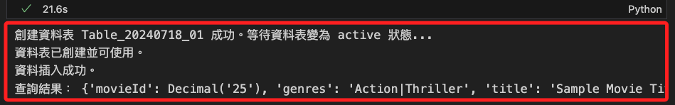
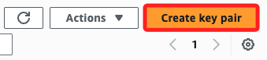
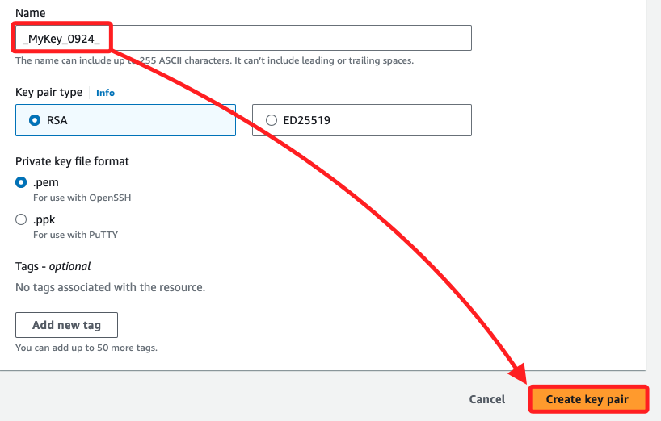
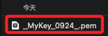

# LearnerLab 設置 AWS 認證密鑰

## 取得 AWS 認證憑證

1. 可透過 EC2 主控台進入 `Key Pairs`。



2. 點擊 `Create key pair`。



3. 任意命名如 `_MyKey_0924_`。



4. 同時會下載 `*.pem` 文件。




4. LearnerLab 提供的憑證：檢查 LearnerLab 的使用手冊或說明，通常會有一個步驟告訴您如何獲取與 LearnerLab 帳號相關的 AWS 認證資訊。
   - 憑證通常包含：
     - `AWS Access Key ID`
     - `AWS Secret Access Key`
     - `Region`（例如 `ap-northeast-1` 或 `us-east-1`）

5. LearnerLab 主控台：如果 LearnerLab 提供一個類似於 AWS 主控台的介面，您可以嘗試在主控台的安全憑證頁面中搜尋 `Access Key` 和 `Secret Key`。通常，這些資訊會在 LearnerLab 的 AWS 設定或憑證管理頁面中提供。

6. LearnerLab 文件或技術支援：如果 LearnerLab 沒有直接提供憑證資訊，您可以查看官方文件或聯繫 LearnerLab 的支援團隊，詢問如何從 LearnerLab 帳號中提取 AWS 認證憑證。

### 步驟 2：在本地設置 AWS 認證

一旦您從 LearnerLab 獲取了 `AWS Access Key ID` 和 `AWS Secret Access Key`，可以在本地環境中進行設置。這裡有兩種方法可以設置 AWS 認證憑證。

#### 方法 1：使用 AWS CLI 進行配置
如果您有安裝 AWS CLI，您可以通過 CLI 工具進行配置：

```bash
aws configure
```

此指令會提示您輸入以下資訊：
- AWS Access Key ID：輸入從 LearnerLab 獲得的 `Access Key ID`。
- AWS Secret Access Key：輸入從 LearnerLab 獲得的 `Secret Access Key`。
- Default region name：輸入 LearnerLab 提供的區域，例如 `ap-northeast-1` 或 `us-east-1`。
- Default output format：輸入 `json`（或您偏好的輸出格式）。

這將會在您的本地建立一個憑證檔案，位於 `~/.aws/credentials`，並且 `boto3` 會自動讀取這個檔案中的憑證。

#### 方法 2：設置環境變量
如果您不想使用 AWS CLI，也可以直接設置環境變量。這可以手動將 LearnerLab 的 AWS 認證密鑰設置在您的系統環境變量中。您可以在指令行中輸入以下指令：

```bash
export AWS_ACCESS_KEY_ID='your-access-key-id'
export AWS_SECRET_ACCESS_KEY='your-secret-access-key'
export AWS_DEFAULT_REGION='ap-northeast-1'
```

將 `your-access-key-id` 和 `your-secret-access-key` 替換為您從 LearnerLab 獲取的真實值。這樣，`boto3` 也會自動讀取這些環境變量中的憑證。

### 步驟 3：編寫 Python 腳本並查詢 DynamoDB

完成 AWS 認證密鑰的設置後，您可以編寫 Python 腳本並使用 `boto3` 查詢 DynamoDB。以下是一個簡單的 Python 查詢範例：

```python
import boto3

# 使用本地環境的認證
dynamodb = boto3.resource('dynamodb', region_name='ap-northeast-1')

# 設定要查詢的資料表
table = dynamodb.Table('Table_20240718_01')

# 查詢資料表中的項目
response = table.get_item(
    Key={
        'movieId': '25'
    }
)

# 打印查詢結果
item = response.get('Item')
if item:
    print("查詢結果：", item)
else:
    print("未找到該 movieId 的資料")
```

這段程式碼會使用您本地設置的 AWS 認證，並查詢 `movieId` 為 `25` 的 DynamoDB 項目。

### 總結：
1. 從 LearnerLab 獲取 AWS 認證憑證：這通常會包括 `AWS Access Key ID`、`AWS Secret Access Key` 和區域資訊。
2. 在本地環境設置 AWS 認證密鑰：您可以使用 AWS CLI 或環境變量設置本地的認證資訊。
3. 編寫 Python 腳本查詢 DynamoDB：使用 `boto3` 連接到 DynamoDB 並查詢資料。

希望這些步驟能幫助您成功在本地環境中設置並查詢 DynamoDB。如果還有進一步的問題或疑問，請隨時告訴我！