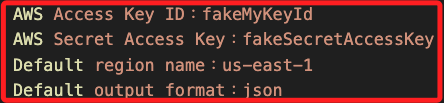

# DynamoDB Local

_在本地 MacOS 上安裝並運行_

<br>

## 步驟

1. 從 AWS 官方下載 DynamoDB Local 的 `.tar.gz` 文件 [DynamoDB Local `.tar.gz` 下載連結](https://s3.us-west-2.amazonaws.com/dynamodb-local/dynamodb_local_latest.tar.gz)。

<br>

2. 下載完成後，使用終端解壓。

    ```bash
    tar -xvzf dynamodb_local_latest.tar.gz
    ```

<br>

3. 解壓後會生成一個文件夾，將文件夾移動到任何合適的位置。

<br>

4. DynamoDB Local 需要 Java Runtime Environment（JRE）17 或更高版本，使用以下命令檢查當前 Java 版本，如果版本過低則需安裝 JRE 17 或更新的版本。

    ```bash
    java -version
    ```

<br>

## 啟動 DynamoDB Local

1. 打開終端，進入解壓的文件夾所在目錄。

<br>

2. 啟動 DynamoDB Local。

    ```bash
    java -Djava.library.path=./DynamoDBLocal_lib -jar DynamoDBLocal.jar -sharedDb
    ```

<br>

3. DynamoDB Local 默認使用埠 `8000`，如果 `8000` 埠已被佔用，可更換埠號。

    ```bash
    java -Djava.library.path=./DynamoDBLocal_lib -jar DynamoDBLocal.jar -sharedDb -port 8001
    ```

<br>

4. 按 `Ctrl + C` 可停止 DynamoDB。

<br>

## 配置 AWS CLI

_DynamoDB Local 不需要真實的 AWS 憑證，但 AWS CLI 需要憑證信息，可使用 `虛擬` 的憑證來配置_

<br>

1. 使用 AWS CLI 配置虛擬憑證。

    ```bash
    aws configure
    ```

<br>

2. 輸入以下信息，ID 設置為 `fakeMyKeyId`、Key 設置為 `fakeSecretAccessKey`。

    

<br>

## 使用 AWS CLI 驗證本地 DynamoDB

1. 列出本地 DynamoDB 中的表格。

    ```bash
    aws dynamodb list-tables --endpoint-url http://localhost:8000
    ```

<br>

2. 這應返回一個空表清單或已創建的表清單，這表明已成功連接到本地的 DynamoDB。

<br>

3. 可使用 AWS CLI、NoSQL Workbench 或其他開發工具通過 `http://localhost:8000` 與本地 DynamoDB 進行交互。

<br>

4. 特別注意，使用 NoSQL Workbench 時，也需要指定 `http://localhost:8000` 作為 `Endpoint URL` 來連接本地的 DynamoDB。

<br>

5. 若要在本地使用 AWS SDK，也需要指定 `endpoint_url` 參數。

    ```python
    import boto3

    dynamodb = boto3.resource(
        'dynamodb',
        endpoint_url="http://localhost:8000"
    )
    ```

<br>

___

_END_