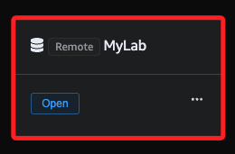

# NoSQL Workbench 連接 AWS DynamoDB

 

## 步驟

1. 從 AWS 官方網站下載並安裝 [NoSQL Workbench 下載](https://docs.aws.amazon.com/zh_tw/amazondynamodb/latest/developerguide/workbench.settingup.html)；安裝完成啟動 APP。

    

 

2. 運行 DynamoDB。

    

 

3. 在左側切換頁籤到 `Operation Builder`。

    

 

4. 畫面下方的連線是依據本地 `~/.aws` 的設定文件 `config` 自動載入的連線。

    

 

5. 點擊 `Add connection` 設定新的連接。

    

 

6. 連接類型選擇 `Remote`。

    

 

7. 自訂名稱如 `MyLab`，區域為 `us-east-1`，`ID` 和 `Key` 依照查詢結果填入，Lab 帳號必須填入 `Session token`。

    

 

8. 可勾選 `Persist connection`，點擊右下角 `Connect`；勾選的用意是在憑證有效期間內，無需再次輸入以上資訊。

    

 

9. 會自動返回連線清單，在所建立的連線中點擊 `Open`。

    

 

## 連接操作

1. 完成連接可以在左側面板中查看該區域下的所有 DynamoDB 表。

    

 

2. 選擇表格就可以進行查詢、編輯和管理操作。

    

 

___

_END_