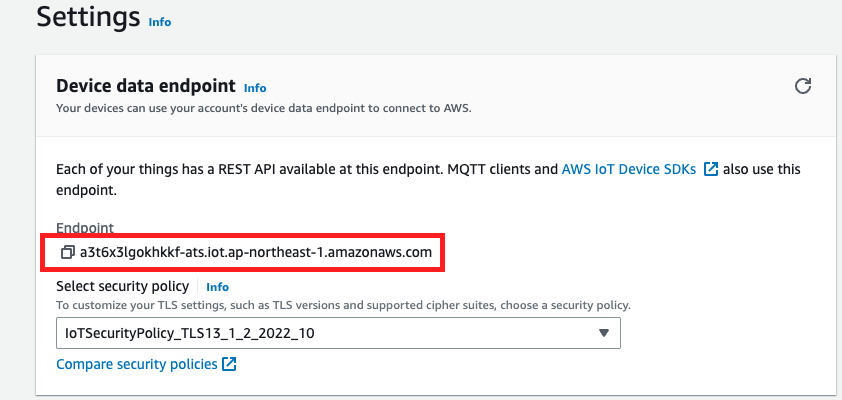
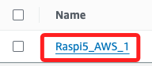
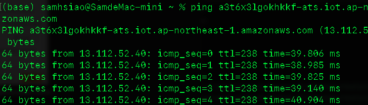

# 在樹莓派進行設置

_以下操作是在樹莓派進行，AWS 網頁不用關閉，設置過程還需複製資訊_

<br>

## 安裝 NPM

_假如樹莓派尚未安裝_

<br>

1. 更新系統套件。

    ```bash
    sudo apt update && sudo apt upgrade -y
    ```

<br>

2. 安裝 Node.js。

    ```bash
    curl -fsSL https://deb.nodesource.com/setup_18.x | sudo -E bash - && sudo apt-get install -y nodejs
    ```

<br>

3. 驗證安裝。

    ```bash
    node -v && npm -v
    ```

<br>

## 準備工作

1. 安裝 paho-mqtt 來作為 MQTT 客戶端

    ```bash
    pip install paho-mqtt
    ```

<br>

2. 安裝 AWS IoT SDK for Python

    ```bash
    pip install AWSIoTPythonSDK
    ```

<br>

3. 在 `文件` 中建立並進入專案目錄 `exAWS_01`。

    ```bash
    cd ~/Documents && mkdir exAWS_01 && cd exAWS_01
    ```

<br>

4. 在專案目錄內新增目錄 `certs`。

```bash
mkdir certs
```

<br>

5. 進入本地下載資料夾；避免下一個指令太長。

    ```bash
    cd ~/Downloads
    ```

<br>

6. 把下載的五個證書放到樹莓派的專案資料夾的 `certs` 目錄內；這裡保留 `~/Downloads/` 只是便於理解指令結構，由於已經在下載資料夾中，語句中可以省略路徑。

    ```bash
    scp ~/Downloads/4dfac575167b7d309e4ea364dd06a224a4f55d8ea1f27edd31af40d3bb6c07c3-certificate.pem.crt ~/Downloads/4dfac575167b7d309e4ea364dd06a224a4f55d8ea1f27edd31af40d3bb6c07c3-private.pem.key ~/Downloads/4dfac575167b7d309e4ea364dd06a224a4f55d8ea1f27edd31af40d3bb6c07c3-public.pem.key ~/Downloads/AmazonRootCA1.pem ~/Downloads/AmazonRootCA3.pem ssd:~/Documents/exAWS_01/certs/
    ```

<br>

## 建立專案

1. 建立專案，名稱自訂，如 `ex01.ipynb`。

<br>

2. 複製以下代碼，要修改其中部分項目 `awshost`、`clientId`、`thingName`、`caPath、certPath、keyPath`；這將在下一個步驟中逐一查詢。

    ```python
    '''
    建立一個 MQTT 客戶端，使其可以連線到 AWS IoT Core
    然後持續向 topic/test 這個主題發布訊息，
    訊息在範例中是 "Hello from Raspberry Pi 111!"。
    '''
    # 導入必要的程式庫：MQTT 客戶端、SSL 加密通訊以及 JSON 格式資料處理
    import paho.mqtt.client as mqtt
    import ssl
    import json

    # 在 AWS 查
    _awshost = 'a3nin252nmbu93-ats.iot.us-west-2.amazonaws.com'

    # 任意自訂
    _clientId = 'MyClientId'

    # 自訂在 AWS 上
    _thingName = "Raspi4_AWS_01"

    # CA1
    _caPath = './certs/AmazonRootCA1.pem'
    # certificate
    _certPath = './certs/139c4f2be2b56c0f57dd0c445769f5d621468df4c2c9c71018b291fb672c540d-certificate.pem.crt'
    # private
    _keyPath = './certs/139c4f2be2b56c0f57dd0c445769f5d621468df4c2c9c71018b291fb672c540d-private.pem.key'

    # AWS IoT Core 的連線設定
    # 定義你的 AWS IoT Core 端點
    awshost = _awshost
    # 定義連線的端口號，一般為 8883
    awsport = 8883
    # 定義獨特的客戶端 ID
    clientId = _clientId
    # 定義在 AWS IoT Core 中的 thing 名稱
    thingName = _thingName
    # 定義 SSL/TLS 連線所需的憑證和金鑰路徑
    caPath = _caPath
    certPath = _certPath
    keyPath = _keyPath
    # 定義連線回呼函數，當連線成功後會被呼叫
    # 此函數將連線結果印出，並訂閱所有子主題
    def on_connect(client, userdata, flags, rc):
        print("連線結果回報代碼:" + str(rc))
        client.subscribe("#")
    # 建立 MQTT 客戶端，並設定連線回呼函數
    mqttc = mqtt.Client()
    mqttc.on_connect = on_connect
    # 設定 SSL/TLS 加密通訊的憑證和金鑰
    mqttc.tls_set(caPath, certfile=certPath, keyfile=keyPath, cert_reqs=ssl.CERT_REQUIRED, tls_version=ssl.PROTOCOL_TLSv1_2, ciphers=None)
    # 連線至 AWS IoT Core
    mqttc.connect(awshost, awsport, keepalive=60)
    # 開始 MQTT 通訊
    mqttc.loop_start()
    # 建立無窮迴圈以持續發布訊息
    # 建立一個 JSON 相容的字典，然後轉換成 JSON 格式並發布
    while True:
        message = {"message": "Hello from Raspberry Pi 222!"}
        mqttc.publish("topic/test", json.dumps(message))
    ```

<br>

## 回到 AWS 設定頁面

1. 在 `AWS IoT` 的主控台中，點擊左側下方的 `Settings`。

    

2. 畫面中央有個 `Endpoint`，這是代碼中 `awshost` 所需的值。

    

## 繼續編輯腳本

1. 自定義一個 `clientId` 如 `MyClientId-001`，這是一個自訂的識別符。

    ```python
    client = AWSIoTMQTTClient("MyClientId-001")
    ```

<br>

2. 依據在 AWS 設定的 Thins 的 Name 作為代碼中 `thingName`，這裡填入
`Raspi5_AWS_1`。

    

<br>

3. 另外，五個密鑰文件中，有三個密鑰文件 `AmazonRootCA1.pem`、`*certificate.pem.crt`、`*private.pem.key`，依序將其填入 `caPath`、`certPath`、`keyPath`
。

    ```python
    # CA1
    _caPath = './certs/AmazonRootCA1.pem'
    # certificate
    _certPath = './certs/4dfac575167b7d309e4ea364dd06a224a4f55d8ea1f27edd31af40d3bb6c07c3-certificate.pem.crt'
    # private
    _keyPath = './certs/4dfac575167b7d309e4ea364dd06a224a4f55d8ea1f27edd31af40d3bb6c07c3-private.pem.key'
    ```

<br>

## 進入 AWS

1. 讚 `AWS IoT` 控制台中，展開左側 `Connect` 並點擊 `Connect one device`。

    

<br>

2. 會出現下的說明，其中有一行測試指令，複製貼到終端機中測試。

    

<br>

3. 這個指令就是透過 ping 服務的 endpoint 以驗證連線正常。

    

<br>

4. 驗證無誤即可點擊 `Next`。

    

<br>

___

_END_

