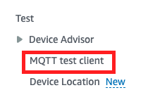
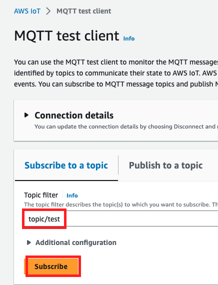
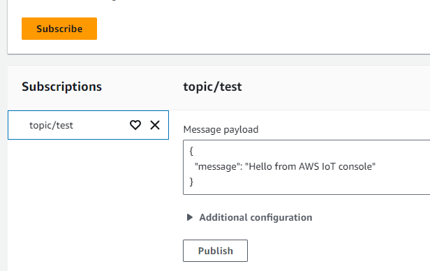
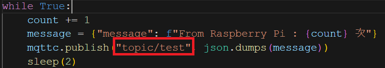
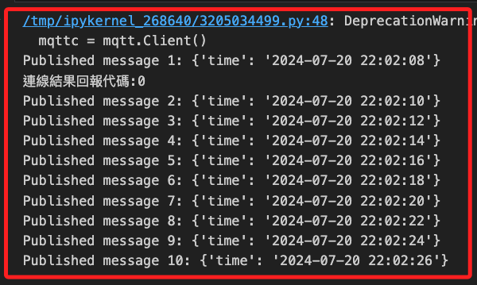

# 發布與訂閱

_透過樹莓派發佈、在AWS訂閱_

 

1. 在 AWS 主控台中展開 `Test` 功能，點擊 `MQTT test client`。

    

 

2. 自訂 `Topic filter` 名稱如 `topic/test`，然後點擊 `Subscribe`，這個主題過濾器要跟樹梅派的程式碼適配。

    

 

3. 點擊訂閱後會顯示預設的訊息 `Hello from AWS IoT console`。

    

 

## 進入樹莓派

1. 進入樹莓派執行 Python 腳本，特別注意前面提及的 `訂閱主題過濾器` 的適配。

    

 

2. 執行腳本。

    

 

3. 進入 AWS 查看訂閱的主題 `topic/test`，下方 Console 會輸出樹莓派所發佈的訊息。

    

 

___

_END_