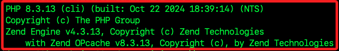

# 路徑設定

_以下分兩部分，分別是環境設置與 VSCode 設置_

<br>

## 錯誤訊息

1. 開啟 VSCode 時出現這樣的警告 `PHP executable not found.`，這個錯誤訊息表示 VSCode 中的 `PHP IntelliSense` 擴展需要一個可執行的 PHP 來運行，但它找不到安裝的 PHP。

    

<br>

## 安裝套件

1. 如果尚未安裝 PHP，可運行以下指令使用 Homebrew 進行安裝。

    ```bash
    brew install php
    ```

<br>

2. 完成後，透過檢查版本確認 PHP 已安裝。

    ```bash
    php -v
    ```

    

<br>

3. 檢查 PHP 路徑。

    ```bash
    which php
    ```

    

<br>

4. 編輯 `~/.zshrc` 將此路徑添加到 PATH。

    ```bash
    code ~/.zshrc
    ```

<br>

5. 依據查詢結果，使用以下格式將路徑添加到設定中，就是加上前綴 `export PATH=` 後用引號將路徑包覆，路徑並加入後綴 `:$PATH` 代表應用本身。

    ```bash
    export PATH="/opt/homebrew/bin:$PATH"
    ```

<br>

6. 保存文件後，立即套用更新。

    ```bash
    source ~/.zshrc
    ```

<br>

7. 再次確認 PHP 可以被全局訪問。

    ```bash
    php -v
    ```

<br>

## 設定 php.executablePath

_如果以上步驟無法解決，可手動設定 PHP IntelliSense 的路徑。_

<br>

1. 按下組合鍵 `Cmd` + `,` 開啟 VSCode 的設定，點擊 `settings.json` 進行編輯。

<br>

2. 搜尋 `php.executablePath`。

<br>

3. 依據查詢結果，編輯以下設定的內容，這裡是用 Homebrew 管理，所以設定如下。

    ```json
    "php.executablePath": "/opt/homebrew/bin/php"
    ```

<br>

4. 重啟 VSCode。

<br>

___

_END_