# 建立 API

_結合 API Gateway 和 Lambda 的簡單範例_

<br>

## 說明

1. 在 AWS 中，可使用 API Gateway 和 Lambda 來建立一個簡單的 API 並建立接口給使用者使用。

<br>

2. 以下範例展示如何建立一個簡單的 API，這個 API 將調用一個 Lambda 函數來處理請求；其中 `Lambda 函數` 負責處理 API 請求並返回響應，`API Gateway` 提供一個 `RESTful API` 接口，將請求路由到 Lambda 函數。

<br>

## 建立 Lambda 函數

1. 進入 Lambda 服務，點擊 `Create function`。

    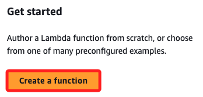

<br>

2. 選擇 `Author from scratch`，並為函數命名，如 `MyFunction-0723`。

    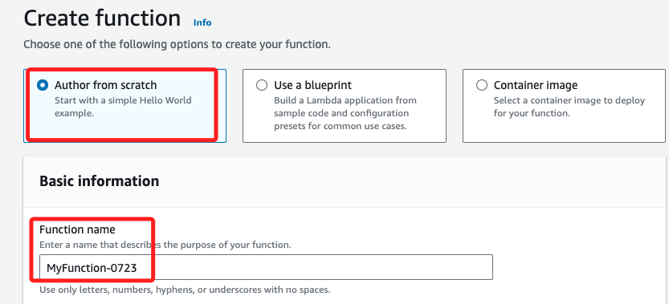

<br>

3. 選擇運行環境 Runtime，如 `Python 3.12`。

    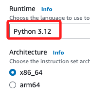

<br>

4. 在 `Permission` 部分可自動建立全新角色，若有現成合用的角色則選擇現有角色。

    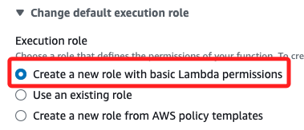

<br>

5. 完成以上步驟，點擊 `Create function`。

    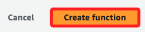

<br>

6. 在 Lambda 的 Code 頁籤中，使用預設的代碼。

    ```python
    def lambda_handler(event, context):
        return {
            'statusCode': 200,
            'body': 'Hello from Lambda!'
        }
    ```

<br>

7. 沒修正所以不用 Deploy，點擊 Test 即可，確認回傳 `200`。

    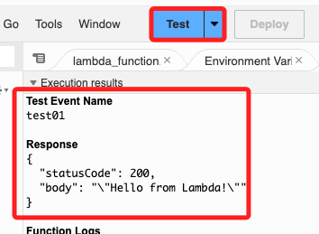

<br>

## 建立 API Gateway

1. 進入 API Gateway 服務，選擇 `HTTP API`，點擊 `Build`。

    

<br>

2. 為 API 命名，如 `MyAPI-0723`，然後點擊 `Next`。

    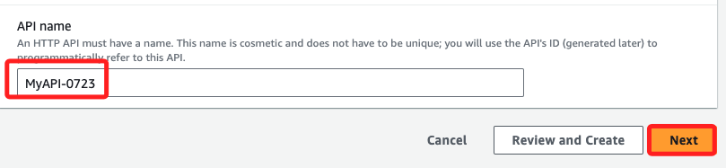

<br>

3. 在 `Routes` 頁面，點擊 `Next`。

    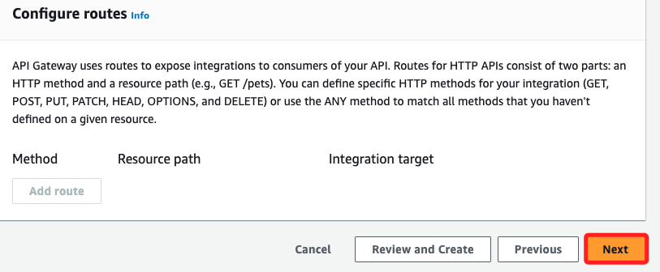

<br>

4. 在 `Define stages` 中，刪除預設的 Stage `$default`，然後在 Stage name 中命名新的 `prod` ，然後點擊 `Next`。

    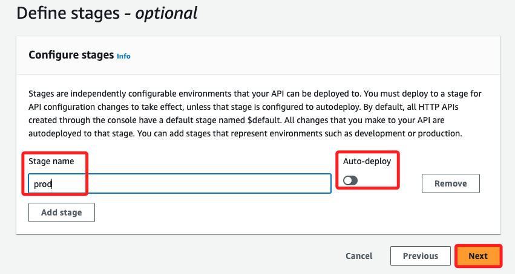

<br>

5. 點擊右下角 `Create`。

    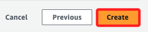

<br>

## 添加路由

1. 添加路由。

    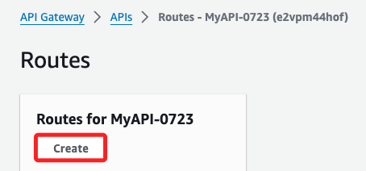

<br>

2. 設置路由方法，例如 `GET`，並加入路由路徑 `/hello`，點擊 `Create`。

    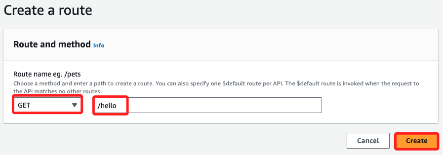

<br>

## 配置 Lambda 集成

1. 在 API Gateway 頁面左側導覽中選擇 `Integration`，切換到 `Manage integrations` 頁籤，並點擊 `Create`。

    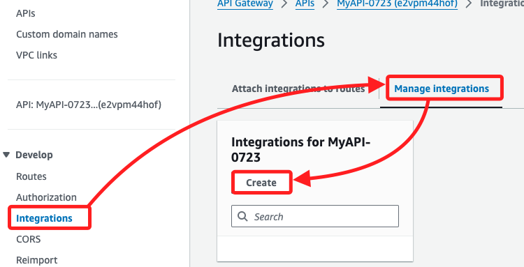

<br>

2. 在 `Integration type` 選單中選擇 `Lambda function`，接著在 `Lambda function` 選單中選擇前面步驟建立的函數 `MyFunction-0723`。

    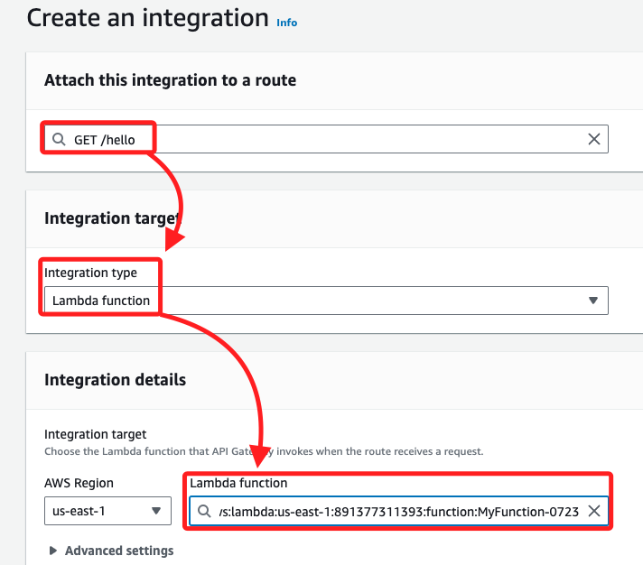

<br>

3. 點擊右下角 `Create`。

    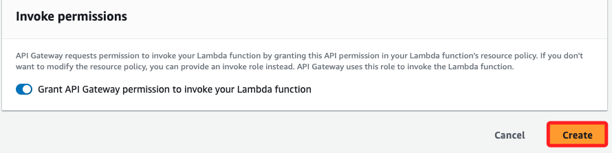

<br>

## 部署 API

1. 回到整合頁面中，點擊右上角的 `Deploy`。

    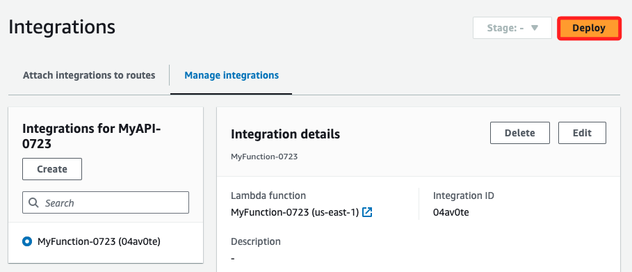

<br>

2. 在彈出視窗中，Stage 選取 `prod`，然後點擊 `Deploy`。

    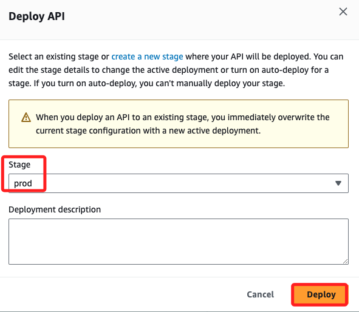

<br>

3. 完成後，進入主控頁面，點擊左側 `API`，接著右側中的 `Invoke URL` 就是調用的端點。

    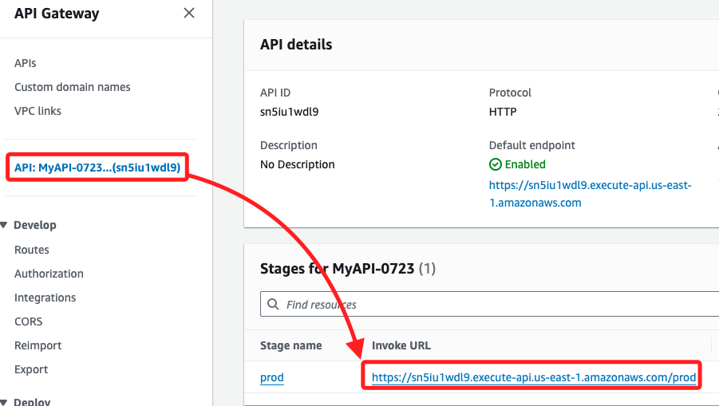

<br>

## 測試 API

1. 可在瀏覽器中進行端點訪問。

    ```bash
    https://sn5iu1wdl9.execute-api.us-east-1.amazonaws.com/prod/hello
    ```

<br>

2. 會顯示。

    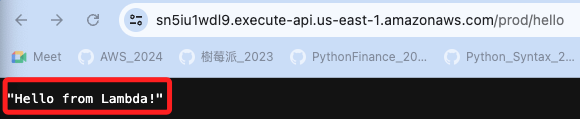

<br>

3. 也可使用 Postman 工具來訪問 API 端點。

    ```bash
    curl https://sn5iu1wdl9.execute-api.us-east-1.amazonaws.com/prod/hello
    ```

    

<br>

4. 若正確運行會看到 Lambda 函數的返回結果。

    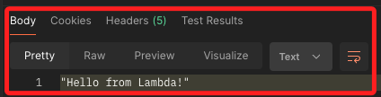

<br>

___

_END_
