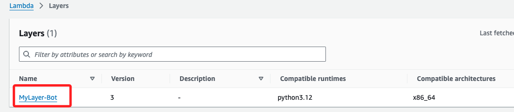

# 建立 Lambda Layer 和 Lambda Function

<br>

## 設置記錄文件

_以下的記錄字串統一加上雙引號_

<br>

1. 設置變數並建立記錄文件。

    ```bash
    API_NAME="MyAPI-Bot"
    LAMBDA_FUNCTION_NAME="MyFunction-Bot"
    REGION="us-east-1"
    ROLE_NAME="LabRole"
    LAYER_NAME="MyLayer-Bot"
    ZIP_FILE="fileb://python.zip"
    RUNTIME="python3.12"
    ARCHITECTURE="x86_64"
    LOG_FILE="$HOME/Desktop/api_setup_log.txt"
    ```

<br>

2. 建立記錄文件；使用 VSCode 在新的單獨視窗中開啟，這裡先建立再開啟，主要著眼於可各自使用慣用編輯器。

    ```bash
    touch $LOG_FILE && code -n $LOG_FILE
    ```

<br>

3. 寫入初始內容。

    ```bash
    echo "# 設置已知變數" > $LOG_FILE
    echo "API_NAME=\"$API_NAME\"" >> $LOG_FILE
    echo "LAMBDA_FUNCTION_NAME=\"$LAMBDA_FUNCTION_NAME\"" >> $LOG_FILE
    echo "REGION=\"$REGION\"" >> $LOG_FILE
    echo "ROLE_NAME=\"$ROLE_NAME\"" >> $LOG_FILE
    echo "LAYER_NAME=\"$LAYER_NAME\"" >> $LOG_FILE
    echo "ZIP_FILE=\"$ZIP_FILE\"" >> $LOG_FILE
    echo "RUNTIME=\"$RUNTIME\"" >> $LOG_FILE
    echo "ARCHITECTURE=\"$ARCHITECTURE\"" >> $LOG_FILE
    ```

<br>

4. 取得 ACCOUNT_ID。

    ```bash
    ACCOUNT_ID=$(\
    aws sts get-caller-identity \
        --query 'Account' \
        --output text)
    echo "ACCOUNT_ID=\"$ACCOUNT_ID\"" | tee -a $LOG_FILE
    ```

<br>

5. 設置 ROLE_ARN 並寫入 LOG_FILE。

    ```bash
    ROLE_ARN=$(printf "arn:aws:iam::%s:role/%s" "$ACCOUNT_ID" "$ROLE_NAME")
    echo "ROLE_ARN=\"$ROLE_ARN\"" | tee -a "$LOG_FILE"
    ```

<br>

## 補充說明

_文檔的寫入與更新_

<br>

1. 假如原本已經寫在記錄文檔內，只是沒有值的變數，可使用以下語法進行更新，而不是直接寫入。

    ```bash
    sed -i '' "s/^ACCOUNT_ID=.*/ACCOUNT_ID=\"$ACCOUNT_ID\"/" $LOG_FILE
    ```

<br>

## 建立 Lambda Layer

_假設已經製作好 python.zip，並且是存放在桌面，所以先進入桌面。_

<br>

1. 進入桌面。

    ```bash
    cd ~/Desktop
    ```

<br>

2. 建立名為 `MyLayer-Bot` 的 `Lambda Layer`，並將本地文件 `python.zip` 上傳。

    ```bash
    aws lambda publish-layer-version \
        --layer-name $LAYER_NAME \
        --zip-file $ZIP_FILE \
        --compatible-runtimes $RUNTIME \
        --compatible-architectures $ARCHITECTURE
    ```

<br>

3. 可進入主控台查看，其中 `Version` 會自動設定，包含已經刪除的同名 Layer。

    

<br>

## 建立 Lambda Function

_使用前一步驟建立的 Layer_

<br>

1. 建立名為 `MyFunction-Bot` 的 Lambda Function，使用 `Python 3.12` 運行環境、`x86_64` 架構和指定的 IAM 角色（`LabRole`），並將之前建立的 Layer 附加到該 Function 中。

    ```bash
    aws lambda create-function \
        --function-name "$LAMBDA_FUNCTION_NAME" \
        --runtime "$RUNTIME" \
        --role "$ROLE_ARN" \
        --handler lambda_function.lambda_handler \
        --zip-file "$ZIP_FILE" \
        --architectures "$ARCHITECTURE" \
        --layers $(aws lambda list-layer-versions \
            --layer-name "$LAYER_NAME" \
            --query 'LayerVersions[0].LayerVersionArn' \
            --output text)
    ```

<br>

2. 完成建立。

    

<br>

## 建立 API Gateway

1. 建立 `REST API`，同時將 `API_ID` 寫入變數。

    ```bash
    API_ID=$(\
    aws apigateway create-rest-api \
        --name $API_NAME \
        --endpoint-configuration types=REGIONAL \
        --region $REGION \
        --query 'id' \
        --output text)

    echo "API_ID=\"$API_ID\"" | tee -a "$LOG_FILE"
    ```

<br>

2. 取得根資源 ID 並寫入變數。

    ```bash
    RESOURCE_ID=$(\
    aws apigateway get-resources \
        --rest-api-id $API_ID \
        --region $REGION \
        --query 'items[?path==`/`].id' \
        --output text)

    echo "RESOURCE_ID=\"$RESOURCE_ID\"" | tee -a $LOG_FILE
    ```

<br>

3. 建立 POST 方法。

    ```bash
    aws apigateway put-method \
        --rest-api-id $API_ID \
        --resource-id $RESOURCE_ID \
        --http-method POST \
        --authorization-type NONE \
        --region $REGION
    ```

    

<br>

4. 將 POST 方法連接至 Lambda 函數。

    ```bash
    aws apigateway put-integration \
        --rest-api-id $API_ID \
        --resource-id $RESOURCE_ID \
        --http-method POST \
        --type AWS_PROXY \
        --integration-http-method POST \
        --uri "$(printf "arn:aws:apigateway:%s:lambda:path/2015-03-31/functions/arn:aws:lambda:%s:%s:function:%s/invocations" "$REGION" "$REGION" "$ACCOUNT_ID" "$LAMBDA_FUNCTION_NAME")" \
        --region $REGION

    ```

<br>

5. 查看 POST 方法的 Lambda 整合。

    ```bash
    aws apigateway get-integration \
        --rest-api-id $API_ID \
        --resource-id $RESOURCE_ID \
        --http-method POST \
        --region $REGION
    ```

    

    <br>

## 賦予權限

1. 賦予 API Gateway 調用 Lambda 函數的權限；特別說明，`*` 字元會被解釋為路徑模式並嘗試展開，所以使用單引號 `' '` 將 `--source-arn` 的值包圍起來，這樣 `zsh` 不會嘗試展開 `*`。

    ```bash
    aws lambda add-permission \
        --function-name $LAMBDA_FUNCTION_NAME \
        --statement-id apigateway-access \
        --action lambda:InvokeFunction \
        --principal apigateway.amazonaws.com \
        --source-arn 'arn:aws:execute-api:'$REGION':'$ACCOUNT_ID':'$API_ID'/*/POST/' \
        --region $REGION
    ```

    

<br>

2. 使用 get-policy 查看 Lambda 函數的權限。

    ```bash
    aws lambda get-policy \
        --function-name $LAMBDA_FUNCTION_NAME \
        --region $REGION
    ```

3. 顯示 Lambda 函數 `MyFunction-Bot` 的 `policy`，以及成功授權 `API Gateway` 調用該 Lambda 的權限。

    

<br>

## 部署 API 並

1. 將階段名稱設定為 `prod`。

    ```bash
    DEPLOYMENT_ID=$(\
    aws apigateway create-deployment \
        --rest-api-id $API_ID \
        --stage-name prod \
        --region $REGION \
        --query 'id' \
        --output text)

    echo "DEPLOYMENT_ID=\"$DEPLOYMENT_ID\"" | tee -a $LOG_FILE
    ```

<br>

2. 取得 Invoke URL 並記錄到文件；這就是這個應用的 `Webhook`。

    ```bash
    INVOKE_URL="https://$API_ID.execute-api.$REGION.amazonaws.com/prod"
    echo "INVOKE_URL=\"$INVOKE_URL\"" | tee -a $LOG_FILE

    echo "API Gateway setup complete. Invoke URL: $INVOKE_URL"
    ```

<br>

