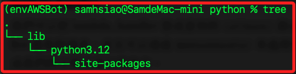
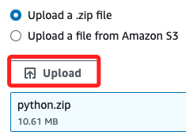
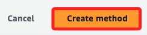

# 建立 LineBot

_以下步驟包含了 AWS Lambda、AWS API Gateway，並使用 Python 建立一個部署在 AWS 的 Linebot。_

<br>

## 步驟

1. 進入桌面建立資料夾 `Python`；這將用來建立 Layer 使用。

    ```bash
    cd ~/Desktop && mkdir python && cd python
    ```

<br>

2. 建立並進入一個層級資料夾，以下指令會進入 `site-packages` 中，這就是要安裝套件的位置。

    ```bash
    mkdir -p lib/python3.12/site-packages && cd lib/python3.12/site-packages
    ```

    

<br>

3. 使用指定版本安裝 Linebot SDK；透過參數 `--platform` 指定安裝平台環境為 `manylinux2014_x86_64`。

    ```bash
    pip3 install --platform manylinux2014_x86_64 --target . --python-version 3.12 --only-binary=:all: line-bot-sdk
    ```

<br>

4. 退回到桌面。

    ```bash
    cd ~/Desktop
    ```

<br>

5. 將資料夾 `python` 進行壓縮。

    ```bash
    zip -r python.zip python
    ```

<br>

6. 可透過指令查看。

    ```bash
    ls python.zip
    ```

<br>

## 建立 Layer

1. 進入 Lambda 點擊 Layers。

    

<br>

2. 點擊右上角 `Create Layer`。

    

<br>

3. 任意命名，如 `MyLayer-Bot`。

    

<br>

4. 上傳檔案，選擇壓縮的 `python.zip`。

    

<br>

5. 勾選架構，並且選擇指定版本的系統。

    

<br>

6. 完成後點擊右下角 `Create`。

    

<br>

## Functions

1. 接著點擊 Lambda 的 Functions。

    

<br>

2. 點擊右上角 `Create Function`。

    

<br>

3. 任意命名，如 `MyFunction-Bot`。

    

<br>

4. 系統與架構需與前面相同。

    

<br>

5. 預設會建立一個新的 Role。

    

<br>

6. 點擊右下角 `Create Function`。

    

<br>

7. 點擊中央 Function 的 Layer。

    

<br>

8. 這時 Function 還沒有 Layer，點擊 `Add a Layer`。

    

<br>

9. 選擇 `Custom layers`，並指定前面步驟建立的 Layer，版本選擇 `1`，接著點擊 `Add`。

    

<br>

## 先行測試

1. 為了測試 Layer 是否正確，可先在 `lambda_function` 中添加所要運行的套件。

    ```python
    import os

    from linebot.v3 import WebhookHandler
    from linebot.v3.messaging import (ApiClient, Configuration, MessagingApi,
                                    ReplyMessageRequest, TextMessage)
    from linebot.v3.webhooks import MessageEvent, TextMessageContent
    ```

<br>

2. 接著先點擊 `Deploy`。

    

<br>

3. 接著點擊 `Test`。

    

<br>

4. 第一次測試會要求輸入 `Event name`，任意命名如 `Test-Bot`。

    

<br>

5. 其餘不變，點擊右下角 `Save`。

    

<br>

6. 接著再點擊一次 `Test`，觀察下方是否為 `200`，確認無錯誤發生。

    

<br>

7. 以上都正確，可將 `lambda_function` 的內容改為專案腳本。

    ```python
    import json
    import os

    from linebot.v3 import WebhookHandler
    from linebot.v3.messaging import (ApiClient, Configuration, MessagingApi,
                                    ReplyMessageRequest, TextMessage)
    from linebot.v3.webhooks import MessageEvent, TextMessageContent


    configuration = Configuration(
        access_token=os.getenv('CHANNEL_ACCESS_TOKEN'))
    handler = WebhookHandler(os.getenv('CHANNEL_SECRET'))

    @handler.add(MessageEvent, message=TextMessageContent)
    def handle_message(event):
        with ApiClient(configuration) as api_client:
            line_bot_api = MessagingApi(api_client)
            
            line_bot_api.reply_message_with_http_info(
                ReplyMessageRequest(
                    reply_token=event.reply_token,
                    messages=[TextMessage(text=event.message.text)]
                )
            )

    def lambda_handler(event, context):
        try: 
            body = event['body']
            signature = event['headers']['x-line-signature']
            handler.handle(body, signature)
            return {
                'statusCode': 200,
                'body': json.dumps('Hello from Lambda!')
            }
        except Exception as e:
            return {
                'statusCode': 500,
                'body': json.dumps(str(e))
            }
    ```

<br>

8. 點擊 `Deploy`，完成時上方會顯示 `Successfully ...`。

    

<br>

## API Gateway

1. 進入 `API Gateway` 點擊 `Create API`。

    

<br>

2. 選擇 `REST API` 後點擊 `Build`。

    

<br>

3. 任意命名，如 `MyAPI-Bot`，然後點擊 `Create API`。

    

<br>

4. 接著點擊 `Create method`。

    

<br>

5. 選擇 `POST`。

    

<br>

6. 使用 `Lambda function`，打開 PROXY，並選擇正確的 Function。

    

<br>

7. 其餘使用預設，點擊右下角 `Create`。

    

<br>

8. 接下來點擊右上角的 `Deploy`。

    

<br>

9. 在 Stage 選擇 `New stage`，然後名稱命名為 `prod`，然後點擊右下角 `Deploy`。

    

<br>

10. 回到 `Stage details` 頁面中，中間的 `Invoke URL` 就是要提供給 Linebot 的 `Webhook`。

    

<br>

## LineDevelopers

1. 複製 `Channel access token` 及 `Channel secret`。

<br>

2. 回到 `Functions` 中的 `Configuration`，切換到 `Environment variables`，然後點擊 `Edit`。

    

<br>

3. 加入兩個環境參數 `CHANNEL_ACCESS_TOKEN`、`CHANNEL_SECRET`，鍵的名稱要與代碼中相同，完成後點擊 `Save`。

    

<br>

4. 點擊 `Edit` 編輯 `Webhook`，填入 `Invoke URL`，完成後點擊 `Update` 上傳，接著點擊 `Verify` 驗證是否正確；出現 `Success` 就代表成功，有時候需要稍等幾秒鐘。

    

<br>

5. 進行對話測試，會回覆相同文字；確認有回應就是正確的。

    

<br>

## 環境復原

1. 刪除 Lambda 函數。

    ```bash
    aws lambda delete-function \
        --function-name "$LAMBDA_FUNCTION_NAME" \
        --region "$REGION"
    ```

<br>

2. 刪除 Lambda Layer。

    ```python
    aws lambda delete-layer-version \
        --layer-name "$LAYER_NAME" \
        --version-number $(aws lambda list-layer-versions \
            --layer-name "$LAYER_NAME" \
            --query 'LayerVersions[0].Version' \
            --output text) \
        --region "$REGION"
    ```

<br>

3. 查看是否有已部署 Stage。

    ```bash
    aws apigateway get-stages \
        --rest-api-id "$API_ID" \
        --region "$REGION"
    ```

<br>

4. 如果有先刪除 API Gateway stage。

    ```bash
    aws apigateway delete-stage \
        --rest-api-id "$API_ID" \
        --stage-name "prod" \
        --region "$REGION"
    ```

<br>

5. 刪除 API Gateway。

    ```bash
    aws apigateway delete-rest-api \
        --rest-api-id "$API_ID" \
        --region "$REGION"
    ```

<br>

4. 刪除本地文件。

    ```bash
    rm "$LOG_FILE" && rm python.zip event.json output.json
    ```

<br>

___

_END_