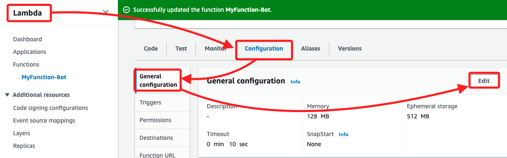
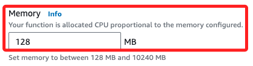
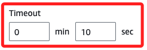

# Lambda 補充

 

## 關於 Timeout

1. 在 Lambda 的 Configuration 頁籤中，點擊 `General configuration` 後進行 `Edit`。

    

 

2. 關於記憶體配置關乎收費，參考書建議值為 128 MB。

    

 

3. 設定為 10 秒。

    

 

4. 一個 Lambda 最多可掛載 `5` 個 Layer，加起來的檔案 Size 不能超過 `250 MB`。

 

___

_END_