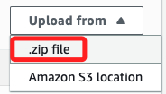
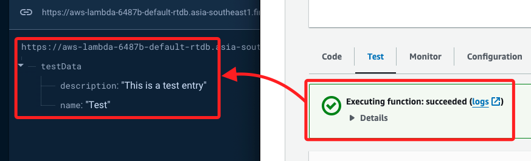

# 建立 Firebase Layer

<br>

## 建立 Firebase 專案

1. 建立專案，命名如 `AWS-Lambda`。

    

<br>

2. 進入 `Project settings`，切換到 `Service accounts`，點擊下載密鑰文件。

    

<br>

1. 進入下載資料夾，將密鑰文件進行重新命名 `serviceAccountKey.json`。

<br>

## 建立本機文件

1. 在桌面建立並進入專案資料夾 `_AWS_Firebase_`。

    ```bash
    cd ~/.Desktop && mkdir _AWS_Firebase_ && cd _AWS_Firebase_
    ```

<br>

2. 建立必要文件並啟動 VSCode。

    ```bash
    touch package.json index.js && code .
    ```

<br>

3. 編輯 `package.json`；特別注意，文件名稱要正確。

    ```json
    {
        "name": "firebase-lambda",
        "version": "1.0.0",
        "main": "index.js",
        "dependencies": {
            "firebase-admin": "^12.2.0"
        }
    }
    ```

<br>

4. 透過指令查詢 `firebase-admin` 版本。

    ```bash
    npm view firebase-admin version
    ```

    

<br>

5. 填寫的時候寫入 `^12.2.0`。

    ```json
    {
        "name": "firebase-lambda",
        "version": "1.0.0",
        "main": "index.js",
        "dependencies": {
            "firebase-admin": "^12.2.0"
        }
    }
    ```

<br>

6. 編輯 `index.js`。

    ```js
    const admin = require('firebase-admin');
    const serviceAccount = require('serviceAccountKey.json');

    admin.initializeApp({
        credential: admin.credential.cert(serviceAccount)
    });

    exports.handler = (event, context, callback) => {
        // 
        const firebaseStorage = admin.storage();

        // 可編輯 firestore 功能代碼
        const firebaseFirestore = admin.firestore();

        // 可編輯 auth 相關代碼
        const firebaseAuth = admin.auth();

        // 傳回成功的訊息
        callback(null, {
            statusCode: 200,
            body: JSON.stringify({ message: 'Firebase 服務初始化成功。'})
        });
    }
    ```

<br>

7. 將更名後的密鑰文件移至專案資料夾，這個文件將會一起打包到 AWS。

    ```bash
    mv ~/.Downloads/serviceAccountKey.json .
    ```

<br>

## 安裝

1. 執行安裝指令，將會依據 `package.json` 指定列表安裝所需套件到 `node_modules` 目錄中；假如有生成 `node_modules` 資料夾，就必須檢查是哪裡出錯。

    ```bash
    npm install
    ```

<br>

2. 對當前資料夾進行壓縮，並對壓縮後的檔案自訂名稱，如 `00_AWS_Firebase.zip`。

    ```bash
    zip -r 00_AWS_Firebase.zip .
    ```

<br>

3. 查詢 `nodejs` 版本號備用。

    ```bash
    node -v
    ```

    

<br>

## 進入 AWS Lambda

1. 建立 `Function`。

    

<br>

2. 自訂名稱，如 `MyFinction-Firebase`，並依據查詢結果選擇 `Nodejs` 版本，然後點擊右下角 `Create Function`。

    

<br>

3. 在 `Code` 頁籤中點擊右側的 `Upload from`。

    

<br>

4. 在下拉選單中選取 `.zip` 文件。

    

<br>

5. 選擇本地專案資料夾內的 `.zip` 文件。

    

<br>

6. 點擊右下角 `Save`。

    

<br>

7. 切換到 `Test` 頁籤，並點擊右側的 `Test`。

    

<br>

8. 完成時顯示 `succeeded`。

    

<br>

## 再次測試

_改用以下腳本測試寫入 Firebase Realtime Database，其餘設定相同_

<br>

1. 先在 Firebase 專案中建立 Realtime Database 服務，因為要複製資料庫的 URL。

    

<br>

2. 編輯 `index.js` 腳本，填入資料庫 URL；其餘步驟與前面相同，不再贅述。

    ```js
    const admin = require('firebase-admin');
    const serviceAccount = require('./serviceAccountKey.json');

    admin.initializeApp({
        credential: admin.credential.cert(serviceAccount),
        databaseURL: "https://aws-lambda-6487b-default-rtdb.asia-southeast1.firebasedatabase.app/"
    });

    exports.handler = async (event, context) => {
        context.callbackWaitsForEmptyEventLoop = false;

        try {
            // 寫入數據到 Firebase Realtime Database
            const db = admin.database();
            const ref = db.ref('testData');
            await ref.set({
                name: 'Test',
                description: 'This is a test entry'
            });

            // 回傳成功訊息
            return {
                statusCode: 200,
                body: JSON.stringify({ message: 'Data written to Firebase Realtime Database successfully' })
            };
        } catch (error) {
            // 回傳錯誤訊息
            return {
                statusCode: 500,
                body: JSON.stringify({ error: error.message })
            };
        }
    };
    ```

<br>

3. 點擊 `Test`，顯示成功，並寫入資料庫。

    

<br>

___

_END_