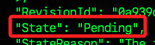

# LocalStack

_通過 Docker 容器模擬 AWS Lambda 服務_

<br>

## LocalStack

1. LocalStack 是一個本地 AWS 雲服務模擬器，可模擬多種 AWS 服務，包括 Lambda，可在本地開發和測試 AWS 服務。

<br>

## 停用並刪除當前運作中容器

1. 列出當前運行的 Docker 容器。

    ```bash
    docker ps
    ```

<br>

2. 停用容器。

    ```bash
    docker stop <container-id>
    ```

<br>

3. 刪除容器。

    ```bash
    docker rm <container-id>
    ```

<br>

4. 列出所有容器以確認刪除。

    ```bash
    docker ps -a
    ```

<br>

## 安裝與運行 LocalStack

1. 安裝 Docker：確保已在樹莓派上安裝了 Docker。

    _略_

<br>

2. 拉取 LocalStack Docker 映像。

    ```bash
    docker pull localstack/localstack
    ```

<br>

3. 運行 LocalStack。

    ```bash
    docker run -d -p 4566:4566 -p 4571:4571 -v /var/run/docker.sock:/var/run/docker.sock localstack/localstack
    # 或是
    docker run -d -p 4566:4566 -p 4510-4559:4510-4559 localstack/localstack
    ```

<br>

4. 檢查運行中容器的 ID。

    ```bash
    docker ps -a
    ```

<br>

5. 確認 Docker socket 是否掛載成功。

    ```bash
    docker inspect <localstack-container-id>
    ```

<br>

6. 或僅顯示容器的綁定端口和掛載點等訊息。

    ```bash
    docker inspect -f '{{.Name}} {{.HostConfig.Binds}} {{.HostConfig.PortBindings}}' <localstack-container-id>
    ```

<br>

7. 設置 Docker 環境變數。

    ```bash
    export DOCKER_HOST=unix:///var/run/docker.sock
    ```

<br>

8. 可設置超時時間為 `300` 秒，避免過短的設置發生超時錯誤。

    ```bash
    export LAMBDA_RUNTIME_ENVIRONMENT_TIMEOUT=300
    ```

<br>

9. 確保可使用 `awslocal`，需要安裝以下幾個模組；`awscli-local` 用於與本地的模擬 AWS 服務的工具 LocalStack 互動；`awscli` 是 Amazon 提供的命令行工具，用於與 AWS 服務互動；`localstack-client` 是 LocalStack 提供的 Python 客戶端庫。

    ```bash
    pip install awscli-local awscli localstack-client
    ```

<br>

## 確認 Lambda 函數和 Role 設置

1. 建立並進入專案資料夾。

    ```bash
    cd ~/Documents && mkdir exAWS && cd exAWS
    ```

<br>

2. 創建角色時的 AssumeRole 策略 `assume-role-policy.json`。

    ```bash
    touch assume-role-policy.json && sudo nano assume-role-policy.json
    ```

<br>

3. 定義 Lambda 的 IAM 角色策略。

    ```json
    {
        "Version": "2012-10-17",
        "Statement": [
            {
                "Effect": "Allow",
                "Principal": {
                    "Service": "lambda.amazonaws.com"
                },
                "Action": "sts:AssumeRole"
            }
        ]
    }
    ```

<br>

4. 建立並編輯執行策略 `execution-policy.json`。

    ```bash
    touch execution-policy.json && sudo nano execution-policy.json
    ```

<br>

5. 編輯。

    ```json
    {
        "Version": "2012-10-17",
        "Statement": [
            {
                "Effect": "Allow",
                "Action": "logs:*",
                "Resource": "arn:aws:logs:*:*:*"
            },
            {
                "Effect": "Allow",
                "Action": [
                    "lambda:InvokeFunction",
                    "lambda:GetFunction"
                ],
                "Resource": "*"
            }
        ]
    }
    ```

<br>

6. 創建角色。

    ```bash
    awslocal iam create-role --role-name lambda-role --assume-role-policy-document file://assume-role-policy.json
    ```

    _輸出_

    ```bash
    (envOpenCV) sam6238@raspi-2024-ssd:~/Documents/exAWS $ awslocal iam create-role --role-name lambda-role --assume-role-policy-document file://role-policy.json
    {
        "Role": {
            "Path": "/",
            "RoleName": "lambda-role",
            "RoleId": "AROAQAAAAAAAO7FVHRKXV",
            "Arn": "arn:aws:iam::000000000000:role/lambda-role",
            "CreateDate": "2024-07-19T15:17:41.136000Z",
            "AssumeRolePolicyDocument": {
                "Version": "2012-10-17",
                "Statement": [
                    {
                        "Effect": "Allow",
                        "Principal": {
                            "Service": "lambda.amazonaws.com"
                        },
                        "Action": "sts:AssumeRole"
                    }
                ]
            }
        }
    }
    ```

<br>

5. 附加執行策略。

    ```bash
    awslocal iam put-role-policy --role-name lambda-role --policy-name lambda-basic-execution --policy-document file://execution-policy.json
    ```

<br>

## 創建和部署 Lambda 函數

1. 在工作目錄下創建一個名為 `lambda_function.py` 的文件。

    ```bash
    touch lambda_function.py && sudo nano lambda_function.py
    ```

<br>

2. 編輯腳本內容；儲存後退出。

    ```python
    def lambda_handler(event, context):
        return {
            'statusCode': 200,
            'body': 'Hello from Lambda!'
        }
    ```

<br>

3. 壓縮 Lambda 函數代碼。

    ```bash
    zip function.zip lambda_function.py
    ```

<br>

4. 在專案資料夾內，使用 `awslocal` 命令創建和部署 Lambda 函數；結果成功建立並顯示詳細配置。

    ```bash
    awslocal lambda create-function --function-name my-function --runtime python3.8 --role arn:aws:iam::000000000000:role/lambda-role --handler lambda_function.lambda_handler --zip-file fileb://function.zip
    ```

<br>

5. 會顯示 `Pending`，稍等一陣子。

    

<br>

6. 檢查 Lambda 函數狀態。

    ```bash
    awslocal lambda get-function --function-name my-function
    ```

<br>

7. 成功建立後會顯示。

    ```bash
    "State": "Active",
    "LastUpdateStatus": "Successful",
    ```

<br>

8. 輸出中包含配置訊息。

    ```bash
    FunctionName: my-function
    Runtime: python3.10
    Role: arn:aws:iam::000000000000:role/lambda-role
    Handler: lambda_function.lambda_handler
    State: Pending - 函數正在創建中
    CodeSize: 284 bytes
    Timeout: 3 seconds
    MemorySize: 128 MB
    ```

<br>

9. 使用 `awslocal` 來測試 Lambda 函數，調用（invoke）在 LocalStack 中創建的 Lambda 函數 my-function，並將其執行結果寫入 output.txt 文件。

    ```bash
    awslocal lambda invoke --function-name my-function output.txt
    ```

<br>

10. 顯示 output.txt 文件的內容，從而查看 Lambda 函數的執行結果；特別注意，若有錯誤發生時不會有輸出文件。

    ```bash
    cat output.txt
    ```

<br>

## 關於錯誤

_使用 `awslocal lambda invoke` 測試時發生錯誤_

<br>

1. 錯誤訊息表示 Lambda 函數處於 Failed 狀態，這表示在創建或更新函數時發生了某些問題，導致函數無法正確執行；特別注意，錯誤發生時，不會建立 `output.txt` 文件。

    

<br>

2. 錯誤訊息。

    ```bash
    An error occurred (ServiceException) when calling the Invoke operation (reached max retries: 4): Internal error while executing lambda
    ```

<br>

3. 若出現函數已經存在的錯誤，可刪除衝突的 Lambda 函數。

    ```bash
    awslocal lambda delete-function --function-name my-function
    ```

<br>

## 關於角色

_錯誤訊息 `EntityAlreadyExists` 錯誤，表示名為 `lambda-role` 的角色已經存在_

<br>

1. 檢查已存在的角色。

    ```bash
    awslocal iam get-role --role-name lambda-role
    ```

<br>

2. 如果確定要重新創建角色，可以先刪除已存在的角色。

    ```bash
    awslocal iam delete-role --role-name lambda-role
    ```

<br>

3. 刪除角色後，重新創建角色並附加策略。

    ```bash
    awslocal iam create-role --role-name lambda-role --assume-role-policy-document file://assume-role-policy.json
    ```

<br>

## 各種檢查

1. 檢查 Docker 是否正在運行。

    ```bash
    docker ps
    ```

<br>

2. 查詢日誌。

    ```bash
    docker logs <容器 ID>
    ```

<br>

3. 檢查 Lambda 函數狀態。

    ```bash
    awslocal lambda get-function --function-name my-function
    ```

<br>

4. 檢查 Lambda 函數列表，確認是否確實存在名為 my-function 的 Lambda 函數。

    ```bash
    awslocal lambda list-functions
    ```

<br>

5. 檢查現有角色。

    ```bash
    awslocal iam list-roles
    ```

<br>

6. 檢查角色策略。

    ```bash
    awslocal iam get-role-policy --role-name lambda-role --policy-name lambda-basic-execution
    ```

    <br>

## 容器操作

1. 停用當前 LocalStack 容器。

    ```bash
    docker stop <localstack-container-id>
    ```

<br>

2. 刪除當前容器。

    ```bash
    docker rm <localstack-container-id>
    ```

<br>

3. 重新啟動 LocalStack 並確保 Docker 正確掛載。

    ```bash
    docker run -d -p 4566:4566 -p 4571:4571 -v /var/run/docker.sock:/var/run/docker.sock localstack/localstack
    ```

<br>

## 成功時查看

1. 當 Lambda 函數狀態顯示為 Active 並且 LastUpdateStatus 為 Successful 時，調用函數建立輸出；這似乎需要一點時間。

    ```bash
    awslocal lambda invoke --function-name my-function output.txt
    ```

<br>

2. 然後查看輸出。

    ```bash
    cat output.txt
    ```

<br>

___

_END_