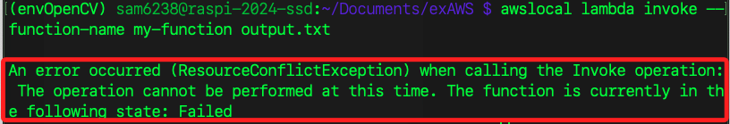

# LocalStack

_通過 Docker 容器模擬 AWS Lambda 服務_

<br>

## LocalStack

1. LocalStack 是一個本地 AWS 雲服務模擬器，可模擬多種 AWS 服務，包括 Lambda，可在本地開發和測試 AWS 服務。

<br>

## 停用並刪除當前運作中容器

1. 列出當前運行的 Docker 容器。

    ```bash
    docker ps
    ```

2. 停用容器。

    ```bash
    docker stop <container-id>
    ```

3. 刪除容器。

    ```bash
    docker rm <container-id>
    ```

4. 列出所有容器以確認刪除。

    ```bash
    docker ps -a
    ```

<br>

## 安裝與運行 LocalStack

1. 安裝 Docker：確保已在樹莓派上安裝了 Docker。

    _略_

<br>

2. 拉取 LocalStack Docker 映像。

    ```bash
    docker pull localstack/localstack
    ```

<br>

3. 運行 LocalStack。

    ```bash
    docker run -d -p 4566:4566 -p 4571:4571 -v /var/run/docker.sock:/var/run/docker.sock localstack/localstack

    ```

4. 檢查 ID。

    ```bash
    docker ps
    ```

5. 確認 Docker socket 是否掛載成功。

    ```bash
    docker inspect <localstack-container-id>
    ```

6. 設置 Docker 環境變數。

    ```bash
    export DOCKER_HOST=unix:///var/run/docker.sock
    ```

7. 確保可使用 `awslocal`，需要安裝以下幾個模組；`awscli-local` 用於與本地的模擬 AWS 服務的工具 LocalStack 互動；`awscli` 是 Amazon 提供的命令行工具，用於與 AWS 服務互動；`localstack-client` 是 LocalStack 提供的 Python 客戶端庫。

    ```bash
    pip install awscli-local awscli localstack-client
    ```

<br>

## 確認 Lambda 函數和 Role 設置


1. 建立並進入專案資料夾。

    ```bash
    cd ~/Documents && mkdir exAWS && cd exAWS
    ```

2. 創建 JSON 文件 `role-policy.json`。
    ```bash
    touch role-policy.json && sudo nano role-policy.json
    ```

3. 定義 Lambda 的 IAM 角色策略。

    ```json
    {
      "Version": "2012-10-17",
      "Statement": [
        {
          "Effect": "Allow",
          "Principal": {
            "Service": "lambda.amazonaws.com"
          },
          "Action": "sts:AssumeRole"
        }
      ]
    }
    ```

4. 創建角色。

    ```bash
    awslocal iam create-role --role-name lambda-role --assume-role-policy-document file://role-policy.json
    ```

    _輸出_

    ```bash
    (envOpenCV) sam6238@raspi-2024-ssd:~/Documents/exAWS $ awslocal iam create-role --role-name lambda-role --assume-role-policy-document file://role-policy.json
    {
        "Role": {
            "Path": "/",
            "RoleName": "lambda-role",
            "RoleId": "AROAQAAAAAAAO7FVHRKXV",
            "Arn": "arn:aws:iam::000000000000:role/lambda-role",
            "CreateDate": "2024-07-19T15:17:41.136000Z",
            "AssumeRolePolicyDocument": {
                "Version": "2012-10-17",
                "Statement": [
                    {
                        "Effect": "Allow",
                        "Principal": {
                            "Service": "lambda.amazonaws.com"
                        },
                        "Action": "sts:AssumeRole"
                    }
                ]
            }
        }
    }
    ```

<br>

## 創建和部署 Lambda 函數

1. 在工作目錄下創建一個名為 `lambda_function.py` 的文件。

    ```bash
    touch lambda_function.py && sudo nano lambda_function.py
    ```

2. 編輯腳本內容；儲存後退出。

    ```python
    def lambda_handler(event, context):
        return {
            'statusCode': 200,
            'body': 'Hello from Lambda!'
        }
    ```

3. 壓縮 Lambda 函數代碼。

    ```bash
    zip function.zip lambda_function.py
    ```

4. 在專案資料夾內，使用 `awslocal` 命令創建和部署 Lambda 函數；結果成功建立並顯示詳細配置。

    ```bash
    awslocal lambda create-function --function-name my-function --runtime python3.10 --role arn:aws:iam::000000000000:role/lambda-role --handler lambda_function.lambda_handler --zip-file fileb://function.zip
    ```

    _成功建立後會顯示配置_

    ```bash
    FunctionName: my-function
    Runtime: python3.10
    Role: arn:aws:iam::000000000000:role/lambda-role
    Handler: lambda_function.lambda_handler
    State: Pending - 函數正在創建中
    CodeSize: 284 bytes
    Timeout: 3 seconds
    MemorySize: 128 MB
    ```

5. 使用 `awslocal` 來測試 Lambda 函數，調用（invoke）在 LocalStack 中創建的 Lambda 函數 my-function，並將其執行結果寫入 output.txt 文件。

    ```bash
    awslocal lambda invoke --function-name my-function output.txt
    ```

6. 出現錯誤訊息表示 Lambda 函數處於 Failed 狀態，這表示在創建或更新函數時發生了某些問題，導致函數無法正確執行；特別注意，錯誤發生時，不會建立 `output.txt` 文件。

    

7. 顯示 output.txt 文件的內容，從而查看 Lambda 函數的執行結果。

    ```bash
    cat output.txt
    ```

<br>

## 各種檢查

1. 檢查 Docker 是否正在運行。

    ```bash
    docker ps
    ```

2. 檢查 Lambda 函數狀態。

    ```bash
    awslocal lambda get-function --function-name my-function
    ```

3. 檢查 LocalStack 容器的日誌，以確保沒有其他錯誤。

    ```bash
    docker logs <localstack-container-id>
    # 例如
    docker logs 0de469e86f8c
    ```

<br>

4. 停用當前 LocalStack 容器。

    ```bash
    docker stop <localstack-container-id>
    ```

5. 刪除當前容器。

    ```bash
    docker rm <localstack-container-id>
    ```

6. 重新啟動 LocalStack 並確保 Docker 正確掛載。

    ```bash
    docker run -d -p 4566:4566 -p 4571:4571 -v /var/run/docker.sock:/var/run/docker.sock localstack/localstack
    ```

7. 確認 Docker 主機環境變量設置。

    ```bash
    export DOCKER_HOST=unix:///var/run/docker.sock
    ```

8. 再次創建 Lambda 函數。

    ```bash
    awslocal lambda create-function --function-name my-function --runtime python3.10 --role arn:aws:iam::000000000000:role/lambda-role --handler lambda_function.lambda_handler --zip-file fileb://function.zip
    ```

9. 即便是順利啟動服務，但是立即檢查應該會得到 `Pending`，過幾分鐘進行檢查。

    ```bash
    awslocal lambda get-function --function-name my-function
    ```

    _成功時會顯示_

    ```bash
    "State": "Active",
    "LastUpdateStatus": "Successful",
    ```

## 成功時查看

1. 當 Lambda 函數狀態顯示為 Active 並且 LastUpdateStatus 為 Successful 時，調用函數建立輸出；這似乎需要一點時間。
```bash
awslocal lambda invoke --function-name my-function output.txt
```

2. 然後查看輸出。

```bash
cat output.txt
```

## 錯誤排除

1. 檢查 Lambda 函數列表，確認是否確實存在名為 my-function 的 Lambda 函數。

    ```bash
    awslocal lambda list-functions
    ```

2. 函數已經存在，刪除已經存在的 Lambda 函數。

    ```bash
    awslocal lambda delete-function --function-name my-function
    ```

<br>

___

_END_