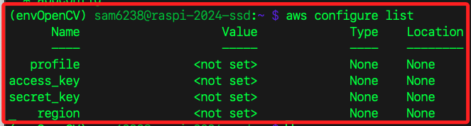

# LocalStack 

_通過 Docker 容器模擬 AWS Lambda 服務，可參考 [官方說明](https://docs.localstack.cloud/getting-started/installation/)_

<br>

## 簡介

1. LocalStack 是一個用於本地開發的工具，允許在本地模擬 AWS 雲端環境中的多個服務，可在不實際連接 AWS 的情況下進行開發和測試。

<br>

2. LocalStack 主要支援的是 `無狀態的` AWS 服務，如 S3、Lambda、DynamoDB 等。對於 EC2 等涉及 `狀態` 和 `持久化` 的服務並不直接支援。具體來說，LocalStack 不完全支援 EC2 的模擬，因此無法完全仿真 EC2 實例的建立和管理。

<br>

3. 延續上一點，可以使用 LocalStack 模擬一些相關的 EC2 API 呼叫，但無法真正啟動和管理 EC2 實例。

<br>

## 主要功能

1. 可模擬多種 AWS 服務，如 S3、DynamoDB、Lambda、API Gateway 等。

<br>

2. 通常使用 Docker 容器進行部署，因此能夠輕鬆整合到現有的開發環境中，只需簡單的 Docker 指令即可啟動和配置。

<br>

3. 可以在本地環境中進行自動化測試，而無需每次都部署到真實的 AWS 環境中進行測試，這對於 CI/CD 流程的優化非常有幫助。

<br>

## 安裝 LocalStack。

_以下將使用 AWS CLI 進行操作_

<br>

1. 首先需要在本地安裝 Docker。

<br>

2. 使用以下命令啟動 LocalStack。

    ```bash
    docker run --rm -it -p 4566:4566 -p 4571:4571 localstack/localstack
    ```

<br>

3. 設定 AWS CLI 使用的 `aws_access_key_id` 及 `aws_secret_access_key` 為 `test`，這是虛擬的 ID 及 Key；在 LocalStack 中不需要真實的 AWS 憑證，透過任意的虛擬值來指向 LocalStack 提供的模擬服務即可；特別注意，在預設區域部分，雖然這個設定對 LocalStack 的模擬環境運行影響不大，但仍需要指定一個有效的區域，所以這裡設定為 `us-east-1`。

    ```bash
    # 設定 AWS Access Key ID
    aws configure set aws_access_key_id test
    
    # 設定 AWS Secret Access Key
    aws configure set aws_secret_access_key test
    
    # 設定預設區域
    aws configure set region us-east-1
    ```

<br>

4. 也可以使用以下指令讓系統引導設置。

    ```bash
    aws configure
    ```

<br>

5. 查詢當前環境中的設定值。

    ```bash
    aws configure list
    ```

<br>

6. 延續上一點，假如還沒設定會顯示如下。

    

<br>

7. 查看特定配置文件的位置。

    ```bash
    aws configure list --profile default
    ```

<br>

8. AWS 的設定文件預設路徑為 `~/.aws`，可透過指令查詢當前設定文件。

    ```bash
    cat ~/.aws/credentials
    cat ~/.aws/config
    ```

<br>

## 使用 LocalStack 提供的服務

_以 S3 為例_

<br>

1. 建立一個 S3 Bucket，並自訂 S3 bucket 的名稱為 `my-local-bucket`，`--endpoint-url=http://localhost:4566` 是指定 AWS CLI 連接的端點 URL，指向 LocalStack 運行的本地地址和端口 `http://localhost:4566`，而不是實際的 AWS 雲端服務；`mb` 代表 `make bucket`，用於建立新 S3 bucket 的子命令。

    ```bash
    aws --endpoint-url=http://localhost:4566 s3 mb s3://my-local-bucket
    ```

<br>

2. 列出當前 LocalStack 環境中所有已建立的 S3 buckets。

    ```bash
    aws --endpoint-url=http://localhost:4566 s3 ls
    ```

<br>

3. 列出指定 bucket（`my-local-bucket`）中的所有物件；如果 bucket 是空的，會顯示則不會回傳任何數據。

    ```bash
    aws --endpoint-url=http://localhost:4566 s3 ls s3://my-local-bucket
    ```

<br>

4. 檢查 LocalStack 日誌。

    ```bash
    docker logs <容器 ID>
    ```

<br>

5. 查詢容器清單。

    ```bash
    docker ps
    ```

<br>

___

_END_