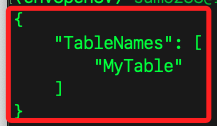

# 模擬 DynamoDB

<br>

## 安裝和啟動 LocalStack

1. 確保已安裝 Docker 並啟動 LocalStack 容器。

    ```bash
    docker run --rm -it -p 4566:4566 -p 4571:4571 localstack/localstack
    ```

<br>

2. 配置 AWS CLI 以連接到 LocalStack。

    ```bash
    aws configure set aws_access_key_id test
    aws configure set aws_secret_access_key test
    aws configure set region us-east-1
    ```

<br>

## 建立 DynamoDB

1. 建立一個 DynamoDB Table。

    ```bash
    aws --endpoint-url=http://localhost:4566 dynamodb create-table \
        --table-name MyTable \
        --attribute-definitions AttributeName=Id,AttributeType=S \
        --key-schema AttributeName=Id,KeyType=HASH \
        --provisioned-throughput ReadCapacityUnits=5,WriteCapacityUnits=5
    ```

<br>

2. 列出所有 DynamoDB Table。

    ```bash
    aws --endpoint-url=http://localhost:4566 dynamodb list-tables
    ```

    

<br>

3. 描述表結構。

    ```bash
    aws --endpoint-url=http://localhost:4566 dynamodb describe-table --table-name MyTable
    ```

<br>

4. 插入數據到 Table。

    ```bash
    aws --endpoint-url=http://localhost:4566 dynamodb put-item \
        --table-name MyTable \
        --item '{
        "Id": {"S": "223"},
        "Name": {"S": "模擬項目 02"},
        "Price": {"N": "130"}
        }'
    ```

<br>

5. 查詢 Table 中的數據。

    ```bash
    aws --endpoint-url=http://localhost:4566 dynamodb get-item \
        --table-name MyTable \
        --key '{"Id": {"S": "123"}}'
    ```

    

<br>

6. 掃描 Table 以取得所有項目。

    ```bash
    aws --endpoint-url=http://localhost:4566 dynamodb scan --table-name MyTable
    ```

<br>

## 關於持久化

1. 如果在樹莓派上使用 Docker 容器運行 LocalStack 並模擬 DynamoDB，關機重啟後，容器中的所有數據將會丟失，因為 Docker 容器預設是無狀態的。

<br>

2. 為了使 DynamoDB 的數據在重啟後仍然存在，需要將數據持久化到主機文件系統中，這需要使用 `-v` 參數將主機上的目錄掛載到容器中。

<br>

## 使用參數 `-v` 持久化數據

1. 建立一個目錄來保存 LocalStack 的數據。

    ```bash
    mkdir -p ~/Documents/localstack/data
    ```

<br>

2. 運行 LocalStack 並掛載數據目錄。

    ```bash
    docker run --rm -it -p 4566:4566 -p 4571:4571 -v ~/Documents/localstack/data:/tmp/localstack localstack/localstack
    ```

<br>

3. 若尚未配置，可運行以下 AWS CLI 指令進行配置。

    ```bash
    aws configure set aws_access_key_id test
    aws configure set aws_secret_access_key test
    aws configure set region us-east-1
    ```

<br>

## 使用 AWS CLI 操作 DynamoDB

1. 建立一個 DynamoDB 表。

    ```bash
    aws --endpoint-url=http://localhost:4566 dynamodb create-table \
        --table-name MyTable \
        --attribute-definitions AttributeName=Id,AttributeType=S \
        --key-schema AttributeName=Id,KeyType=HASH \
        --provisioned-throughput ReadCapacityUnits=5,WriteCapacityUnits=5
    ```

<br>

2. 插入數據到表中。

    ```bash
    aws --endpoint-url=http://localhost:4566 dynamodb put-item \
        --table-name MyTable \
        --item '{
        "Id": {"S": "123"},
        "Name": {"S": "Sample Item"},
        "Price": {"N": "100"}
        }'
    ```

<br>

## 重啟容器進行測試

1. 停止當前運行的容器。

    ```bash
    docker stop <container_id>
    ```

<br>

2. 重新運行 LocalStack，並 _掛載相同的數據目錄 `~/Documents/localstack/data`_，這樣重啟後將會從掛載的數據目錄中加載先前的數據，使 DynamoDB 表和數據在重啟後仍然存在。

    ```bash
    docker run --rm -it -p 4566:4566 -p 4571:4571 -v ~/Documents/localstack/data:/tmp/localstack localstack/localstack
    ```

<br>

___

_END_