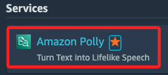
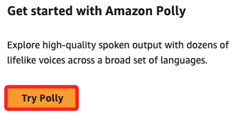

# 簡單範例

_使用 `Amazon Polly` 建立一個 `Text-to-Speech Converter` 專案_

<br>

## 概述

1. 使用 Amazon Polly 將文字轉換為語音。

<br>

2. 建立一個 API 來接收用戶輸入的文字並返回語音文件。

<br>

3. 使用 AWS Lambda 來處理文字轉換請求。

<br>

4. 使用 Amazon S3 來存儲生成的語音文件。

<br>

5. 使用 API Gateway 來提供 API 接口。

<br>

6. 設置 IAM 角色和權限來確保安全性。

<br>

## Polly

1. 進入服務。

    

<br>

2. 開始使用。

    

<br>

## 步驟

1. 建立一個 S3 Bucket 來存儲生成的語音文件。

    ```bash
    aws s3 mb s3://<Bucket 名稱>
    ```

<br>

2. 建立一個 IAM 角色，並附加以下政策。

    ```bash
    - AmazonPollyFullAccess
    - AmazonS3FullAccess
    - AWSLambdaBasicExecutionRole
    ```

<br>

3. 建立 Lambda 來處理文字轉換請求。

    ```python
    import boto3
    import os

    def lambda_handler(event, context):
        text = event.get('text', 'Hello, world!')
        polly = boto3.client('polly')
        response = polly.synthesize_speech(
            Text=text,
            OutputFormat='mp3',
            VoiceId='Joanna'
        )

        s3 = boto3.client('s3')
        bucket_name = os.environ['S3_BUCKET']
        object_key = f"speech/{context.aws_request_id}.mp3"

        s3.put_object(
            Bucket=bucket_name,
            Key=object_key,
            Body=response['AudioStream'].read()
        )

        return {
            'statusCode': 200,
            'body': f"https://{bucket_name}.s3.amazonaws.com/{object_key}"
        }
    ```

<br>

4. 部署 Lambda 函數，並設置環境變數 `S3_BUCKET` 為建立的 S3 Bucket 名稱。

<br>

## 建立 API Gateway

1. 建立一個新的API。

<br>

2. 設置一個POST方法，並將其與Lambda函數集成。

<br>

3. 配置API Gateway來觸發Lambda函數，並處理請求和回應。

<br>

## 測試和部署

1. 部署API，並獲取API的URL。

<br>

2. 測試API，確保可以成功將文字轉換為語音並存儲在S3桶中。

<br>

___

_END：尚未完成_