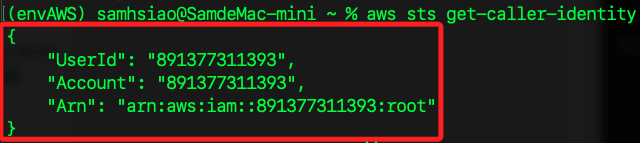
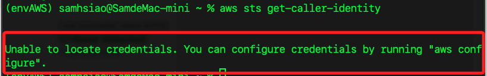
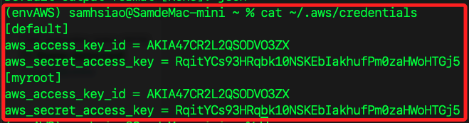
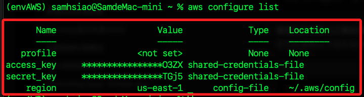
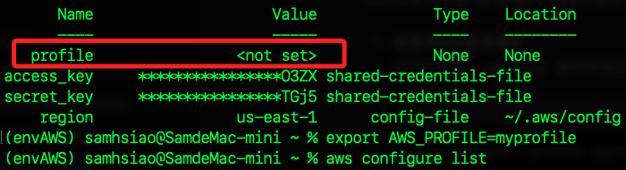
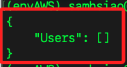
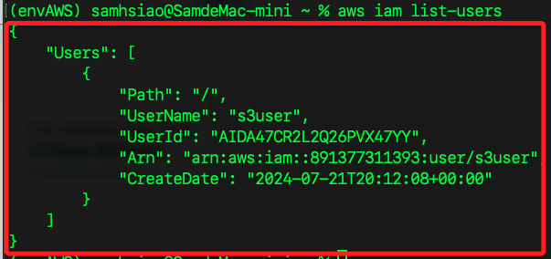

# 建立 IAM User

_使用 CLI 建立一個具有 S3 完整權限的 IAM User_

<br>

## 開始之前

1. 確認是否已經配置和登入可以使用 AWS CLI；已經登入時，這個指令也可用於取回 `UserId` 及 `Arn`。

    ```bash
    aws sts get-caller-identity
    ```

    

<br>

2. 假如尚未登入任何 IAM User，會提示執行指令登入。

    

<br>

3. 執行登入指令，也可用於重置登入設定。

    ```bash
    aws configure
    ```

<br>

4. 設定時對設定的文件自訂名稱，如命名為 `myroot`。

    ```bash
    aws configure --profile myroot
    ```

    

<br>

5. 設定好 profile 之後，你可以使用環境變數來切換到指定的 profile，例如要使用預設的 `default`。

    ```bash
    export AWS_PROFILE=default
    ```

<br>

6. 確認當前登入帳號的密鑰資訊。

    ```bash
    aws configure list
    ```

    

<br>

6. 若並非使用環境參數登入預設帳號，查詢配置文件時，`profile` 顯示 `<not set>` 是正常的。

    

<br>

## 建立 User

1. 查詢當前有哪些 User；特別注意，會回傳一個列表，但不包含 `root` 帳號。

    ```bash
    aws iam list-users
    ```

    

<br>

2. 建立一個新的 IAM 用戶，命名為 `s3user`。

    ```bash
    aws iam create-user --user-name s3user
    ```

<br>

3. 為用戶 `s3user` 建立訪問密鑰，包含 `Access Key` 和 `Secret Key`；務必將密鑰儲存好，之後將無法查詢。

    ```bash
    aws iam create-access-key --user-name s3user
    ```

<br>

4. 再次查詢 `aws iam list-users`。

    

<br>

___

_END_