# IoT Core

_以下結合樹莓派進行操作，這個部分可在 Learner Lab 中操作。_

<br>

## 說明

1. 進入 `IoT Core`。

    

<br>

2. 左側 `Manage` 中選取 `All devices`，然後點擊 `Things`。

    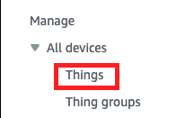

<br>

3. 點擊右上角的 `Create things`。

    

<br>

4. 選取 `Create single thing`，然後點擊右下角 `Next`。

    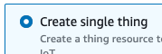

<br>

5. 任意命名，如 `Raspi5_AWS_1`，然後點擊右下角的 `Next`。

    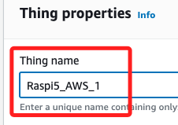

<br>

6. 在 `Device certificate` 部分，使用預設的 `Auto-generate a new certificate (recommended)` 即可，點擊 `Next`。

    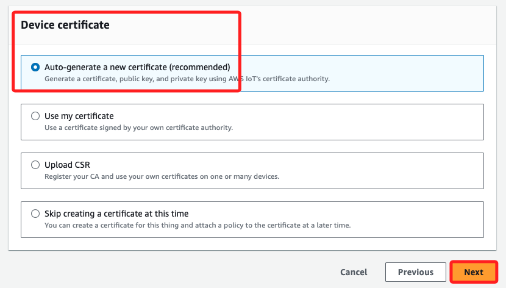

<br>

7. Polices 部分先不用填寫，直接點擊 `Create thing`。

    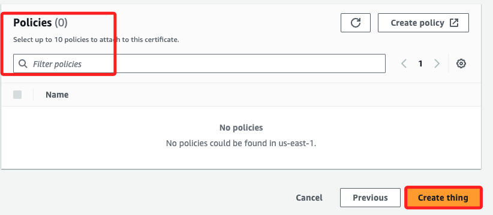

<br>

## 下載憑證與密鑰

1. 會看到以下畫面，特別注意這裡有提到，這會是 _唯一一次機會_ 下載憑證與密鑰。

    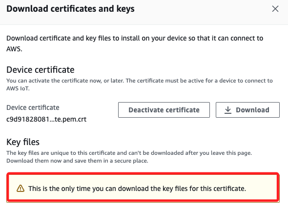

<br>

2. 第一步，下載 `Device certificate`。

    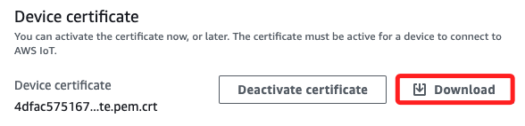

<br>

3. 接著將下方四個項目也都下載。

    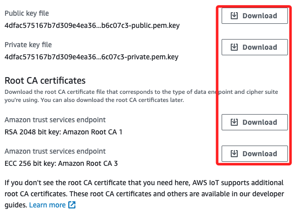

<br>

4. 確認沒有缺漏後點擊右下角的 `Done`。

    

<br>

5. 下載完成後可在本機查看是否下載了五個文件。

    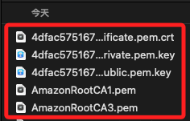

<br>

## 安全性

1. 展開左側 `Security`，並點擊 `Policies`。

    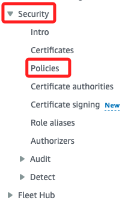

<br>

2. 點擊右上角的 `Create policy`。

    

<br>

3. 自訂名稱如 `MyPolicy_Raspi5_01`。

    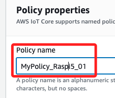

<br>

4. 在 `Policy document` 中切換到 `JSON`。

    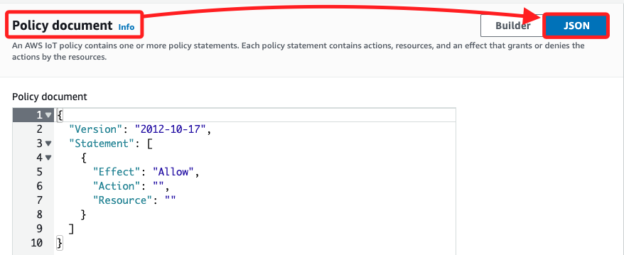

<br>

5. 編輯文件內容，在 `Action` 中加入 `iot:*`，`Resource` 加入 `*`，如下。

    ```json
    {
        "Version": "2012-10-17",
        "Statement": [
            {
            "Effect": "Allow",
            "Action": "iot:*",
            "Resource": "*"
            }
        ]
    }
    ```

<br>

6. 完成後點擊右下角的 `Create`。

    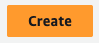

<br>

7. 清單中添加一個政策。

    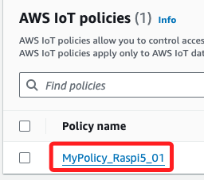

<br>

## 設定

1. 回到 `Things`，點擊先前所建立的 Thing `Raspi5_AWS_1` 進入設定畫面。

    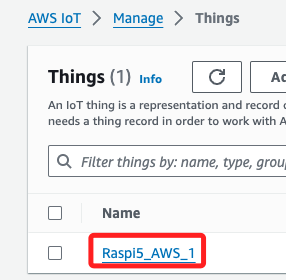

<br>

2. 進入後，點擊名稱邊的 `Info` 可以查看文件。

    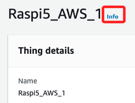

<br>

3. 滑動到下方，將頁籤切換到 `Certificates`。

    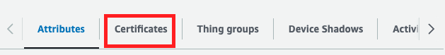

<br>

4. 目前已經有一個證書，點 ID 進入詳細頁面。

    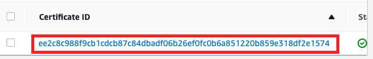

<br>

5. 滑到下方 `Policies` 點右側的 `Attach policies`。

    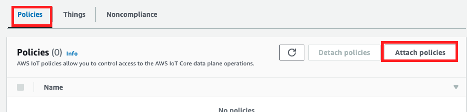

<br>

6. 在跳出的視窗中選取前面步驟所定義的 Policy，並且 `Attach policies`。

    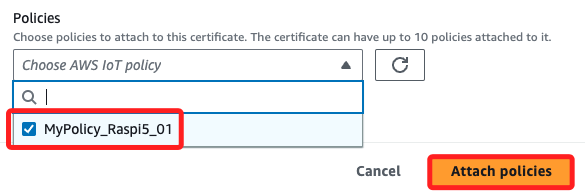

<br>

7. 相關操作資訊都會顯示在上方。

    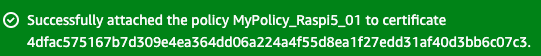

<br>

8. 在 Policies 部分也就是添加了這個 Policy。

    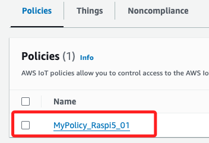

<br>

___

_進入下一步驟_

