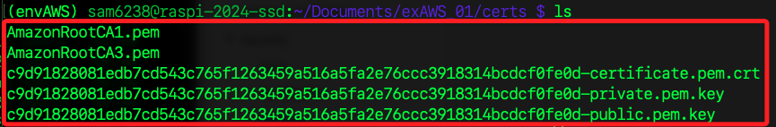
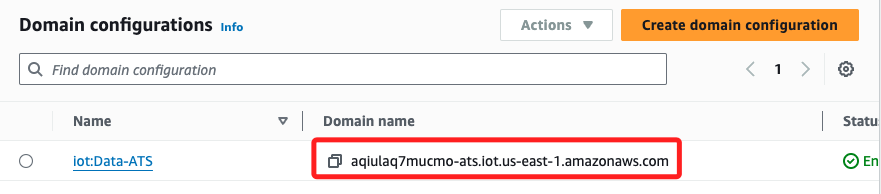

# 在樹莓派進行設置

_以下操作是在樹莓派進行，AWS 網頁不用關閉，設置過程還需複製資訊_

<br>

## 準備文本

1. 內容如下。

    ```bash
    # 第一部分：複製 AWS CLI 貼上，格式不重要，稍後會直接覆蓋
    [default]
    aws_access_key_id=
    aws_secret_access_key=
    aws_session_token=


    # 第二部分：建立環境變數
    export AWS_ACCESS_KEY_ID=$aws_access_key_id
    export AWS_SECRET_ACCESS_KEY=$aws_secret_access_key
    export AWS_SESSION_TOKEN=$aws_session_token


    # 第三部分：其他環境變數
    CERTIFICATE_ARN=
    HASH=
    DOMAIN_NAME=
    ```

<br>

2. 在本機終端機中先運行一次三部分。

    

<br>

## 安裝 NVM

_進入樹莓派安裝 `NVM`，這用於管理多版本 Nodejs 的工具。_

<br>

1. 更新系統套件。

    ```bash
    sudo apt update && sudo apt upgrade -y
    ```

<br>

2. 下載並執行 NVM 安裝腳本。

    ```bash
    curl -o- https://raw.githubusercontent.com/nvm-sh/nvm/v0.40.0/install.sh | bash
    ```

<br>

3. 使其在當前視窗中立即生效。

    ```bash
    source ~/.bashrc
    ```

<br>

4. 安裝 Node.js Version 20.18.0。

    ```bash
    nvm install 20
    ```

<br>

5. 檢查版本。

    ```bash
    node -v && npm -v
    ```

<br>

## 建立虛擬環境

1. 進入 Documents 並建立虛擬環境管理目錄 `PythonENVs`。

    ```bash
    cd ~/Documents && mkdir PythonENVs && cd PythonENVs
    ```

<br>

2. 建立虛擬環境 `envAWS`。

    ```bash
    python -m venv envAWS
    ```

<br>

3. 編輯 `~/.bashrc`。

    ```bash
    sudo nano ~/.bashrc
    ```

<br>

4. 寫入以下路徑。

    ```bash
    source /home/sam6238/Documents/PythonENVs/envAWS/bin/activate
    ```

<br>

5. 套用變更。

    ```bash
    source ~/.bashrc
    ```

<br>

## 建立專案

1. 安裝 paho-mqtt 來作為 MQTT 客戶端。

    ```bash
    pip install paho-mqtt
    ```

<br>

2. 安裝 AWS IoT SDK for Python。

    ```bash
    pip install AWSIoTPythonSDK
    ```

<br>

3. 在樹莓派安裝 AWS CLI。

    ```bash
    pip install awscli --upgrade
    ```

<br>

4. 在 `文件` 中建立並進入專案目錄 `exAWS_01`。

    ```bash
    cd ~/Documents && mkdir exAWS_01 && cd exAWS_01
    ```

<br>

5. 在專案目錄內新增目錄 `certs`。

    ```bash
    mkdir certs
    ```

<br>

## 傳送檔案到樹莓派

_回到本機_

<br>

1. 進入 `Downloads` 資料夾；避免下一個指令太長。

    ```bash
    cd ~/Downloads
    ```

<br>

2. 提取憑證 ARN 中的哈希值並存入變數。

    ```bash
    CERTIFICATE_ARN=$(aws iot list-thing-principals --thing-name "Raspi5_AWS_1" --region us-east-1 --query "principals[0]" --output text)
    HASH=$(echo $CERTIFICATE_ARN | awk -F'cert/' '{print $2}')
    ```

<br>

3. 可查看是否正確儲存，也可以寫入記錄文檔。

    ```bash
    echo $HASH
    ```

<br>

4. 把下載的五個證書放到樹莓派的專案資料夾的 `certs` 目錄內；這裡保留 `~/Downloads/` 只是便於理解指令結構，由於已經在下載資料夾中，語句中可以省略路徑。

    ```bash
    scp ~/Downloads/${HASH}-certificate.pem.crt \
        ~/Downloads/${HASH}-private.pem.key \
        ~/Downloads/${HASH}-public.pem.key \
        ~/Downloads/AmazonRootCA1.pem \
        ~/Downloads/AmazonRootCA3.pem \
        ssd:~/Documents/exAWS_01/certs/
    ```

<br>

5. 返回樹莓派查看。

    

<br>

## 取得 AWS 端點

_回到 AWS 主控台_

<br>

1. 在 `AWS IoT` 的主控台中，點擊左側下方的 `Settings`。

    

<br>

2. 更新後 `Endpoint` 已經移除，點擊任一 `domain` 設置。

    

<br>

3. 複製 `Domain name`，這就是端點，貼在記錄文檔中。

    

<br>

4. 運行指令查詢 `Domain name`。

    ```bash
    DOMAIN_NAME=$(aws iot describe-endpoint --endpoint-type iot:Data-ATS --query "endpointAddress" --output text --region us-east-1)
    echo $DOMAIN_NAME
    ```

<br>

## 建立專案

1. 建立專案，名稱自訂，如 `ex01.ipynb`。

    ```bash
    cd ~/Documents/exAWS_01 && touch ex01.ipynb
    ```

<br>

2. 可使用 VSCode 連線上一步驟的專案，複製以下代碼，要修改其中部分項目 `awshost`、`clientId`、`thingName`、`caPath、certPath、keyPath`；這將在下一個步驟中逐一查詢。

    ```python
    '''
    建立一個 MQTT 客戶端，使其可以連線到 AWS IoT Core
    然後持續向 topic/test 這個主題發布訊息，
    訊息在範例中是 "Hello from Raspberry Pi 111!"。
    '''
    # 導入必要的程式庫：MQTT 客戶端、SSL 加密通訊以及 JSON 格式資料處理
    import paho.mqtt.client as mqtt
    import ssl
    import json
    import time
    from datetime import datetime

    # 在 AWS 查尋後填入
    _awshost = '<端點>'

    # 哈希
    _HASH = '<哈希前綴>'

    # 任意自訂
    _clientId = 'MyClientId-001'

    # 自訂在 AWS 上
    _thingName = "Raspi5_AWS_1"

    # CA1
    _caPath = './certs/AmazonRootCA1.pem'
    # certificate
    _certPath = f'./certs/{_HASH}-certificate.pem.crt'
    # private
    _keyPath = f'./certs/{_HASH}-private.pem.key'

    # AWS IoT Core 的連線設定
    # 定義你的 AWS IoT Core 端點
    awshost = _awshost
    # 定義連線的端口號，一般為 8883
    awsport = 8883
    # 定義獨特的客戶端 ID
    clientId = _clientId
    # 定義在 AWS IoT Core 中的 thing 名稱
    thingName = _thingName
    # 定義 SSL/TLS 連線所需的憑證和金鑰路徑
    caPath = _caPath
    certPath = _certPath
    keyPath = _keyPath
    # 定義連線回呼函數，當連線成功後會被呼叫
    # 此函數將連線結果印出，並訂閱所有子主題
    def on_connect(client, userdata, flags, rc):
        print("連線結果回報代碼:" + str(rc))
        client.subscribe("#")
    # 建立 MQTT 客戶端，並設定連線回呼函數
    mqttc = mqtt.Client()
    mqttc.on_connect = on_connect
    # 設定 SSL/TLS 加密通訊的憑證和金鑰
    mqttc.tls_set(caPath, certfile=certPath, keyfile=keyPath, cert_reqs=ssl.CERT_REQUIRED, tls_version=ssl.PROTOCOL_TLSv1_2, ciphers=None)
    # 連線至 AWS IoT Core
    mqttc.connect(awshost, awsport, keepalive=60)
    # 開始 MQTT 通訊
    mqttc.loop_start()
    # 發布 10 次訊息
    # 建立一個 JSON 相容的字典，然後轉換成 JSON 格式並發布
    for i in range(10):
        current_time = datetime.now().strftime("%Y-%m-%d %H:%M:%S")
        message = {"time": current_time}
        mqttc.publish("sdk/test/js", json.dumps(message))
        print(f"Published message {i+1}: {message}")
        time.sleep(2)
    ```

<br>

## 繼續編輯腳本

1. 自定義一個 `clientId` 如 `MyClientId-001`，這是一個自訂的識別符。

    ```python
    client = AWSIoTMQTTClient("MyClientId-001")
    ```

<br>

2. 依據在 AWS 設定的 Thins 的 Name 作為代碼中 `thingName`，這裡填入
`Raspi5_AWS_1`。

    

<br>

3. 另外，五個密鑰文件中，有三個密鑰文件 `AmazonRootCA1.pem`、`*certificate.pem.crt`、`*private.pem.key`，依序將其填入 `caPath`、`certPath`、`keyPath`
。

    ```python
    # CA1
    _caPath = './certs/AmazonRootCA1.pem'
    # certificate
    _certPath = './certs/4dfac575167b7d309e4ea364dd06a224a4f55d8ea1f27edd31af40d3bb6c07c3-certificate.pem.crt'
    # private
    _keyPath = './certs/4dfac575167b7d309e4ea364dd06a224a4f55d8ea1f27edd31af40d3bb6c07c3-private.pem.key'
    ```

<br>

## 進入 AWS

1. 讚 `AWS IoT` 控制台中，展開左側 `Connect` 並點擊 `Connect one device`。

    

<br>

2. 會出現下的說明，其中有一行測試指令，複製貼到終端機中測試。

    

<br>

3. 這個指令就是透過 ping 服務的 endpoint 以驗證連線正常。

    

<br>

4. 驗證無誤即可點擊 `Next`。

    

<br>

___

_進入下一小節_

