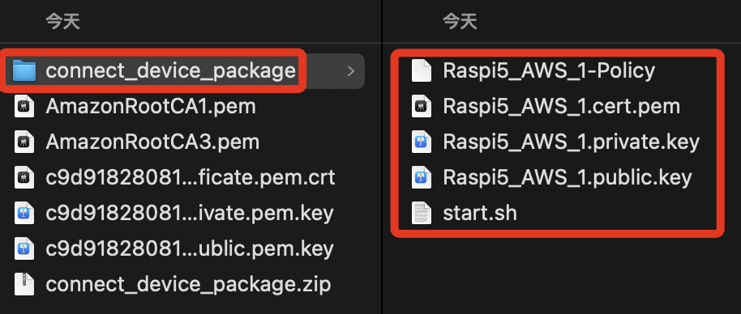

# 串連硬體與服務

<br>

## 進入 AWS

1. 在 `Thing properties` 區塊中，選取 `Choose an existing thing`，並在下方選單中選擇前面步驟建立好的 Thing `Raspi5_AWS_1`；點擊 `Next`。

    

<br>

2. 在 `Platform and SDK` 部分，分別選取 `Linux / MacOS` 及 `Python`，然後點擊 `Next`。

    

<br>

3. 點擊 `Download connection kit` 下載 Kit，下載後點擊 `Next`。

    

<br>

4. 在本機下載資料夾內會多一個壓縮文件 `connect_device_package.zip`。

    

<br>

5. AWS 主控台維持在這個畫面中。

    

<br>

## 回到本機電腦

1. 進入在下載資料夾，點擊壓縮文件會自動解壓縮，解壓縮後有以下這些檔案。

    

<br>

2. 若要在樹莓派上運行，可將這個資料夾透過 VSCode 拖曳到樹梅派專案目錄中，或是透過指令複製。

    ```bash
    scp -r ~/Downloads/connect_01 ssd:~/Documents/exAWS_01/
    ```

<br>

## 運行官方腳本

_進入解壓縮的資料夾並開啟終端機_

<br>

1. 以下操作在 AWS 主控台皆有指引。

    

<br>

2. 先修改腳本權限。

    ```bash
    chmod +x start.sh
    ```

<br>

3. 啟動腳本。

    ```bash
    sudo ./start.sh
    ```

<br>

4. 會先開始一些安裝。

    

<br>

5. 安裝完成後會啟動。

    

<br>

6. 透過 AWS 網頁可看到執行狀況

    

<br>

7. 點擊右下角的 `Continue`。

    

<br>

8. 會顯示設備已經連線。

    

<br>

9. 點擊右下角 `View thing`，會回到 `Raspi5_AWS_1`。

    

<br>

## 回到訂閱測試畫面

_細節自行參考_

<br>

1. 特別注意訂閱的節點是 `sdk/test/python`，寫入記錄文檔中。

    

<br>

2. 編輯 Python腳本，寫入訂閱節點 `sdk/test/python`，然後運行腳本。

    

<br>

___

_END_

