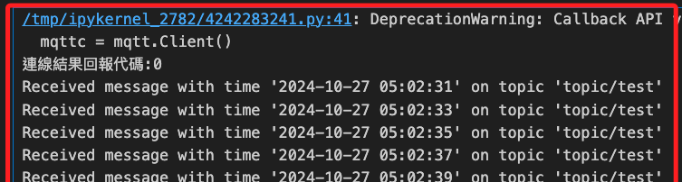
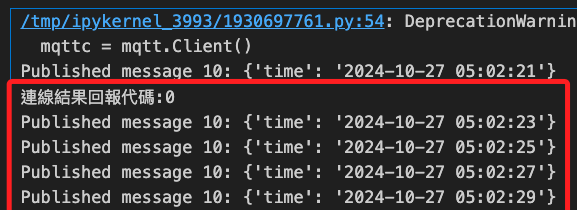

# 在樹莓派進行訂閱

_在兩台樹莓派運行_

<br>

## 說明

1. 運行腳本進行訂閱。

    ```python
    import paho.mqtt.client as mqtt
    import ssl
    import json

    # AWS IoT Core 的連線設定
    awshost = '<填入端點>'
    awsport = 8883

    # 自訂名稱，特別注意要使用不同的 clientId 避免衝突
    clientId = 'MySubscriberId'
    # 使用 AWS Thing 名稱
    thingName = "Raspi5_AWS_1"

    # 哈希
    _HASH = '<哈希>'
    
    # 三個證書文件
    caPath = './certs/AmazonRootCA1.pem'
    certPath = f'./certs/{_HASH}-certificate.pem.crt'
    keyPath = f'./certs/{_HASH}-private.pem.key'

    # 訂閱節點
    _Subscriptions_Path = 'topic/test'

    # 定義連線回呼函數，當連線成功後會被呼叫
    def on_connect(client, userdata, flags, rc):
        print("連線結果回報代碼:" + str(rc))
        # 訂閱特定的主題
        client.subscribe(_Subscriptions_Path)


    # 當收到消息時呼叫的回呼函數
    def on_message(client, userdata, message):
        # 將消息內容從 JSON 格式解析
        try:
            msg_content = json.loads(message.payload.decode())
            # 使用 `get` 方法來提取 "time" 鍵
            msg_time = msg_content.get(
                "time", "No 'time' key in payload"
            )
            print(
                f"Received message with time '{msg_time}' "
                f"on topic '{message.topic}'"
            )
        except json.JSONDecodeError:
            print(
                "Received non-JSON message:",
                message.payload.decode()
            )


    mqttc = mqtt.Client()
    mqttc.on_connect = on_connect
    mqttc.on_message = on_message
    mqttc.tls_set(
        caPath, 
        certfile=certPath, 
        keyfile=keyPath, 
        cert_reqs=ssl.CERT_REQUIRED, 
        tls_version=ssl.PROTOCOL_TLSv1_2, 
        ciphers=None
    )
    mqttc.connect(awshost, awsport, keepalive=60)
    mqttc.loop_forever()
    ```

<br>

2. 顯示如下。

    

<br>

3. 發布的內容如下。

    

<br>

___

_END_
