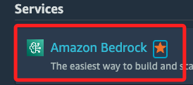
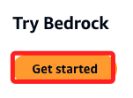
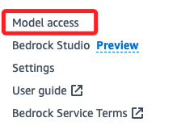
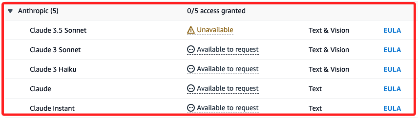
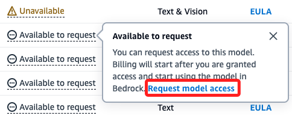
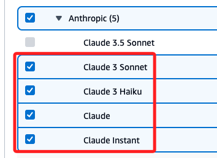
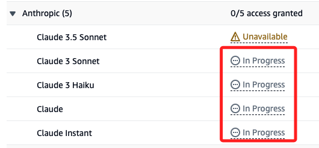
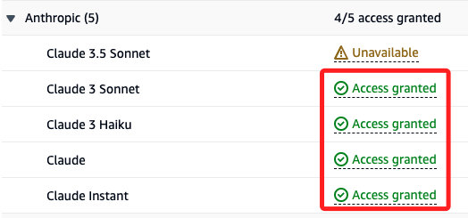

# Bedrock

_可參考 D28-Bedrock+Huggingface_

 

## 步驟說明

1. 搜尋並進入服務 `Bedrock`。

    

 

2. 點擊 `Get started`。

    

 

3. 點擊左側選單中下方的 `Model access`，提出使用模型的請求。

    

 

## Anthropic

1. 找到模型中的 Anthropic 區塊。

    

 

2. 點擊任意一個可請求的模型。

    

 

3. 選取要申請的模型。

    

 

4. 點擊右下角的 `Next`。

    

 

5. 大致填寫後點擊 `Next`。

    

 

6. 接著點擊 `Submit`。

    

 

7. 回到清單會顯示 `In Progress`。

    

 

8. 基本上幾分鐘內就會核准，核准時會收到 Email 通知；核准後即可進行模型使用。

    

 

___

_END_