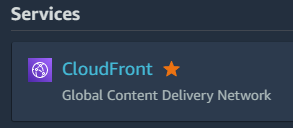
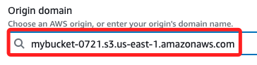
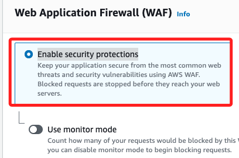
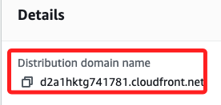
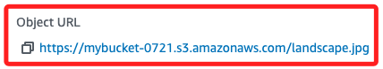

# 建立 CloudFront

<br>

## 簡介

1. 在後續建立 CloudFront 服務的過程稱為 `Create distribution`，這是因為 CloudFront 的主要功能是將內容 `分發（distribution）` 給全球的用戶，這裡的`distribution` 指的是將靜態和動態網頁內容從 `原始伺服器（source server）` 通過 CloudFront 的 `全球邊緣節點網絡` 分發給 `終端用戶`。

<br>

## 說明

1. 進入 `CloudFront`。

    

<br>

2. 點擊 `Create a CloudFront distribution` 進行建立。

    

<br>

3. 在 `Origin domain` 選取前面步驟建立的 S3 物件。

    

<br>

4. 在 `Web Application Firewall` 部分選取 `Enable security protections` 以啟用 WAF，確保應用程式免受常見的網路威脅和安全漏洞的侵害，並在有惡意請求時阻止它們進入您的伺服器。

    

<br>

5. 其餘都先使用預設值，點擊右下角的 `Create distribution`。

    

<br>

6. 完成後會顯示相關資訊，其中 `Distribution domain name` 就是稍後訪問所使用的。

    

<br>

## 建立簡單網頁

_使用 Bucket 中的相片建立一個簡單的網站範例_

<br>

1. 建立一個超文本 `index.html`，這裡不贅述建立過程，直接上代碼。

    ```html
    <!DOCTYPE html>
    <html lang="en">
    <head>
        <meta charset="UTF-8">
        <meta name="viewport" content="width=device-width, initial-scale=1.0">
        <title>Document</title>
    </head>
    <body>
        <p>
            
        </p>
    </body>
    </html>
    ```

<br>

2. 其中圖片的 URL 是 `domain name + 相片名稱`；特別注意，在 S3 中這個圖片其實也有一個 URL，但是在站台中，使用的是 `CloudFront` 的主機，雖然來源相同，但其本質有所不同，將在後續說明。

    

<br>

## CloudFront vs. S3 Bucket

_CloudFront 服務是透過全球分佈的邊緣節點來達成的_

<br>

1. 緩存機制：當使用者第一次請求 CloudFront URL 時，請求會被轉發到 S3 源端點並獲取內容，這個內容會被緩存在 CloudFront 的邊緣節點，隨後來自相同地理位置的請求會從該邊緣節點直接提供緩存的內容，而不需要每次都從 S3 獲取。

<br>

2. 邊緣節點：CloudFront 擁有分佈於全球的眾多邊緣節點，這些節點靠近終端使用者，請求會自動被路由到離使用者最近的邊緣節點，這樣可顯著減少延遲，因為內容不需要從 S3 的單一地理位置傳輸到全球各地。

<br>

3. 自動更新：當 S3 上的原始內容更新時，CloudFront 會根據緩存政策自動在一定時間內更新其緩存的內容，這確保了使用者獲取到最新的內容，而不需要手動同步操作。

<br>

4. 安全防護：CloudFront 包含 DDoS 防護功能，可以在內容傳輸過程中保護服務，除此，CloudFront 支持 HTTPS，可以確保傳輸中的數據加密，提升安全性。

<br>

___

_END_