# 部署站台到 EC2

<br>

## 使用 CLI

1. 登錄到 EC2 控制台並啟動一個新實體 `MyWeb-0721`。

    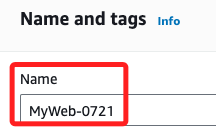

<br>

2. 選擇 `Amazon Linux 2023 AMI`。

    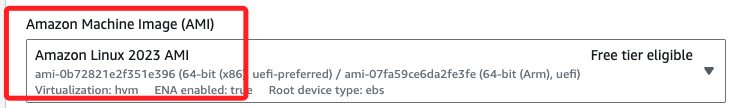

<br>

3. Instance type 使用預設的 `t2.micro` 類型。

    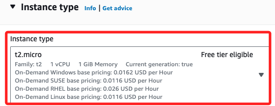

<br>

4. Key pair 使用之前建立的 `_test01_`。

    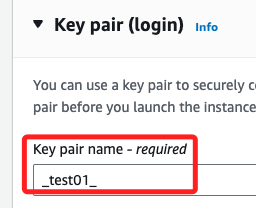

<br>

5. 網路配置使用預設值。

    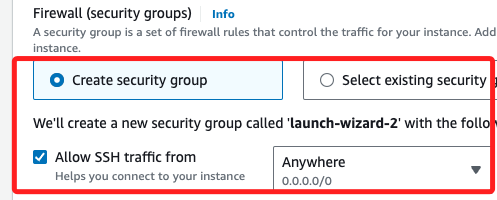

<br>

6. 接著點擊右下角 `Launch instance`。

    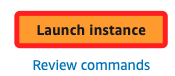

<br>

7. 複製 IP 備用。

    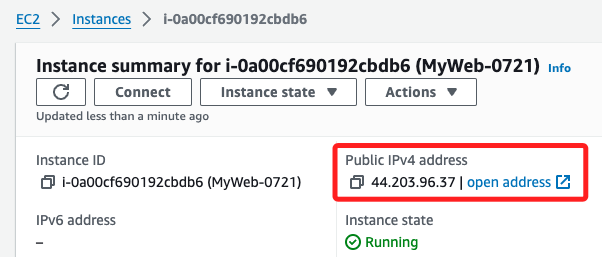

<br>

## 設置安全群組

1. 滑動到 `Inbound rules` 並點擊 `Edit inbound rules`。

    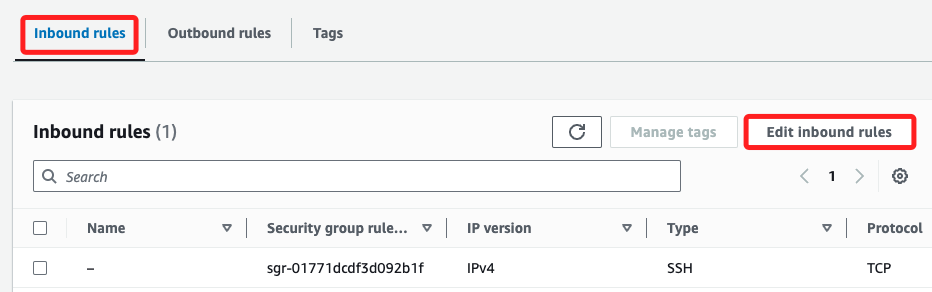

<br>

2. 預設僅有 `SSH (port 22)`，添加一組流量 `HTTP (port 80)`，並允許 `0.0.0.0/0`，然後點擊右下角的 `Save rules`。

    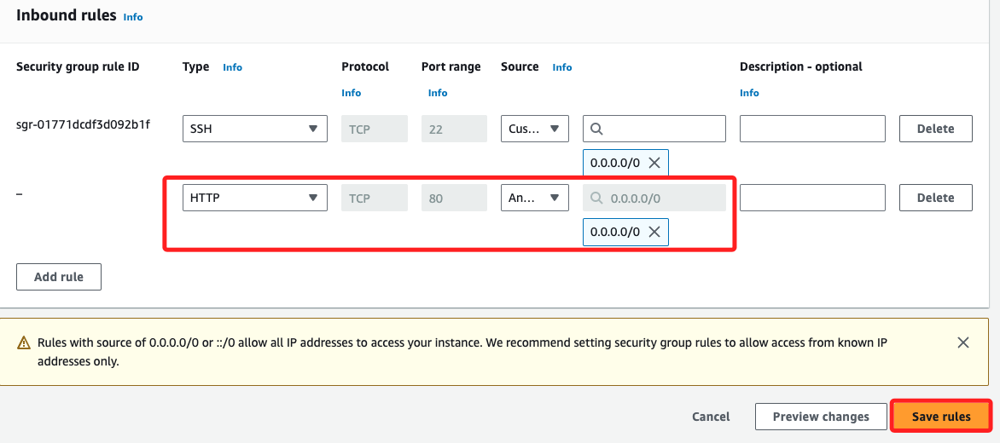

<br>

## 連接到 EC2 實例

1. 編輯 `~/.ssh` 文件。

    ```bash
    Host myec2
    HostName 44.203.96.37
    User ec2-user
    IdentityFile ~/.ssh/_test01_.pem
    ```

<br>

2. 在終端機中使用 SSH 連接到 EC2 實例。

    ```bash
    ssh myec2
    ```

    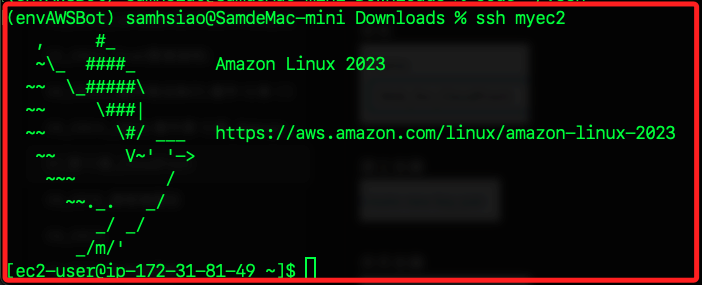

<br>

3. 在 EC2 實例中運行以下指令安裝和啟動 `Apache HTTP Server`。

    ```bash
    sudo yum update -y
    sudo yum install -y httpd
    sudo systemctl start httpd
    sudo systemctl enable httpd
    ```

<br>

## 複製文件

1. 回到本地電腦上，為了簡化後續指令的路徑，所以先進入專案資料夾所在的桌面。

    ```bash
    cd ~/Desktop
    ```

<br>

2. 先將文件上傳到 EC2 用戶的主目錄。

    ```bash
    scp -r _web0721_/* myec2:~/
    ```

<br>

3. 再使用 sudo 移動到 `/var/www/html/`。

    ```bash
    ssh myec2 'sudo mv ~/index.html /var/www/html/'
    ```

<br>

4. 假如先進入遠端，那指令僅需移動即可。

    ```bash
    sudo mv ~/index.html /var/www/html/
    ```

<br>

## 檢查網站

1. 在瀏覽器中訪問 EC2 的 `Puclic IP address` 或是 `Public IP DNS`。

    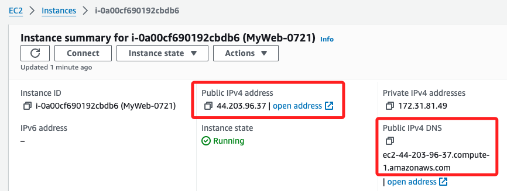

<br>

___

_END_