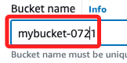
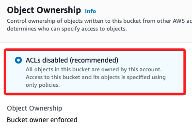
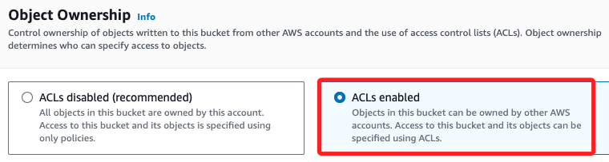
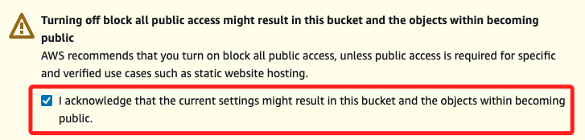
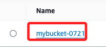
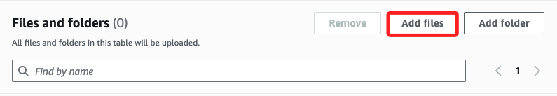
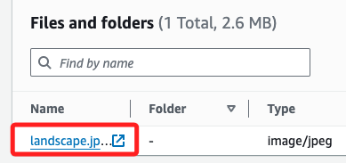
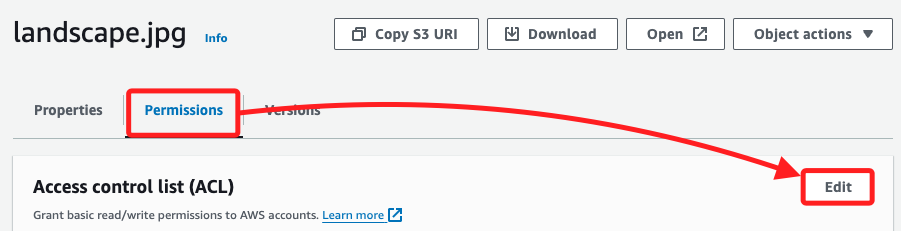
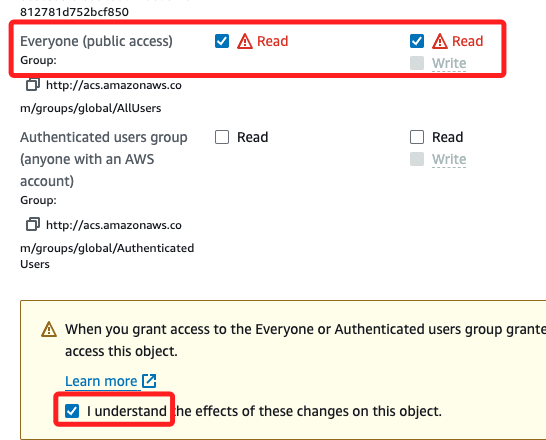
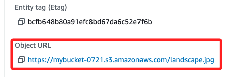

# CloudFront

_雲端內容傳遞服務_

 

## 說明

_以下示範包含的服務有 `S3 Bucket`、`CloudFront`、`EC2`_

 

## 建立 Bucket

1. 點擊 `Create Bucket`。

    

 

2. 自訂名稱，如 `mybucket-0721`；命名必須是全小寫，且沒有重複，系統會自動檢查。

    

 

3. 在 `Object Ownership` 部分預設是 `ACLs disabled`，表示該 S3 bucket 的所有物件都是由這個帳戶擁有，並且訪問控制僅通過策略來管理。

    

 

4. 因為這個 Bucket 將提供給 CloudFront 使用，而 CloudFront 需要訪問 S3 Bucket 中的物件以進行內容分發，所以將其開啟。

    

 

5. 取消 Block，因為需要允許 CloudFront 服務訪問 S3 Bucket 中的物件。

    

 

6. 取消前項 Block 後，必須勾選 `I acknowledge` 表示瞭解其中風險。

    

 

7. 其他使用預設，點擊右下角 `Create bucket`。

    

 

## 上傳檔案

1. 點擊進入。

    

 

2. 點擊 `Upload` 上傳一個檔案來演繹 `CloudFront` 。

    

 

3. 點擊 `Add files`。

    

 

4. 任選一張圖片如 `landscape.jpg`。

    

 

5. 完成後點擊右下角 `Upload`。

    

 

## 設定權限

1. 點擊文件進入設定頁面。

    

 

2. 切換到 `Permissions` 頁籤後點擊 `Edit`。

    

 

3. 點選 `Everyone` 的兩個 checkbox，並點擊下方的 `I understand`。

    

 

4. 點擊右下角的 `Save changes`。

    

 

5. 使用右下角的 URL 進行訪問。

    

 

___

_END_