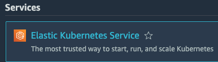
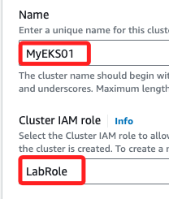

# Elastic Kubernetes Service (EKS)

_AWS 的 EKS 是一個完全託管的 Kubernetes 服務，功能是在 AWS 上執行 Kubernetes，而無需管理 Kubernetes 基礎架構。_

## 簡介

<br>

## 步驟

1. 搜尋並進入 EKS。



2. 展開 `Add cluster`，然後點擊 `Create`。


3. 設定叢集名稱 `MyEKS01`、角色選擇預設的 `LabRole`。



4. 點擊右下角 `Next`。


<br>

5. 在接下來的 `Specify networking` 部分，因為 EKS 不支援在可用區 `us-east-1e` 建立控制層實例，所以點擊 `x` 取消。


6. 其餘保留；另外，建立叢集時，要確保控制層面的子網覆蓋了至少兩個這些可用區。


7. 展開 `Security groups` 並選取 `default`。


8. 點擊右下角 `Next`。


## 其餘設定

1. 在 `Configure observability` 部分直點擊右下角 `Next`。


2. 進入 `Select add-ons`，這些 Add-ons 可提升 EKS 叢集的功能，從網絡到安全性等多方面進行擴展；先略過詳細介紹，將其全部選取。


3. 點擊右下角 `Next`。


4. 進入 `Configure selected add-ons settings` 後皆使用當前預設，點擊右下角 `Next`。


5. 在 `Add-ons` 中顯示 `aws-guardduty-agent` 的狀態為 `Requires activation`，這表示此安全相關的附加元件尚未被啟用，並需要進行手動激活才能開始工作；暫不予處理。


6. 點擊 `Create`。


##

8. 配置 `kubectl`，安裝和配置 `kubectl` 以管理 EKS 叢集。使用 AWS CLI 執行以下指令以配置 `kubectl`。

    ```bash
    aws eks --region <your-region> update-kubeconfig --name <your-cluster-name>
    ```

<br>

3. 部署應用程式，使用 `kubectl` 指令來部署應用程式。例如，部署一個 Nginx 服務。
    ```bash
    kubectl apply -f https://k8s.io/examples/application/deployment.yaml
    ```

<br>

4. 自動縮放和更新，配置 Cluster Autoscaler 和 Horizontal Pod Autoscaler 以動態調整資源。配置更新政策以無縫部署新版本。

<br>

5. 監控和記錄，使用 Amazon CloudWatch 監控 EKS 叢集。配置 Fluentd 或其他日誌收集器將 Kubernetes 日誌發送到 CloudWatch Logs。

<br>

## 範例

1. 以下是建立 EKS 叢集的 Python 範例腳本，使用 boto3 來調用 AWS API。

    ```python
    import boto3

    def create_eks_cluster(cluster_name, role_arn, subnet_ids, security_group_ids):
        client = boto3.client('eks')

        response = client.create_cluster(
            name=cluster_name,
            version='1.21',
            roleArn=role_arn,
            resourcesVpcConfig={
                'subnetIds': subnet_ids,
                'securityGroupIds': security_group_ids,
            }
        )

        return response

    # 設定參數
    cluster_name = 'my-eks-cluster'
    role_arn = 'arn:aws:iam::123456789012:role/EKSRole'
    subnet_ids = ['subnet-abc123', 'subnet-def456']
    security_group_ids = ['sg-abc123']

    # 建立 EKS 叢集
    response = create_eks_cluster(cluster_name, role_arn, subnet_ids, security_group_ids)
    print(response)
    ```

<br>

## 注意事項

1. 確保有適當的 IAM 權限來建立和管理 EKS 叢集。

2. 選擇適當的 VPC、子網路和安全組配置以確保叢集的安全性和可擴展性。

3. 定期更新 Kubernetes 版本以利用最新的功能和安全性改進。

<br>

___

_END_