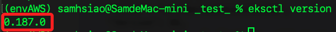
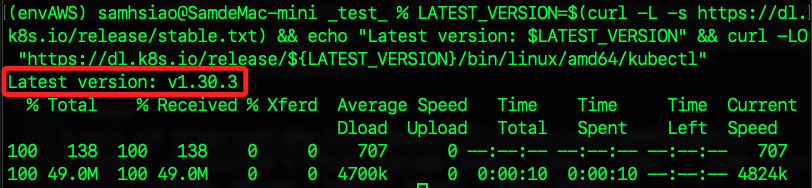

# 準備工作及建立及上

<br>

## 安裝 AWS CLI

1. 檢查安裝版本。

    ```bash
    aws --version
    ```

<br>

## 安裝 eksctl

_eksctl 是一個專門用於管理 Amazon EKS 集群的指令行工具，它不是 AWS CLI 的一部分，因此需要單獨安裝。_

<br>

1. 使用 Homebrew 安裝；輸出訊息中，`weaveworks/tap` 是 `eksctl` 所在的 `Homebrew tap`，也就就是儲存庫；然後安裝依賴項目 `aws-iam-authenticator` 及 `kubernetes-cli`、安裝自動補全工具 `zsh`，並且自動運行 `brew cleanup` 清理過時的版本和不再需要的文件；補充說明，關於這個清理動作，可透過設置 `HOMEBREW_NO_INSTALL_CLEANUP` 禁用此功能。

    ```bash
    brew tap weaveworks/tap && brew install weaveworks/tap/eksctl
    ```

<br>

2. Windows 系統可使用二進制文件安裝。

    ```bash
    curl --location "https://github.com/weaveworks/eksctl/releases/latest/download/eksctl_$(uname -s)_amd64.tar.gz" | tar xz -C /tmp
    sudo mv /tmp/eksctl /usr/local/bin
    ```

<br>

3. 驗證是否安裝完成。

    ```bash
    eksctl version
    ```

    

<br>

## 安裝 kubectl

1. 查詢並顯示版本號。

    ```bash
    LATEST_VERSION=$(curl -L -s https://dl.k8s.io/release/stable.txt) && echo "Latest version: $LATEST_VERSION"
    ```

<br>

2. 依據輸出的版本號進行下載。

    ```bash
    curl -LO "https://dl.k8s.io/release/${LATEST_VERSION}/bin/linux/amd64/kubectl"
    ```

<br>

3. 合併以上兩指令，自動查詢最版 kubectl，顯示版本號並下載。

    ```bash
    LATEST_VERSION=$(curl -L -s https://dl.k8s.io/release/stable.txt) && echo "Latest version: $LATEST_VERSION" && curl -LO "https://dl.k8s.io/release/${LATEST_VERSION}/bin/linux/amd64/kubectl"
    ```

    

<br>

4. 將下載的 kubectl 文件安裝到 `/usr/local/bin`，設置擁有者和組為 `root`、權限為 `0755`；特別說明，下載的 `kubectl` 文件已經是一個可執行文件，所以僅需將文件複製到指定路徑中，使其可以被全局調用；另外，在 macOS 上，root 用戶屬於 wheel 組。

    ```bash
    sudo cp kubectl /usr/local/bin/ && sudo chown root:wheel /usr/local/bin/kubectl && sudo chmod 0755 /usr/local/bin/kubectl
    ```

<br>

5. 確認完成：檢查本版。

    ```bash
    kubectl version --client
    ```

<br>

## 查詢並建立 EC2 實例

_使用 EKS 建立 Kubernetes 集群時，通常需會使用 EC2 來配置必要的工具以管理 EKS 集群，這個工具包含 `kubectl`、`aws-cli` 和 `eksctl`因為這些工具需要運行在同一個主機上，而 EC2 實例是個方便的選擇。_

<br>

1. 從 SSM 中查詢最新的 Amazon Linux 2 AMI 參數，包括其名稱、類型、值、版本、最後修改日期、ARN 和數據類型，並將結果格式化後輸出。

    ```bash
    aws ssm get-parameters --names /aws/service/ami-amazon-linux-latest/amzn2-ami-hvm-x86_64-gp2 --region eu-west-1 --query "Parameters[*]"
    ```

    _輸出_

    ```bash
    [
        {
            "Name": "/aws/service/ami-amazon-linux-latest/amzn2-ami-hvm-x86_64-gp2",
            "Type": "String",
            "Value": "ami-08575e3ae35f313a6",
            "Version": 121,
            "LastModifiedDate": "2024-07-23T10:58:40.853000+08:00",
            "ARN": "arn:aws:ssm:eu-west-1::parameter/aws/service/ami-amazon-linux-latest/amzn2-ami-hvm-x86_64-gp2",
            "DataType": "text"
        }
    ]
    ```

<br>

## 建立集群

_特別注意，依照官方說明，EKS  對建立的每個 EKS 叢集以每小時 0.10 美元的統一費率收費，無論位於哪個區域。_

<br>

1. 在本機建立 EKS 集群。

    ```bash
    eksctl create cluster --name my-cluster --region us-east-1 --nodes 2
    ```

<br>

## 自訂叢集配置文件 ClusterConfig

1. 自訂義配置文件 `my-cluster.yaml`。

    ```bash
    touch my-cluster.yaml
    ```

<br>

2. 編輯配置文件：建立一個包含所有配置和控制平面記錄檔的 EKS 集群。

    ```yaml
    # 指定 eksctl 的 API 版本
    apiVersion: eksctl.io/v1alpha5
    # 定義配置類型
    kind: ClusterConfig

    metadata:
        # 自訂義元數據名稱
        name: my-cluster
        # Kubernetes 版本
        version: "1.30.3"
        # AWS 區域
        region: us-east-1

    # 定義受管理的節點組
    managedNodeGroups:
        # 名稱
        - name: "ng01-my-cluster"
            # 節點數量為 2
            desiredCapacity: 2
            # 允許 SSH 訪問
            ssh:
                allow: true
                publicKeyName: "my-public-key"
            iam:
                withAddonPolicies:
                    ebs: true
                    fsx: true
                    efs: true
                    awsLoadBalancerController: true
                    autoScaler: true

    # 啟用 IAM OpenID Connect（OIDC）Provider 並設定所需的 IAM 權限
    iam:
        withOIDC: true
    # 啟用控制平面記錄檔
    cloudWatch:
        clusterLogging:
            enableTypes: ["*"]
    ```

<br>

3. 若要使用指定的配置文件進行叢集建立。

    ```bash
    eksctl create cluster -f my-cluster.yaml
    ```

<br>

## 其他常用指令

1. 列出所有 EKS 集群。

    ```bash
    aws eks list-clusters
    ```

<br>

2. 檢查當前區域。

    ```bash
    aws configure get region
    ```

<br>

3. 設置 AWS CLI 使用的區域。

    ```bash
    aws configure set region us-east-1
    ```

<br>

___

_END_