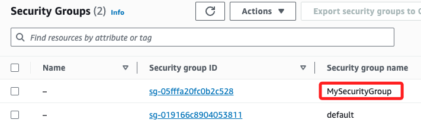
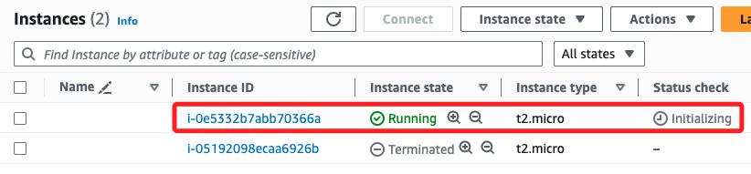
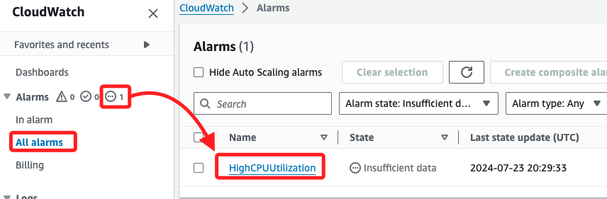
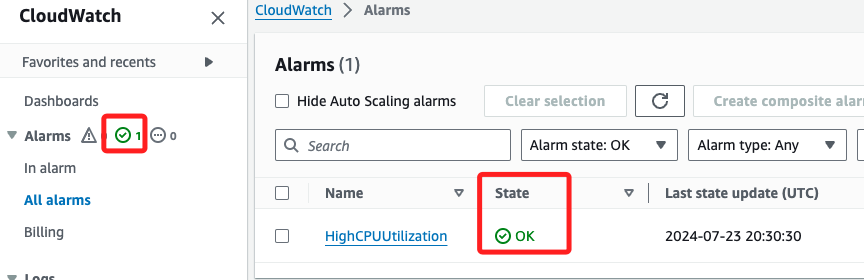
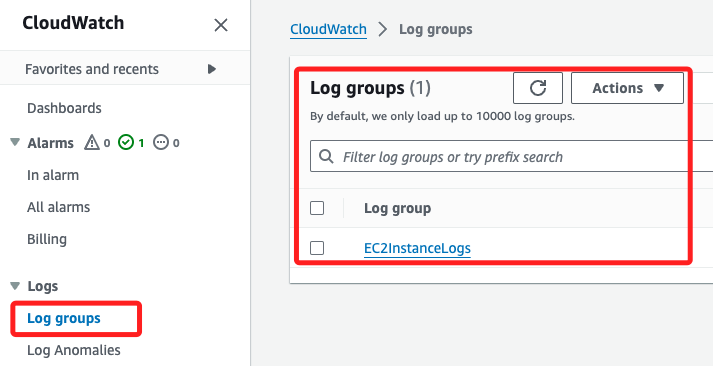
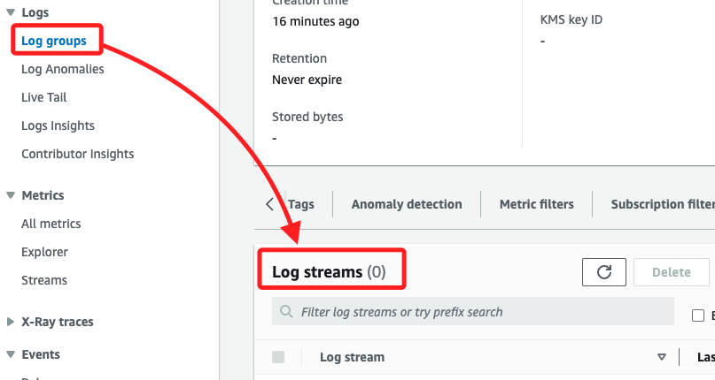
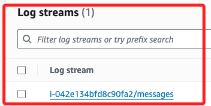
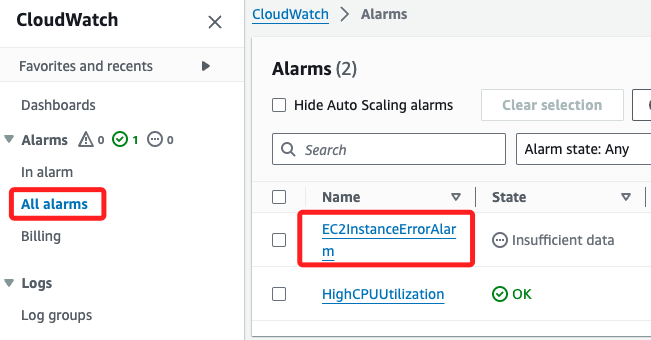

# 簡單範例

_這裡直接實作，使用 AWS CLI 查詢 EC2 實例的相關資訊並設定 CloudWatch 警報_

<br>

## 建立 EC2 實例

1. 查詢最新的 Amazon Linux 2 AMI，並將查詢結果存入變數 `LAST_VERSION`。

    ```bash
    LAST_VERSION=$(aws ssm get-parameters --names /aws/service/ami-amazon-linux-latest/amzn2-ami-hvm-x86_64-gp2 --region us-east-1 --query "Parameters[*].Value" --output text) && echo $LAST_VERSION
    ```

<br>

2. _這是補充說明_，可透過以下指令查詢所有可用的 AMI（Amazon Machine Image）。

    ```bash
    aws ec2 describe-images --owners amazon --filters "Name=name,Values=amzn2-ami-hvm-*-x86_64-gp2" --query "Images[*].[ImageId,Name]" --output table
    ```

<br>

3. 先建立密鑰對並命名為 `MyKeyPair`，並將結果輸出到文件 ` MyKeyPair.pem`，這將用於使用 SSH 連線 EC2；建立完成顯示內容。

    ```bash
    aws ec2 create-key-pair --key-name MyKeyPair --query "KeyMaterial" --output text > MyKeyPair.pem && cat MyKeyPair.pem
    ```

    _可在主控台 EC2 或 VPC 查看 `MyKeyPair`_

    

<br>

4. 變更本地密鑰文件權限。

    ```bash
    chmod 400 MyKeyPair.pem
    ```

<br>

5. 第二步，建立一個安全群組並命名為 `MySecurityGroup`；完成後同樣可在主控台 EC2 或 VPC 查看 `Security Groups`。

    ```bash
    SECURITY_GROUP_ID=$(aws ec2 create-security-group --group-name MySecurityGroup --description "My security group" --query 'GroupId' --output text) && echo $SECURITY_GROUP_ID
    ```

    

<br>

6. 根據前一個步驟儲存的 `SECURITY_GROUP_ID` 建立群組規則，對以下兩個端口進行設置，無需指定 Type 是 SSH 或是 HTTP，系統會自動判斷。

    ```bash
    aws ec2 authorize-security-group-ingress --group-id $SECURITY_GROUP_ID --protocol tcp --port 22 --cidr 0.0.0.0/0 && aws ec2 authorize-security-group-ingress --group-id $SECURITY_GROUP_ID --protocol tcp --port 80 --cidr 0.0.0.0/0
    ```

<br>

7. 建立並啟動 EC2 實例：以上完成建立密鑰、安全群組、啟動端口後，這裡進行建立並啟動，可在主控台中觀察其狀態。

    ```bash
    INSTANCE_ID=$(aws ec2 run-instances --image-id $LAST_VERSION --count 1 --instance-type t2.micro --key-name MyKeyPair --security-group-ids $SECURITY_GROUP_ID --query 'Instances[0].InstanceId' --output text) && echo $INSTANCE_ID
    ```

    

<br>

8. 查詢特定實例的完整詳細資訊；剛建立完成時會一段時間進行 `initializing`。

    ```bash
    aws ec2 describe-instances --instance-ids $INSTANCE_ID
    ```

<br>

## 設置 CloudWatch 監控和警報

1. 建立 CloudWatch 警報，自訂名稱為 `HighCPUUtilization`，對 EC2 的 CPU 使用率進行監控；以下將自動對前面建立的 ID 設置警報。

    ```bash
    aws cloudwatch put-metric-alarm \
        --alarm-name "HighCPUUtilization" \
        --alarm-description "Alarm when CPU exceeds 80%" \
        --metric-name "CPUUtilization" \
        --namespace "AWS/EC2" \
        --statistic "Average" \
        --period 300 \
        --threshold 80 \
        --comparison-operator "GreaterThanThreshold" \
        --evaluation-periods 1 \
        --alarm-actions "arn:aws:sns:us-east-1:account-id:sns-topic" \
        --dimensions "Name=InstanceId,Value=$INSTANCE_ID"
    ```

<br>

2. 以上指令建立完成不會有任何輸出，可在主控台查看；還沒完成時要點擊顯示更多的 `...` 會自動展開 `All alarms`，可看到自定義的警告 `HighCPUUtilization`。

    

<br>

3. 完成時會顯示在運行中的選項中，狀態為 `OK`。

    

<br>

4. 查詢特定 EC2 實例相關的所有警報，當前僅有一個警報 `HighCPUUtilization`；輸出的詳盡說明在講義最下方，可前往查看說明。

    ```bash
    aws cloudwatch describe-alarms-for-metric \
        --metric-name CPUUtilization \
        --namespace AWS/EC2 \
        --dimensions Name=InstanceId,Value=$INSTANCE_ID
    ```

<br>

3. 列出指定警報 `HighCPUUtilization` 的詳細資訊。

    ```bash
    aws cloudwatch describe-alarms --alarm-names "HighCPUUtilization"
    ```

<br>

4. 檢查 CloudWatch 中的相關度量標準，就是列出指定命名空間 `AWS/EC2` 中的所有 `度量標準（metrics）`。

    ```bash
    aws cloudwatch list-metrics --namespace "AWS/EC2"
    ```

<br>

## 設置 CloudWatch Logs

_捕獲 EC2 實例的系統日誌，並設定 CloudWatch 警報來監控這些日誌_

<br>

1. 先取得 EC2 實例的公共 IP。

    ```bash
    MyPublicIP=$(aws ec2 describe-instances --instance-ids $INSTANCE_ID --query "Reservations[*].Instances[*].PublicIpAddress" --output text) && echo $MyPublicIP
    ```

<br>

2. 連接到 EC2 實例：要設置 CloudWatch Logs Agent，先在 EC2 實例上安裝和配置 CloudWatch Logs Agent 以捕獲系統日誌。

    ```bash
    ssh -i "MyKeyPair.pem" ec2-user@$MyPublicIP
    ```

<br>

2. 在 EC2 下載和安裝 CloudWatch Logs Agent；在測試時可直接安裝，無需更新。

    ```bash
    sudo yum update -y && sudo yum install -y awslogs
    ```

<br>

3. 配置 CloudWatch Logs Agent，編輯配置文件 `/etc/awslogs/awslogs.conf`。

    ```bash
    sudo nano /etc/awslogs/awslogs.conf
    ```

<br>

4. 添加或修改如下內容。

    ```bash
    # 修改
    [/var/log/messages]
    log_group_name = EC2InstanceLogs
    log_stream_name = {instance_id}/messages

    # 添加
    [/var/log/cloud-init.log]
    file = /var/log/cloud-init.log
    log_group_name = EC2InstanceLogs
    log_stream_name = {instance_id}/cloud-init.log
    datetime_format = %Y-%m-%d %H:%M:%S
    ```

<br>

5. 具體修正後的完整內容如下。

    ```bash
    [general]
    state_file = /var/lib/awslogs/agent-state

    [/var/log/messages]
    datetime_format = %b %d %H:%M:%S
    file = /var/log/messages
    buffer_duration = 5000
    log_stream_name = {instance_id}/messages
    initial_position = start_of_file
    log_group_name = EC2InstanceLogs

    [/var/log/cloud-init.log]
    file = /var/log/cloud-init.log
    log_group_name = EC2InstanceLogs
    log_stream_name = {instance_id}/cloud-init.log
    datetime_format = %Y-%m-%d %H:%M:%S
    ```

<br>

6. 啟動和設置 CloudWatch Logs Agent。

    ```bash
    sudo systemctl start awslogsd
    sudo systemctl enable awslogsd
    ```

<br>

7. 確認 CloudWatch Logs Agent 已啟動。

    ```bash
    sudo systemctl status awslogsd
    ```

<br>

## 設置 AWS CLI

1. 先在本機另外開啟一個終端，透過以下指令查看設置內容。

    ```bash
    cat ~/.aws/credentials
    ```

<br>

2. 在 EC2 上運行設置指令；從本機複製查詢到的密鑰來設定 EC2。

    ```bash
    aws configure
    ```

<br>

## 建立並附加 IAM 角色

_不能使用 default IAM 角色，需要創建一個專門的 IAM 角色並配置相應的權限，然後將該角色附加到 EC2 實例。_

<br>

1. 創建角色 `MyCloudWatchLogsRole` 並信任政策，使其能夠被 EC2 使用。

    ```bash
    aws iam create-role --role-name MyCloudWatchLogsRole --assume-role-policy-document '{
        "Version": "2012-10-17",
        "Statement": [
            {
                "Effect": "Allow",
                "Principal": {
                    "Service": "ec2.amazonaws.com"
                },
                "Action": "sts:AssumeRole"
            }
        ]
    }'
    ```

<br>

2. 創建一個新的附加政策 `CloudWatchLogsPolicy`，允許 CloudWatch Logs 的必要權限。

    ```bash
    aws iam create-policy --policy-name CloudWatchLogsPolicy --policy-document '{
        "Version": "2012-10-17",
        "Statement": [
            {
                "Effect": "Allow",
                "Action": [
                    "logs:CreateLogGroup",
                    "logs:CreateLogStream",
                    "logs:PutLogEvents",
                    "logs:DescribeLogGroups",
                    "logs:DescribeLogStreams"
                ],
                "Resource": "*"
            }
        ]
    }'
    ```

<br>

3. 將政策 `MyCloudWatchLogsRole` 附加到角色。

    ```bash
    aws iam attach-role-policy --role-name MyCloudWatchLogsRole --policy-arn arn:aws:iam::$(aws sts get-caller-identity --query "Account" --output text):policy/CloudWatchLogsPolicy
    ```

<br>

4. 創建一個實例配置文件 `CloudWatchLogsProfile`。

    ```bash
    aws iam create-instance-profile --instance-profile-name CloudWatchLogsProfile
    ```

<br>

5. 將前面步驟創建的角色附加到該配置文件。

    ```bash
    aws iam add-role-to-instance-profile --instance-profile-name CloudWatchLogsProfile --role-name MyCloudWatchLogsRole
    ```

<br>

6. 停止 EC2 實例。

    ```bash
    aws ec2 stop-instances --instance-ids $INSTANCE_ID
    ```

<br>

7. 附加實例配置文。

    ```bash
    aws ec2 associate-iam-instance-profile --instance-id $INSTANCE_ID --iam-instance-profile Name=CloudWatchLogsProfile
    ```

<br>

8. 啟動 EC2 實例。

    ```bash
    aws ec2 start-instances --instance-ids $INSTANCE_ID
    ```

<br>

## 確認和重啟 CloudWatch Logs Agent

1. 確認配置文件 `/etc/awslogs/awslogs.conf`。

    ```ini
    [general]
    state_file = /var/lib/awslogs/agent-state

    [/var/log/messages]
    datetime_format = %b %d %H:%M:%S
    file = /var/log/messages
    buffer_duration = 5000
    log_stream_name = ${INSTANCE_ID}/messages
    initial_position = start_of_file
    log_group_name = EC2InstanceLogs

    [/var/log/cloud-init.log]
    file = /var/log/cloud-init.log
    log_group_name = EC2InstanceLogs
    log_stream_name = ${INSTANCE_ID}/cloud-init.log
    datetime_format = %Y-%m-%d %H:%M:%S
    ```

<br>

2. 重啟 CloudWatch Logs Agent。

    ```bash
    sudo systemctl restart awslogsd
    ```

<br>

3. 稍等片刻，再次檢查是否有新的日誌事件。

    ```bash
    aws logs get-log-events --log-group-name EC2InstanceLogs --log-stream-name ${INSTANCE_ID}/messages --region us-east-1
    ```

<br>

## 設置 CloudWatch Logs Log Group 和 Log Stream

_使用 AWS CLI 創建 Log Group 和 Log Stream_

<br>

1. 創建 Log Group `EC2InstanceLogs`。

    ```bash
    aws logs create-log-group --log-group-name EC2InstanceLogs --region us-east-1
    ```

<br>

2. 進入主控台可以看到。

    

<br>

3. 通常情況下，CloudWatch Logs Agent 會自動創建日誌流；如果沒有自動建立，可手動創建 Log Stream。

    

<br>

4. 創建日誌流。

    ```bash
    aws logs create-log-stream --log-group-name EC2InstanceLogs --log-stream-name ${INSTANCE_ID}/messages --region us-east-1
    ```

    

<br>

5. 列出日誌組中的所有日誌流。

    ```bash
    aws logs describe-log-streams --log-group-name EC2InstanceLogs --region us-east-1
    ```

    _輸出_

    ```json
    {
        "logStreams": [
            {
                "creationTime": 1721776001190, 
                "arn": "arn:aws:logs:us-east-1:891377311393:log-group:EC2InstanceLogs:log-stream:i-042e134bfd8c90fa2/messages", 
                "logStreamName": "i-042e134bfd8c90fa2/messages", 
                "storedBytes": 0
            }
        ]
    }
    ```

<br>

6. 可嘗試檢查 /var/log/awslogs.log 文件，確保 Agent 正在運行並且沒有錯誤；按下組合鍵 `comtrol + C` 可退出。

    ```bash
    sudo cat /var/log/awslogs.log
    ```

<br>

7. 再次獲取日誌事件。

    ```bash
    aws logs get-log-events --log-group-name EC2InstanceLogs --log-stream-name ${INSTANCE_ID}/messages --region us-east-1
    ```

    _輸出_

    ```json
    {
        "nextForwardToken": "f/38397053140138874559500906921556524658767136414851137536/s", 
        "events": [], 
        "nextBackwardToken": "b/38396892574773445139014287864384961590564293355855937536/s"
    }
    ```

<br>

## 設置 CloudWatch 警報來監控日誌

_監控 `/var/log/messages` 中的關鍵字 `ERROR`；_

<br>

1. 以下指令用於在 CloudWatch Logs 中創建一個 `度量過濾器（Metric Filter）`，將日誌中的特定模式轉換為 CloudWatch 度量標準。

    ```bash
    aws logs put-metric-filter \
        --log-group-name EC2InstanceLogs \
        --filter-name ErrorFilter \
        --filter-pattern "ERROR" \
        --metric-transformations \
        metricName=ErrorCount,metricNamespace=EC2InstanceLogs,metricValue=1
    ```

    _可在主控台中觀察_

    

<br>

2. 以下指令用於在 CloudWatch 中創建一個警報，當特定度量標準超過設定的閾值時觸發警報。

    ```bash
    aws cloudwatch put-metric-alarm \
        --alarm-name "EC2InstanceErrorAlarm" \
        --alarm-description "Alarm when there are errors in EC2 instance logs" \
        --metric-name "ErrorCount" \
        --namespace "EC2InstanceLogs" \
        --statistic "Sum" \
        --period 300 \
        --threshold 1 \
        --comparison-operator "GreaterThanOrEqualToThreshold" \
        --evaluation-periods 1 \
        --alarm-actions "arn:aws:sns:us-east-1:account-id:sns-topic"
    ```

    _可在主控台中觀察多了一個警告，前面步驟建立的警告也已經 `OK`_

    

<br>

3. 取得 EC2 實例的 ID。

    ```bash
    INSTANCE_ID=$(aws ec2 describe-instances --filters "Name=instance-state-name,Values=running" --query "Reservations[*].Instances[*].InstanceId" --output text) && echo $INSTANCE_ID
    ```

<br>

4. 查詢 CloudWatch 日誌。

    ```bash
    aws logs get-log-events --log-group-name EC2InstanceLogs --log-stream-name ${INSTANCE_ID}/messages
    ```

<br>

3. 查詢警報狀態。

    ```bash
    aws cloudwatch describe-alarms --alarm-names "EC2InstanceErrorAlarm"
    ```

<br>

## 警報內容的詳盡說明

_說明警報內容的重要參數_

<br>

1. 警告所顯示的完整內容。

    ```json
    {
        "MetricAlarms": [
            {
                "AlarmName": "HighCPUUtilization",
                "AlarmArn": "arn:aws:cloudwatch:us-east-1:891377311393:alarm:HighCPUUtilization",
                "AlarmDescription": "Alarm when CPU exceeds 80%",
                "AlarmConfigurationUpdatedTimestamp": "2024-07-23T20:29:33.725000+00:00",
                "ActionsEnabled": true,
                "OKActions": [],
                "AlarmActions": [
                    "arn:aws:sns:us-east-1:account-id:sns-topic"
                ],
                "InsufficientDataActions": [],
                "StateValue": "OK",
                "StateReason": "Threshold Crossed: 1 datapoint [7.122636236757979 (23/07/24 20:20:00)] was not greater than the threshold (80.0).",
                "StateReasonData": "{\"version\":\"1.0\",\"queryDate\":\"2024-07-23T20:30:30.531+0000\",\"startDate\":\"2024-07-23T20:20:00.000+0000\",\"statistic\":\"Average\",\"period\":300,\"recentDatapoints\":[7.122636236757979],\"threshold\":80.0,\"evaluatedDatapoints\":[{\"timestamp\":\"2024-07-23T20:20:00.000+0000\",\"sampleCount\":3.0,\"value\":7.122636236757979}]}",
                "StateUpdatedTimestamp": "2024-07-23T20:30:30.533000+00:00",
                "MetricName": "CPUUtilization",
                "Namespace": "AWS/EC2",
                "Statistic": "Average",
                "Dimensions": [
                    {
                        "Name": "InstanceId",
                        "Value": "i-0e5332b7abb70366a"
                    }
                ],
                "Period": 300,
                "EvaluationPeriods": 1,
                "Threshold": 80.0,
                "ComparisonOperator": "GreaterThanThreshold",
                "StateTransitionedTimestamp": "2024-07-23T20:30:30.533000+00:00"
            }
        ]
    }
    ```

<br>

2. ActionsEnabled：`true` 表示啟用警報動作。

<br>

3. OKActions：`[]`，當警報狀態為 OK 時執行的動作，此處空列表表示無指定動作。

<br>

4. AlarmActions：當警報狀態變為 Alarm 時執行的動作，這裡是發送到指定的 SNS 主題。

<br>

5. InsufficientDataActions：`[]`，當數據不足時執行的動作。

<br>

6. StateValue：警報的當前狀態，`OK` 表示當前 CPU 使用率未超過設定的閾值。

<br>

7. StateReason：當前狀態的原因，此處表示最近一次數據點的值（7.12%）未超過閾值（80%）。

<br>

8. StateReasonData：這是一個 JSON 字串，包含更詳細的狀態數據，包含 `queryDate` 請求的日期時間、`startDate` 評估開始的日期時間、`statistic` 使用的統計方法，此處為 "Average"、`period` 度量標準的周期（秒）、 `recentDatapoints` 最近一次數據點的值、`threshold` 設定的閾值、 `evaluatedDatapoints` 評估期間內的數據點。

<br>

9. MetricName：`"CPUUtilization"`，監控的度量標準名稱。

<br>

10. Namespace：`"AWS/EC2"`，度量標準的命名空間。

<br>

11. Statistic：使用的統計方法，此處為 `Average`。

<br>

12. Dimensions：包含的 EC2 實例 ID。

<br>

13. Period：`300`，度量標準的評估周期（秒）。

<br>

14. EvaluationPeriods：`1`，評估周期的數量。

<br>

15. Threshold：`80.0`，警報觸發的閾值。

<br>

16.  ComparisonOperator：`"GreaterThanThreshold"`，這是比較運算符，此處為 `大於閾值`。

<br>

___

_END_