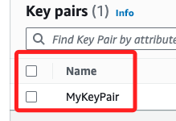

# 簡單範例

_這裡直接實作，使用 AWS CLI 查詢 EC2 實例的相關資訊並設定 CloudWatch 警報_

<br>

## 建立 EC2 實例

1. 可透過以下指令查詢所有可用的 AMI（Amazon Machine Image）。

    ```bash
    aws ec2 describe-images --owners amazon --filters "Name=name,Values=amzn2-ami-hvm-*-x86_64-gp2" --query "Images[*].[ImageId,Name]" --output table
    ```

<br>

2. 更建議的方法是查詢最新的 Amazon Linux 2 AMI，並將查詢結果存入變數 `LAST_VERSION`。

    ```bash
    LAST_VERSION=$(aws ssm get-parameters --names /aws/service/ami-amazon-linux-latest/amzn2-ami-hvm-x86_64-gp2 --region us-east-1 --query "Parameters[*].Value" --output text) && echo $LAST_VERSION
    ```

<br>

3. 建立密鑰對 `MyKeyPair`；建立完成顯示內容。

    ```bash
    aws ec2 create-key-pair --key-name MyKeyPair --query "KeyMaterial" --output text > MyKeyPair.pem && cat MyKeyPair.pem
    ```

    _可在主控台 EC2 或 VPC 查看 `MyKeyPair`_

    

<br>

4. 變更本地密鑰文件權限。

    ```bash
    chmod 400 MyKeyPair.pem
    ```

<br>

5. 建立一個安全組 `MySecurityGroup`；同樣可在主控台 EC2 或 VPC 查看 `Security Groups`。

    ```bash
    SECURITY_GROUP_ID=$(aws ec2 create-security-group --group-name MySecurityGroup --description "My security group" --query 'GroupId' --output text)
    echo $SECURITY_GROUP_ID
    ```

<br>

6. 根據前一個步驟的 `SECURITY_GROUP_ID` 建立群組規則，對以下兩個端口進行設置，無需指定 Type 是 SSH 或是 HTTP，系統會自動判斷。

    ```bash
    aws ec2 authorize-security-group-ingress --group-id $SECURITY_GROUP_ID --protocol tcp --port 22 --cidr 0.0.0.0/0
    aws ec2 authorize-security-group-ingress --group-id $SECURITY_GROUP_ID --protocol tcp --port 80 --cidr 0.0.0.0/0
    ```

<br>

7. 啟動 EC2 實例。

    ```bash
    INSTANCE_ID=$(aws ec2 run-instances --image-id $LAST_VERSION --count 1 --instance-type t2.micro --key-name MyKeyPair --security-group-ids $SECURITY_GROUP_ID --query 'Instances[0].InstanceId' --output text)
    echo $INSTANCE_ID
    ```

<br>

8. 查詢特定實例的詳細資訊；剛建立完成時會一段時間進行 `initializing`。

    ```bash
    aws ec2 describe-instances --instance-ids $INSTANCE_ID
    ```

<br>

## 設置 CloudWatch 監控和警報

1. 建立 CloudWatch 警報以監控 CPU 使用率，確保使用實際的 EC2 實例 ID 設置警報。

    ```bash
    aws cloudwatch put-metric-alarm \
        --alarm-name "HighCPUUtilization" \
        --alarm-description "Alarm when CPU exceeds 80%" \
        --metric-name "CPUUtilization" \
        --namespace "AWS/EC2" \
        --statistic "Average" \
        --period 300 \
        --threshold 80 \
        --comparison-operator "GreaterThanThreshold" \
        --evaluation-periods 1 \
        --alarm-actions "arn:aws:sns:us-east-1:account-id:sns-topic" \
        --dimensions "Name=InstanceId,Value=$INSTANCE_ID"
    ```

<br>

2. 查詢特定 EC2 實例相關的所有警報；查看 EC2 服務的各種可監控指標，進而進行更精確的監控和管理。

    ```bash
    aws cloudwatch describe-alarms-for-metric \
        --metric-name CPUUtilization \
        --namespace AWS/EC2 \
        --dimensions Name=InstanceId,Value=$INSTANCE_ID
    ```

<br>

3. 列出所有警報，並檢查是否包含剛剛創建的警報。

    ```bash
    aws cloudwatch describe-alarms --alarm-names "HighCPUUtilization"
    ```

<br>

4. 檢查 CloudWatch 中的相關度量標準。

    ```bash
    aws cloudwatch list-metrics --namespace "AWS/EC2"
    ```

<br>

## 設置 CloudWatch Logs

_捕獲 EC2 實例的系統日誌，並設定 CloudWatch 警報來監控這些日誌_

<br>

1. 連接到 EC2 實例：要設置 CloudWatch Logs Agent，先在 EC2 實例上安裝和配置 CloudWatch Logs Agent 以捕獲系統日誌。

    ```bash
    ssh -i "MyKeyPair.pem" ec2-user@<Public_IP_Address>
    ```

<br>

2. 下載和安裝 CloudWatch Logs Agent。

    ```bash
    sudo yum update -y
    sudo yum install -y awslogs
    ```

<br>

3. 配置 CloudWatch Logs Agent，編輯配置文件 `/etc/awslogs/awslogs.conf`，添加如下內容。

    ```ini
    [general]
    state_file = /var/lib/awslogs/agent-state

    [/var/log/messages]
    file = /var/log/messages
    log_group_name = EC2InstanceLogs
    log_stream_name = {instance_id}/messages
    datetime_format = %b %d %H:%M:%S

    [/var/log/cloud-init.log]
    file = /var/log/cloud-init.log
    log_group_name = EC2InstanceLogs
    log_stream_name = {instance_id}/cloud-init.log
    datetime_format = %Y-%m-%d %H:%M:%S
    ```

<br>

4. 啟動和設置 CloudWatch Logs Agent。

    ```bash
    sudo systemctl start awslogsd
    sudo systemctl enable awslogsd
    ```

<br>

## 設置 CloudWatch Logs Log Group 和 Log Stream

_使用 AWS CLI 創建 Log Group 和 Log Stream_

<br>

1. 創建 Log Group。

    ```bash
    aws logs create-log-group --log-group-name EC2InstanceLogs
    ```

<br>

2. 創建 Log Stream：這部分由於 Agent 自動處理，不需要手動創建。

<br>

## 設置 CloudWatch 警報來監控日誌

1. 設置警報：假設想監控 `/var/log/messages` 中的關鍵字 "ERROR"。

    ```bash
    aws logs put-metric-filter \
        --log-group-name EC2InstanceLogs \
        --filter-name ErrorFilter \
        --filter-pattern "ERROR" \
        --metric-transformations \
        metricName=ErrorCount,metricNamespace=EC2InstanceLogs,metricValue=1

    aws cloudwatch put-metric-alarm \
        --alarm-name "EC2InstanceErrorAlarm" \
        --alarm-description "Alarm when there are errors in EC2 instance logs" \
        --metric-name "ErrorCount" \
        --namespace "EC2InstanceLogs" \
        --statistic "Sum" \
        --period 300 \
        --threshold 1 \
        --comparison-operator "GreaterThanOrEqualToThreshold" \
        --evaluation-periods 1 \
        --alarm-actions "arn:aws:sns:us-east-1:account-id:sns-topic"
    ```

<br>

2. 查詢 CloudWatch 日誌。

    ```bash
    aws logs get-log-events --log-group-name EC2InstanceLogs --log-stream-name <instance_id>/messages
    ```

<br>

3. 查詢警報狀態。

    ```bash
    aws cloudwatch describe-alarms --alarm-names "EC2InstanceErrorAlarm"
    ```

<br>

___

_END_