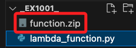

# Greengrass 實作

_以下示範使用 Greengrass V2 組件自動化方式將 Greengrass 配置同步到樹莓派設備，如部署 Lambda 函數或 Greengrass 群組。_

<br>

## 基本環境建立

1. 設置 AWS CLI 環境。

   ```bash
   aws configure
   ```

<br>

2. 任意建立一個專案資料夾，進入後添加腳本並任意命名如 `lambda_function.py`，

   ```bash
   cd ~/Desktop && mkdir _ex1001_ && cd _ex1001_ && code .
   ```

<br>

## 建立 Lambda IAM Role

_在部署 Lambda 函數之前，需要建立一個 Lambda 執行角色並授予其所需的權限，這個角色將允許 Lambda 函數與其他 AWS 服務進行互動；以下操作確保 Lambda 函數有正確的角色來執行並能夠寫入 CloudWatch Logs 以進行日誌記錄。_

<br>

1. 建立策略文件 `trust-policy.json`，允許 Lambda 使用此角色。

   ```json
   {
      "Version": "2012-10-17",
      "Statement": [
         {
            "Effect": "Allow",
            "Principal": {
            "Service": "lambda.amazonaws.com"
            },
            "Action": "sts:AssumeRole"
         }
      ]
   }
   ```

<br>

2. 基於政策文件，建立一個 IAM 角色，並附加基本的 Lambda 執行權限。

   ```bash
   aws iam create-role \
      --role-name GreengrassLambdaExecutionRole \
      --assume-role-policy-document file://trust-policy.json
   ```

<br>

3. 為該角色附加 AWS 預設的 Lambda 基本執行策略 `AWSLambdaBasicExecutionRole`，允許 Lambda 寫入 CloudWatch Logs。

   ```bash
   aws iam attach-role-policy \
      --role-name GreengrassLambdaExecutionRole \
      --policy-arn arn:aws:iam::aws:policy/service-role/AWSLambdaBasicExecutionRole
   ```

<br>

4. 查詢新建角色的 `ARN（Amazon Resource Name）`，以便後續部署 Lambda 函數時使用。

   ```bash
   aws iam get-role \
      --role-name GreengrassLambdaExecutionRole
   ```

<br>

5.  結果會看到角色的 ARN。

   ```json
   {
      "Role": {
         "Arn": "arn:aws:iam::<YOUR_ACCOUNT_ID>:role/GreengrassLambdaExecutionRole",
         // 省略 ...
      }
   }
   ```

<br>

## 配置 Lambda 函數

_建立 Greengrass 群組並配置 Lambda 函數_

<br>

1. 在案資料夾添加腳本並任意命名如 `lambda_function.py`，

   ```bash
   touch lambda_function.py
   ```

<br>

2. 編輯 Lambda 函數，該函數將部署到 Greengrass 群組中。

   ```python
   import json


   def lambda_handler(event, context):
      print("接收到的事件: ", json.dumps(event))
      return {
         'statusCode': 200,
         'body': json.dumps('Hello from Greengrass Lambda!')
      }
   ```

<br>

3. 建立一個部署包，包含代碼和依賴。

   ```bash
   zip function.zip lambda_function.py
   ```

   

<br>

4. 使用 AWS CLI 建立 Lambda 函數，以下命令會建立一個 Lambda 函數並部署至 AWS，`YOUR_ACCOUNT_ID` 和 `YOUR_LAMBDA_ROLE` 分別是 AWS 帳號 ID 和 Lambda 執行角色。

   ```bash
   aws lambda create-function \
      --function-name GreengrassTemperatureFunction \
      --zip-file fileb://function.zip \
      --handler lambda_function.lambda_handler \
      --runtime python3.8 \
      --role arn:aws:iam::YOUR_ACCOUNT_ID:role/YOUR_LAMBDA_ROLE
   ```

<br>

5. 將 Lambda 函數部署到本地的樹莓派 Greengrass 核心設備上，建立 Greengrass 部署後會將 Lambda 函數配置成為 Greengrass 組件。

   ```bash
   aws greengrassv2 create-deployment \
      --target-arn arn:aws:iot:YOUR_ACCOUNT_ID:thing/RaspberryPi_Core \
      --components '{"GreengrassTemperatureFunction":{"componentVersion":"1.0.0"}}' \
      --deployment-policies "failureHandlingPolicy=ROLLBACK"
   ```

<br>

## 在樹莓派設置 Greengrass Core

1. 需要在樹莓派上安裝 Greengrass 核心軟體，才能與 AWS 進行通信並運行配置的 Lambda 函數；首先更新並安裝套件。

   ```bash
   sudo apt-get update && sudo apt-get install python3-pip openjdk-17-jdk
   ```

<br>

2. 下載並安裝 Greengrass 核心軟體。

   ```bash
   wget https://d1onfpft10uf5o.cloudfront.net/greengrass/v2/latest/greengrass-linux-armv7l-2.0.7.tar.gz
   sudo tar -xzf greengrass-linux-armv7l-2.0.7.tar.gz -C /
   sudo /greengrass/v2/bin/greengrass-cli
   ```

<br>

3. 建立 Greengrass 核心的配置目錄。

   ```bash
   sudo mkdir -p /greengrass/v2/config
   ```

<br>

4. 將 AWS IoT 設備證書、私鑰和 CA 證書複製到配置目錄中。

   ```bash
   sudo cp ~/Downloads/certificate.pem /greengrass/v2/config/
   sudo cp ~/Downloads/private_key.pem /greengrass/v2/config/
   sudo cp ~/Downloads/root_CA.pem /greengrass/v2/config/
   ```

<br>

5. 建立 `config.yaml` 配置文件，並編輯內容如下，其中 `region` 要替換為實際的區域。

   ```yaml
   system:
      certificateFilePath: "/greengrass/v2/config/certificate.pem"
      privateKeyPath: "/greengrass/v2/config/private_key.pem"
      rootCaPath: "/greengrass/v2/config/root_CA.pem"
      iotThingName: "RaspberryPi_Core"
      region: "<區域>"
   ```

<br>

6. 啟動 Greengrass 核心軟體，讓它從 AWS 中獲取配置並運行 Lambda 函數。

   ```bash
   sudo /greengrass/v2/bin/greengrass-cli deployment launch
   ```

<br>

## 同步配置到本地設備

1. 在 AWS 中通過 `create-deployment` 建立部署後，Greengrass 核心設備會自動從 AWS 同步這些配置並運行相應的 Lambda 函數或組件，也就是會自動接收到這些配置並開始執行。

<br>

2. Greengrass 具備自動更新的能力，若對 Lambda 函數或其他組件進行更新時，它會自動將這些更新同步到本地設備。

<br>

## 驗證部署結果

_通過 Greengrass CLI 或 AWS IoT 控制台來驗證部署是否成功_

<br>

1. 使用以下命令查看 Greengrass 部署狀態。

   ```bash
   sudo /greengrass/v2/bin/greengrass-cli deployment status
   ```

<br>

___

_END_

