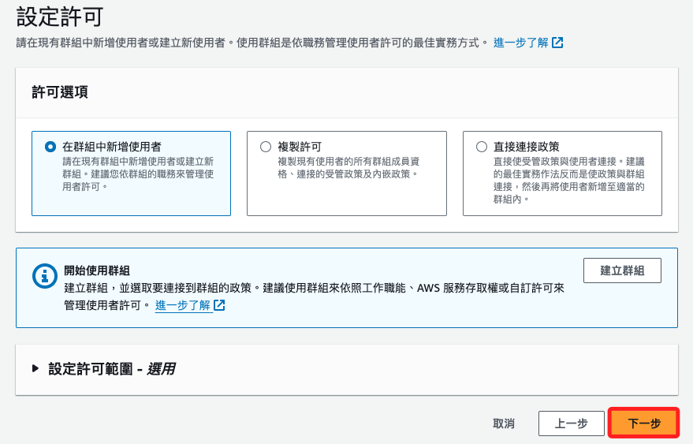
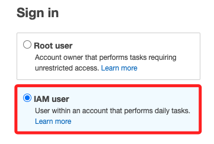
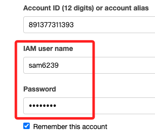
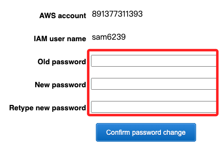
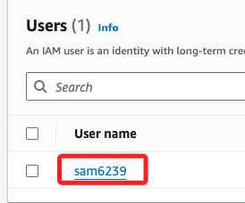
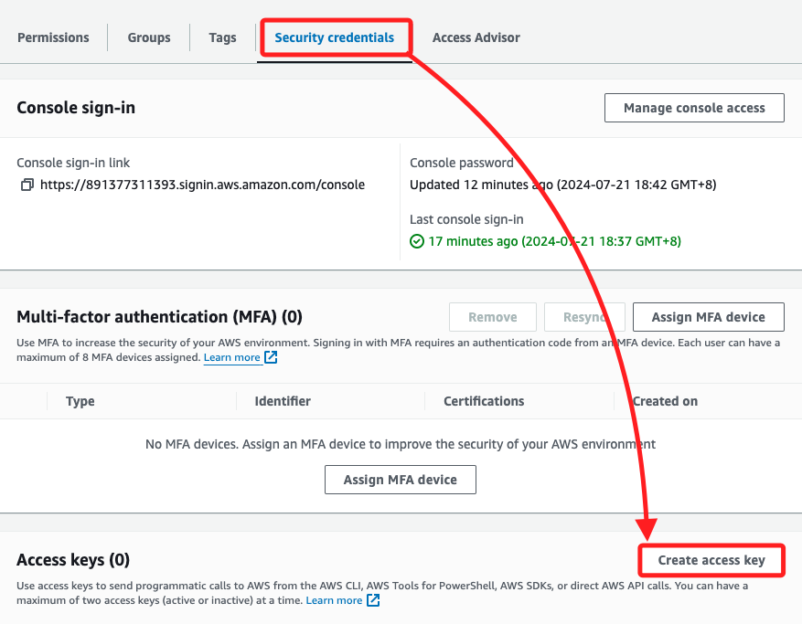
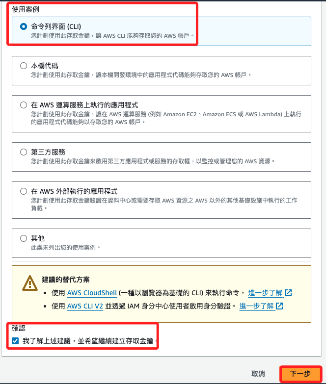
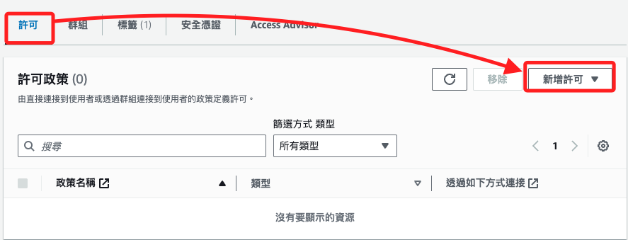

# 新增 IAM 用戶

<br>

## 操作步驟

1. 搜尋 `IAM` 並加入快捷鍵，接著點擊進入。

    

<br>

2. 點擊左側的使用者 `Users`。

    

<br>

3. 點擊建立使用者 `Create user`。

    

<br>

4. 自訂使用者名稱如 `sam6239`，並勾選 `提供使用者對 AWS 管理主控台的存取權` 後勾選 `我想要建立 IAM 使用者`。

    

<br>

5. 使用自訂產生的密碼，另外取消預設的更新密碼選項，接著進入下一步 `Next`。

    

<br>

6. 這裡無論選哪個項目都無妨，預設是 `Add user to group`，點擊下一步 `Next`。

    

<br>

7. 檢視設定後，點擊右下角的建立使用者 `Create user`。

    

<br>

8. 完成建立 IAM 用戶，先點擊 `下載 .csv 檔案`，這會將帳號密碼下載到本地，然後再點擊返回使用者清單 `Return to users list`；這裡若為下載文件，會跳出視窗再次提醒，務必確認保存了必要資訊。

    

<br>

9. 接著會看到添加的個 IAM 用戶在 Users 清單中。

    

<br>

10. 進入本機下載資料夾，查看前面步驟下載的密鑰文件，這個文件會以 `使用者名稱` 作為前綴命名。

    

<br>

11. 文件內容是使用者名稱 `User name`、密碼 `Password` 與 URL；這些資訊是用於讓新的 IAM 使用者首次登入 AWS 管理控制台使用。

    

<br>

## 新 IAM 用戶登入

1. 可以點擊 `*credentials.csv` 文件中的 `Console sign-in URL` 開啟主控台登入頁面，會自訂填入 `Account ID`。

    

<br>

2. 或是使用官方登入畫面，選擇 `IAM user` 進行登入。

    

<br>

3. 在 `Account ID` 部分，參考 `*credentials.csv` 文件中的這 12 碼數字就是帳號的 ID。

    

<br>

4. 自動或手動填入 ID後，接著依照文件內的名稱與密碼進行登入。

    

<br>

5. 第一次登入會提示修改密碼；特別注意，修改之後若為自動進入主控台，就代表所修改的密碼不合規範，一但合乎規範就會自動進入主控台，截至目前（2024/07/21）這裡還有 Bug，不會提示更新失敗。

    

<br>

## 建立使用者密鑰

1. 在 IAM 服務中，點擊進入使用者 `Users` 後，先點擊指定的用戶帳如 `sam6239` 中。

    

<br>

2. 滑動到下方，切換頁籤 `Security credentials`，點擊建立存取金鑰 `Create access key`。

    

<br>

3. 選取 `命令列介面` 後勾選下方的 `確認`，緊接著進入 `下一步`。

    

<br>

4. 任意描述後，點擊右下角的 `Create access key`。

    

<br>

5. 與前面步驟相同，先點擊 `下載 .csv 檔案`，然後完成 `Done`。

    

<br>

6. 這個檔案與前面的 `*credentials.csv` 不同，這時下載的文件名稱是 `*accessKeys.csv`。

    

<br>

7. 文件內容如下，這是在程式碼或應用程序中以程式化的方式訪問 AWS 服務時使用。

    

<br>

## 建立政策

1. 在 IAM 畫面中，點擊左側的 `政策`。

    

<br>

2. 點擊建立政策。

    

<br>

3. 選取 `JSON`，並將以下內容貼在 `政策編輯器`中。

    

<br>

4. 內容如下。

```json
{
    "Version": "2012-10-17",
    "Statement": [
        {
            "Effect": "Allow",
            "Action": [
                "bedrock:InvokeModel",
                "bedrock:ListFoundationModels",
                "bedrock:GetFoundationModel"
            ],
            "Resource": "*"
        }
    ]
}
```

<br>

5. 點擊 `下一步`。

    

<br>

6. 命名 `BedrockAccessPolicy` 並添加描述 `Policy to allow access to Bedrock services`。

    

<br>

7. 建立政策。

    

<br>

8. 完成後可查看全貌。

    

<br>

## 添加政策

1. 在指定使用者介面內，點擊 `許可` 並 `新增許可`。

    

<br>

2. 點擊 `新增許可` 中的 `新增許可`。

    

<br>

3. 會看到前面建立使用者的步驟中看過的畫面，選取 `直接連接政策`。

    

<br>

4. 搜尋前面自建的政策。

    

<br>

5. 點擊右下角 `新增許可`。

    

<br>

___

_END_