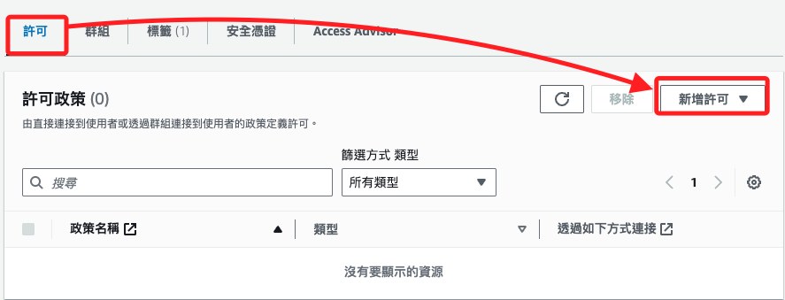

# 建立政策

_以下說明建立新的政策並添加給 IAM 用戶_

<br>

## 步驟說明

1. 在 IAM 畫面中，點擊左側的政策 `Policies`。

    

<br>

2. 點擊右上角的建立政策 `Create policy`。

    

<br>

3. 切換到 `JSON`，可在左側的 `政策編輯器` 中進行政策的修改，預設內容如下；其中 `Sid` 就是 `Statement ID`，是識別策的唯一標識符，但這並非必要項目，如果沒有這個鍵，政策仍然是有效的。

    

<br>

4. 在 `Action` ˋ中添加三個項目，修正後內容如下；其中 `Version` 是政策版本，這裡 `2012-10-17` 是 AWS 使用的標準版本日期；`Statement` 中可包含一個或多個具體的許可聲明；`Effect` 用以指定 `允許 Allow` 或 `拒絕 Deny` 訪問；`Action` 定義允許執行的操作，這裡示範的事列出三個 Bedrock 操作，`bedrock:InvokeModel` 允許調用 Bedrock 模型、`bedrock:ListFoundationModels` 允許列出 Bedrock 基礎模型、`bedrock:GetFoundationModel` 允許獲取 Bedrock 基礎模型的詳細信息；`Resource` 指定操作的資源範圍，使用星號 `*` 表示對所有資源均適用，假如要設定多個資源項目，可使用中括號 `[ ]` 並填入列表，星號 `*` 亦可用 `[*]` 表示。

    ```json
    {
        "Version": "2012-10-17",
        "Statement": [
            {
                "Effect": "Allow",
                "Action": [
                    "bedrock:InvokeModel",
                    "bedrock:ListFoundationModels",
                    "bedrock:GetFoundationModel"
                ],
                "Resource": "*"
            }
        ]
    }
    ```

<br>

5. 完成後點擊下一步 `Next`。

    

<br>

6. 為政策命名如 `MyBedrockAccessPolicy` 並添加描述 `Policy to allow access to Bedrock services`。

    

<br>

7. 點擊右下角的建立政策 `Create policy`。

    

<br>

8. 完成後可在 `Policies` 中進行搜尋，並點擊進入查看。

    

<br>

9. 這可查看各項設定或進行再次編輯。

    

<br>

## 添加政策

1. 在指定的使用者 `Users` 中，點擊許可頁籤 `Permissions`，在點擊右側的新增許可 `Add permissions`。

    

<br>

2. 展開新增許可 `Add permissions` 後點擊新增許可 `Add permissions`。

    

<br>

3. 會看到前面建立使用者的步驟中看過的畫面，選取 `直接連接政策`，點擊後下方會展開 `Permissions policies` 清單。

    

<br>

4. 搜尋前面自建的政策，勾選後點擊 `Next`。

    

<br>

5. 點擊右下角 `新增許可`。

    

<br>

6. 完成後，在 `Permissions policies` 清單中會看到政策已被加入。

    

<br>

___

_END_