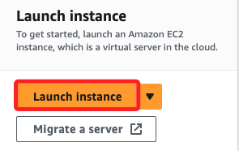
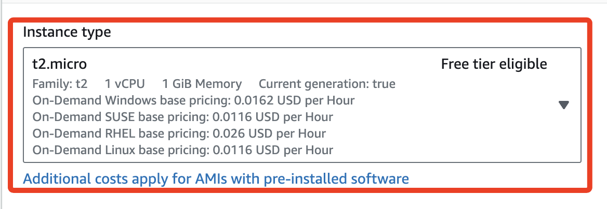
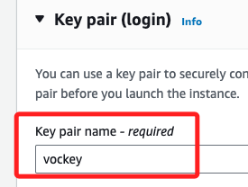
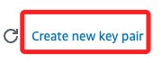
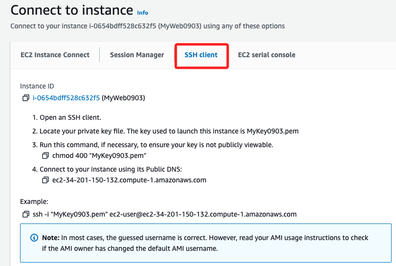
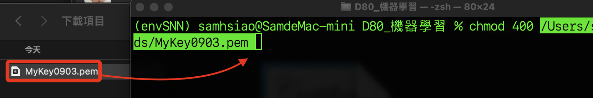
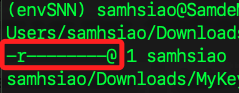

# 進入 Learner Lab

<br>

## 步驟

1. 切換頁籤 `Dashboard`，點擊進入 [90630](https://awsacademy.instructure.com/courses/90630)。

    

<br>

2. 切換頁籤 `Modules`，選取 `Launch AWS Academy Learner Lab`。

    

<br>

3. 尚未啟動，所以 `AWS` 是紅色的。

    

<br>

4. 點擊 `Start Lab` 啟動 Lab，`AWS` 會變成黃色。

    

<br>

5. 過一段時間後， `AWS` 會亮綠燈，耗時蠻久的。

    

<br>

6. 點擊 `AWS` 可進入主控台；與商用相同，惟權限視設定而異。

    

<br>

## EC2

1. 點擊 `Launch Instance`。

    

<br>

2. 任意命名，如 `MyWeb0903`，選取主機類行為 `Amazon Linux aws`，AMI 選取 `Amazon 2023 AMI`。

    

<br>

3. 實例類型使用最基礎的設備規格 `t2.micro`。

    

<br>

4. `Key pair` 可選取預設的 `vockey`，這是用來簡化學習過程中連接 EC2 實例的操作，並且與 AWS Academy 帳號相關聯；特別注意，這樣將無法在尚未寫入 `.ssh` 前使用外部終端機進行 SSH 連線。

    

<br>

5. 可點擊 `Create new key pair` 建立密鑰。

    

<br>

6. 任意命名如 `MyKey0903`，類型選擇預設的 `RSA` 或是更安全的 `ED25519` 皆可，然後點擊 `Create key pair`。

    

<br>

7. 點擊後會自動下載 `.pem` 密鑰文件到本地。

    

<br>

8. 其他關於 EC2 的設定都使用預設值，點擊右下角的 `Launch Instance` 建立實例。

    

<br>

9. 回到清單中可見到新增的實例。

    

<br>

## 建立連線

1. 勾選實例後點擊 `Connect`。

    

<br>

2. 會進入連線頁面，使用或切換到第一個頁籤 `EC2 Instance Connect`，並點擊右下角的 `Connect`，會啟動內建的終端機。

    

<br>

3. 見到以下畫面代表連線成功。

    

<br>

## 自訂連線

1. 可以參考頁籤 `SSH client` 中的說明建立連線。

    

<br>

2. 修改 `.pem` 文件權限，要降低權限到 `400`；開啟終端機，輸入 `chmod 400` 之後將 `.pem` 文件拖曳到終端機中。

    

<br>

3. 完成後透過  `ls -l` 指令查詢確實已經變更，`400` 就是 `唯讀`。

    

<br>

4. 紀錄 `Public IPv4 address` 備用。

    

<br>

5. 接著在終端機中使用 `ssh` 指令進行連線。 

    ```bash
    ssh -i <.pem 文件完整路徑> ec2-user@34.201.150.132
    ```

<br>

6. 第一次連入時會詢問是否連線，確認後會將紀錄寫入本機的 `.ssh` 紀錄文件中。

    

<br>

7. 完成連線。

    

<br>

## 安裝相關套件

1. 參考官方的 [Amazon Linux 2023 Tutorial](https://docs.aws.amazon.com/linux/al2023/ug/ec2-lamp-amazon-linux-2023.html)。

<br>

2. 更新套件管理器並安裝 Apache。

    ```bash
    sudo dnf update -y && sudo dnf install -y httpd
    ```

<br>

3. 啟動並設置 Apache 在開機時啟動。

    ```bash
    sudo systemctl start httpd && sudo systemctl enable httpd
    ```

<br>

4. 查看 httpd 狀態。

    ```bash
    service httpd status
    ```

<br>

5. 若未啟動，則啟動服務並設定為開機啟動。

    ```bash
    sudo systemctl start httpd && sudo systemctl enable httpd
    ```

<br>

6. 若要檢查是否啟動。

    ```bash
    sudo systemctl is-enabled httpd
    ```

<br>

## 安裝 MariaDB

1. 安裝 MariaDB。

    ```bash
    sudo dnf install -y mariadb105-server
    ```

<br>

2. 啟動並設置 MariaDB 在開機時啟動。

    ```bash
    sudo systemctl start mariadb && sudo systemctl enable mariadb
    ```

<br>

3. 檢查 MariaDB 伺服器的運行狀態。

    ```bash
    sudo systemctl status mariadb
    ```

<br>

## 配置 MariaDB

1. 執行 MariaDB 安全設置腳本來配置 root 密碼和其他安全選項。

    ```bash
    sudo mysql_secure_installation
    ```

<br>

2. 設定與一般設定時相同，這裡暫時略過。

<br>

## 安裝 PHP


1. 安裝 PHP 及相關模組。

    ```bash
    sudo dnf install -y php php-mysqlnd
    ```

<br>

2. 重新啟動 Apache 以載入 PHP 模組。

    ```bash
    sudo systemctl restart httpd
    ```

<br>

## 建立網站

_建立簡單的 PHP 網頁_

<br>

1. 編輯文件。

    ```bash
    sudo nano /var/www/html/index.php
    ```

<br>

2. 寫入任意內容後儲存 `control+O`、退出 `control+X`。

    ```php
    <?php
    echo "Hello 你好，歡迎來到 AWS 課程測試首頁。";
    ?>
    ```

<br>

___

_END_


