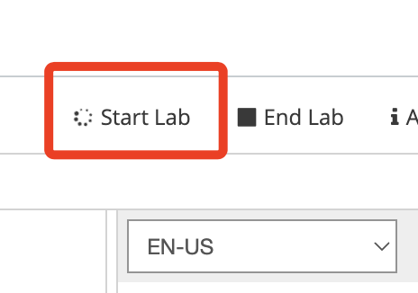
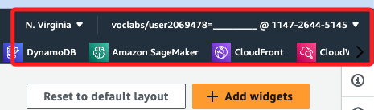

# 步驟

1. 進入 Dashboard，點擊進入 [90630](https://awsacademy.instructure.com/courses/90630)。

2. 點擊 Modules，選取 `Launch AWS Academy Learner Lab`。

3. 尚未啟動，所以 `AWS` 是紅色的。

4. 點擊 `Start Lab` 啟動 Lab。

5. 過一段時間後， `AWS` 會亮綠燈，耗時蠻久的。

6. 點即這個 `AWS` 可進入主控台。

最基礎的設備規格

新的 EC2 相關系統的安裝可以參考這個 [Tutorial](https://docs.aws.amazon.com/linux/al2023/ug/ec2-lamp-amazon-linux-2023.html)

CDN