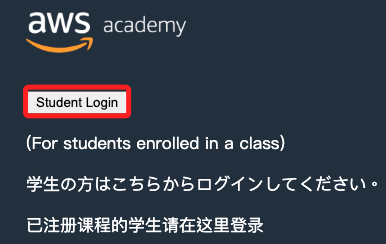
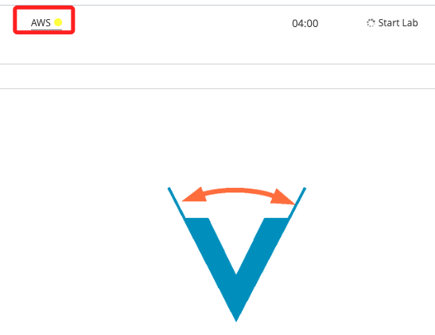
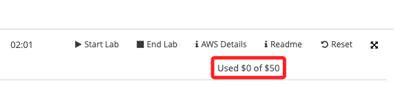
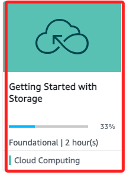
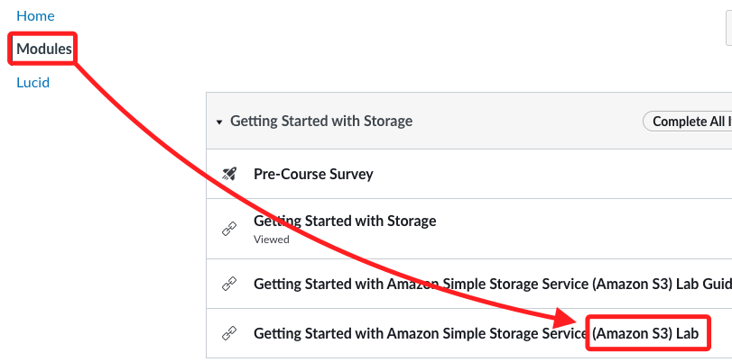
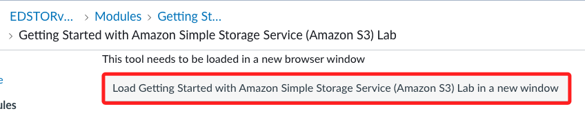
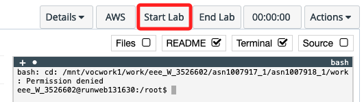
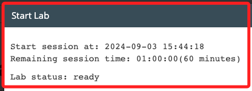
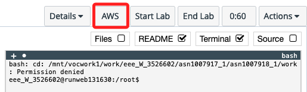
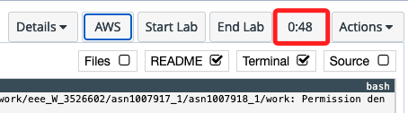

# 登入

 

## 使用 [aws academy](https://www.awsacademy.com/vforcesite/LMS_Login)

1. 選擇 `Student Login`。

    

 

2. 切換頁籤 `Dashboard`，點擊進入 [90630](https://awsacademy.instructure.com/courses/90630)。

    

 

3. 切換頁籤 `Modules`，選取 `Launch AWS Academy Learner Lab`。

    

 

4. 尚未啟動，所以 `AWS` 是紅色的。

    

 

5. 點擊 `Start Lab` 啟動 Lab。

    

 

6. `AWS` 會變成黃色。

    

 

7. 過一段時間後， `AWS` 會亮綠燈，耗時蠻久的。

    

 

8. 點擊 `AWS` 可進入主控台，與商用相同，惟權限視設定而異；特別注意，假如點擊未能完成登入，關閉視窗再次點擊進入即可。

    

 

9. 另外，在這個頁面可看到教育帳戶的餘額。

    

 

## 使用 [aws educate](https://www.awseducate.com/signin/SiteLogin?language=en_US)

1. 進入 `Getting Started with Storage`。

    

 

2. 點擊 `Modules` 進入 `Lab`。

    

 

3. 開啟新視窗。

    

 

4. 先點擊 `Start Lab`。

    

 

5. 啟動後，會限時 `60 minutes`。

    

 

6. 點擊 `AWS` 進入主控台。

    

 

7. 隨著時間經過，可看到倒數的時間減少。

    

 

___

_END_